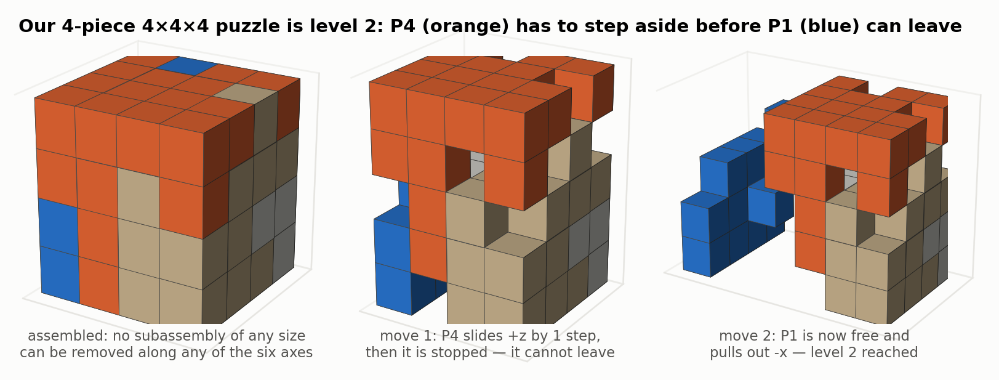
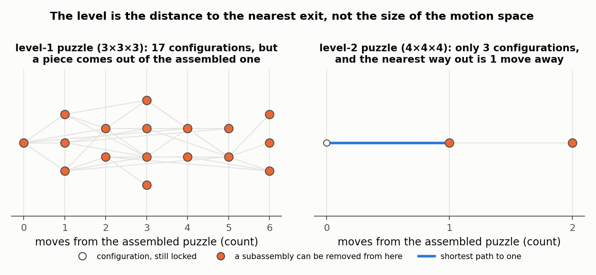
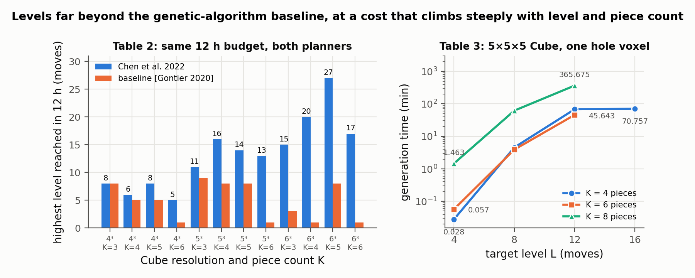

# Computational Design of High-level Interlocking Puzzles

Rulin Chen, Ziqi Wang, Peng Song, Bernd Bickel — *ACM Transactions on Graphics 41(4), Article 150 (SIGGRAPH), 2022*

[Paper](https://doi.org/10.1145/3528223.3530071) · [Project page](https://sutd-cgl.github.io/supp/Publication/projects/2022-SIGGRAPH-High-LevelPuzzle/index.html) · [Code](https://github.com/Linsanity81/High-LevelPuzzle)

**Stability question:** Kinematic — enumerates every arrangement the pieces can reach through axis-aligned moves, computes the fewest moves needed to free the first piece, and designs pieces to push that number up.

**Source read:** full text (https://sutd-cgl.github.io/supp/Publication/papers/2022-SIGGRAPH-High-LevelPuzzle.pdf); Tables 1–3 read from the rendered pages.

## TL;DR
Earlier interlocking designs ([song2012-recursive-interlocking-puzzles.md](song2012-recursive-interlocking-puzzles.md), [fu2015-interlocking-furniture-assembly.md](fu2015-interlocking-furniture-assembly.md)) take the key out in one straight move, which makes them "level 1". This paper designs voxel puzzles where the first piece only comes out after L moves; the highest in the results is L = 27. A *kernel disassembly graph* stores every reachable configuration, and breadth-first search (BFS) gives the exact minimum number of moves. Pieces are grown one at a time so that no partially built puzzle has a removable part, which drives the graph's farthest nodes deeper.

## The problem
**Input:** a voxelized shape (typically fewer than 1,000 voxels), a piece count K (typically 3–8), and a target level L > 1.

**Output:** K connected, similar-sized polycube pieces such that
- some plan removes the first subassembly in L moves, and no plan does it in fewer;
- the puzzle can be taken apart completely.

The *level* counts moves until the first piece or pieces come out. This follows the IBM Research burr-puzzle definition:
- A move is a translation along one axis, whatever the distance. Changing direction counts as a new move.
- The removal itself counts.
- Moving several touching pieces together in one direction counts as one move.

A convex shape can only give level 1, because anything that can move can leave, so users may add interior "hole" voxels.

## Why it matters
Level-1 designs assume a *monotone* plan (pieces never parked in intermediate positions) and a *linear* one (one piece moves at a time). High-level puzzles need non-monotone, possibly non-linear plans, and finding such plans is NP-hard (Kavraki et al. 1993). Known high-level puzzles came from exhaustive or heavy search:
- Cutler analysed 13,354,991 six-piece holey burr assemblies, and the highest level found was 10.
- Gontier's genetic algorithm on supercomputers reported cubes of levels 5, 9, 10, and 13.

Tools like BurrTools report a level that depends on their planner. This paper computes the minimum intrinsic to the puzzle.

## Contributions
1. A graph-based planner that computes the *exact* level over all non-monotone, linear or non-linear plans, plus a recursive check for full disassemblability.
2. A design framework that builds each voxel piece guided by the planner, then reassigns single voxels to reach the target level.
3. A shape optimization that slightly deforms a smooth input mesh before voxelizing, so smooth-looking pieces don't contain fragile slivers.
4. Results up to level 27, a comparison with Gontier's method, 3D-printed puzzles, and an 8-person user study.

## Key intuitions
1. **The motion space is a graph.** Pieces move in whole-voxel steps, so each arrangement is a node recording every piece's integer offset (or ∞ once removed), and each legal move is an edge. The level is the length of the shortest path from the start node to any node where something has been removed.
2. **Relativity halves the enumeration.** Moving a subassembly is equivalent to moving its complement the opposite way, so only subassemblies with at most ⌈K/2⌉ pieces need testing.
3. **To be hard, stay locked at every intermediate stage.** If a partially built puzzle already has a removable subassembly, later pieces can't lift the level above what that stage allows. So every intermediate assembly must have *no* removable subassembly in *any* configuration it can reach.
4. **Grow from the deepest configuration.** Each new piece is made movable but not removable in a configuration far from the start. This creates new configurations that are even farther away, extending the graph depth-first.
5. **Only non-height-field directions can trap a piece.** If the shape is a height field along direction d, anything that moves along d simply leaves. Such directions are useless for making a piece that moves but stays in.

## Technical crux, explained simply
**Analogy.** A pencil box whose lid must slide sideways a little before it lifts off is level 2. A level-6 puzzle is a chain of such slides, each one unblocking the next, sometimes with two pieces sliding together.

**Tiny example.** Three pieces A, B, C sit in a cube with one empty hole voxel.
- At the start (node 0), nothing can leave, but A can shift one step +x into the hole. That gives node 1.
- In node 1, B can slide one step −y, giving node 2. A can also shift back, since edges are undirected.
- In node 2, A can lift +z all the way out, which is a target node.

The path 0 → 1 → 2 → target has 3 edges, so the level is 3, unless another branch reaches a target sooner.

*Figure 1. The same idea worked through. We built a 4-piece 4×4×4 puzzle with one hole voxel and ran a re-implementation of the paper's Algorithms 1–2 on it: in the assembled state no subassembly of any size can be removed along any of the six axes, so P4 must first slide +z by one step, where it is stopped, and only then can P1 be pulled out along −x. Two moves to free the first piece, so this puzzle is level 2, and the remaining three pieces do come apart afterwards. (our own toy computation, not a figure from the paper)*

**The planner.** A configuration lists every piece's state. BFS starts from the assembled puzzle. At each node, for every connected subassembly S of at most ⌈K/2⌉ pieces and each of the six directions, it computes how far S can slide:
- if S can slide forever, the move leads to a target node (S removed);
- otherwise, each step count from 1 to the maximum gives a neighbour node.

The search stops when no new node or edge appears. The level is $L_{exact}=\min_i N(D_i)$, the fewest moves over all kernel plans $D_i$, which is the shortest root-to-target path.

*Figure 2. The kernel disassembly graphs of two of our own puzzles, laid out by distance from the assembled state; orange marks a configuration from which some subassembly can be removed. The level-1 puzzle on the left has by far the bigger motion space — 17 configurations, reaching six moves deep — but a piece drops straight out of the assembled state, so its level is 1. The one on the right has only three configurations and yet is level 2, because the nearest exit is a move away. Level measures the distance to the first exit, not the size of the graph. (our own toy computation)* Complete disassembly is checked recursively on the removed part and on the rest. This check only looks for *a* feasible plan, so failing to find one doesn't prove that none exists.

**The designer.** Pieces are carved in sequence, $R_0 \to [P_1,R_1] \to \dots$, as in Song 2012. For each new piece $P_i$:
1. Pick $C_{prim}$, a configuration farthest from the root in the current graph $G(A_{i-1})$.
2. Choose a non-height-field direction $d_i$ in that configuration, and a seed voxel that can move along $d_i$ but is eventually stopped.
3. Collect every unwanted mobility of the seed, both in $C_{prim}$ and in *every other node* of the graph. Remove them with a minimal set of blocking/blockee voxel pairs joined by shortest paths, using Song 2012's technique.
4. Grow the piece to within $[(1-\delta)\lfloor M/K\rfloor,\ (1+\delta)\lfloor M/K\rfloor]$ voxels (M = total voxels) without undoing any blocking. Rebuild the graph, and backtrack on failure.

Only the final split may make the puzzle disassemblable. If the level still falls short, Algorithm 4 repeatedly moves a loosely connected voxel into a neighbouring piece. A change is kept only if pieces stay connected, the puzzle stays disassemblable, and the level rises, or, on a tie, the total move count rises.

## What the results do well
- **Range of shapes.** 15 results cover voxel shapes (CUBE FRAME, SHELF, SPIDER, MARIO, BUNNY) and smooth ones (COW, MOAI, OWL, and others). Hardware was a 3.6 GHz 8-core Intel CPU with 16 GB RAM.
- **Hardest puzzles.** A 5-piece level-27 6×6×6 CUBE took 383.72 min. For a level-15 SHELF, construction alone failed within 24 h. Construction to level 6 (0.95 h) followed by modification (0.28 h) reached level 15.
- **Speed.** On a 5×5×5 cube with one hole, runs take under 5 min for K ≤ 6 and L ≤ 8 (e.g. 0.028 min for K = 4, L = 4), but time rises steeply (365.675 min for K = 8, L = 12).
- **Against Gontier's genetic algorithm.** The authors re-implemented it in C++, swapped in their own planner, and ran both methods for 12 h. The method is equal or better in all 12 cube/K settings, e.g. 6×6×6 with K = 5 reaches level 27 against 8, and K = 4 reaches 20 against 1.

*Figure 3. Left: Table 2, the highest level each method reached within the same 12 h on cubes with one centre hole voxel. The two are equal only on the smallest setting (4³, K = 3, level 8); the gap then widens with resolution and piece count. Right: Table 3, minutes to generate a 5×5×5 cube puzzle, which climb about four orders of magnitude from 0.028 min at K = 4, L = 4 to 365.675 min at K = 8, L = 12.*
- **Smooth shapes.** Optimizing the COW for 30 min cut problematic voxels from 23.3% to 11.7%.
- **User study (8 people).** Mean solve time rose with level: 0.30, 0.35, and 7.02 min for the level-4, -8, and -16 cubes, and four participants failed the level-16 cube. Graph size also mattered: the level-8 SOFA (307 graph nodes) took 1.87 min against 0.35 min for the level-8 cube (11 nodes).

## Limitations
Stated by the authors:
- Construction doesn't control the level exactly. It regenerates or modifies until it reaches L or hits a time limit, and for very large L it outputs the closest level it found.
- The design problem is $O(K^N \cdot N^{2K})$ (N = voxels), so they restrict to K ≤ 8 and N ≤ 1000.
- The method needs a large interior volume and may fail on shells or tree-like shapes.
- Shape optimization ignores aesthetics and symmetry.
- Puzzles can be hard to play when intermediate configurations aren't stable, and holding many pieces in place is hard too. The authors suggest adding structural stability analysis, citing the survey summarized in [wang2021-star-assemblies-rigid-parts.md](wang2021-star-assemblies-rigid-parts.md).
- Input must be voxelized, and motion is limited to translations along the major axes. The complete-disassembly planner finds a feasible plan, not a shortest one.

Our observations:
- Level measures how convoluted the escape path is, not how firmly pieces are held. Every intermediate configuration is held only by hands, gravity, or friction.
- "Exact" means exact within the translation-only model. Nothing is said about releases that need a rotation.
- The user study is small (8 participants, 5 puzzles).

## Relevance to joint stability in this repo
- **A 2-part joint's motion space is small enough to enumerate exactly.** The paper assumes K ≥ 3, but with two parts relativity reduces the state to A's integer offset relative to B. Voxelize both parts and run BFS over that offset. It tells us whether the joint separates by translation at all, the fewest straight moves needed to separate it (its "level"), and the full set of reachable positions. Level 1 means one straight pull undoes the joint; level 2 or more means the release path has to turn a corner (our observation).
- **The height-field test as a cheap pre-screen.** A piece can be movable yet not removable only along a non-height-field direction. Each LHF cut is a sketch swept along its plane normal n, which suggests n is often a one-move release direction for the part filling that cut. Testing whether the mating region is a height field along n could flag level-1 joints before running BFS (our observation, untested).
- **Level is not load capacity.** Intermediate configurations are free, and the authors themselves note instability during play. A level-2 joint loaded along its first move direction can partly disengage, with less contact area, without fully separating. Judging that takes static contact analysis; see [whiting2009-structurally-sound-masonry.md](whiting2009-structurally-sound-masonry.md) and [nadeau2024-robustness-frictional-contact.md](nadeau2024-robustness-frictional-contact.md).
- **What does not transfer directly:** the model allows only whole-voxel axis moves and no rotations. Dovetail slopes or angled LHF planes would need a fine voxel grid, which makes the state space grow quickly, or a continuous-direction model. The design half of the paper also inverts our goal by making pieces *hard* to separate, though Algorithm 4-style single-voxel edits could be used to search for repair geometries that keep a joint's level (our observation).
