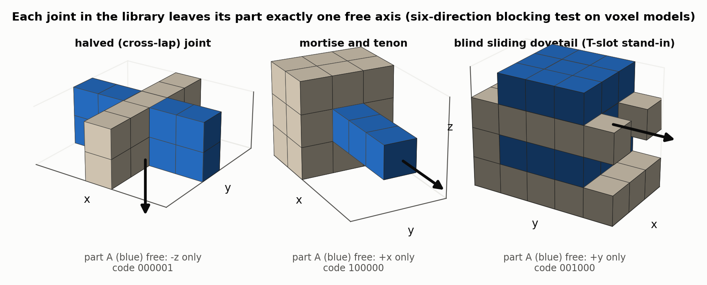
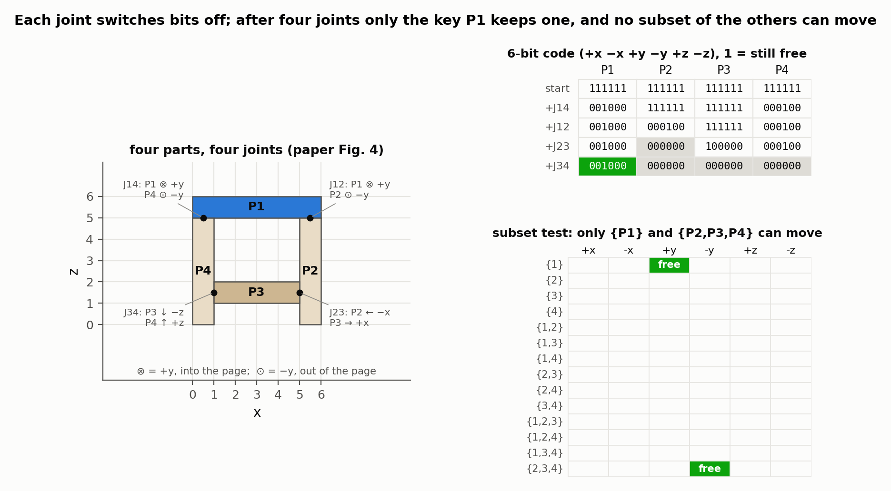
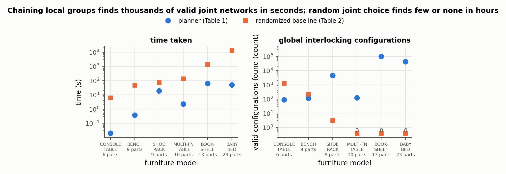

# Computational Interlocking Furniture Assembly

Chi-Wing Fu, Peng Song, Xiaoqi Yan, Lee Wei Yang, Pradeep Kumar Jayaraman, Daniel Cohen-Or — *ACM Transactions on Graphics 34(4), Article 91 (SIGGRAPH), 2015*

[Paper](https://doi.org/10.1145/2766892) · [Project page](http://www.cse.cuhk.edu.hk/~cwfu/papers/interlockfurniture/index.html)

**Stability question:** Kinematic — chooses a single-direction joint for every part–part connection so the whole frame has exactly one removable part; loads are explicitly out of scope.

**Source read:** full text, including the appendix proofs (https://sutd-cgl.github.io/supp/Publication/papers/2015-SIGGRAPH-InterlockFurniture.pdf); Tables 1–2 read from the rendered page image. Fu and Song are marked as joint first authors.

## TL;DR
Furniture is a frame of long and flat boxes, not a compact solid, so voxel carving as in [song2012-recursive-interlocking-puzzles.md](song2012-recursive-interlocking-puzzles.md) doesn't fit it. Here every connection gets a joint (dovetail, halved, mortise-and-tenon) that lets its two parts separate along one axis only. Joint directions are picked so that small 3- or 4-part cycles each lock around a local key, and overlapping cycles lock each other in a chain. A proof shows the whole piece then has a single global key.

## The problem
**Input:** furniture made of simple boxes that touch or overlap, plus a user-chosen key part and removal direction.

**Output:** joint geometry at every connection such that
- every part, and every subset of parts, is immobilized except the key (*global interlocking*);
- the furniture can be assembled part by part (*assemblability*).

Parts only translate along the main axes.

## Why it matters
Glue, nails, screws, and hinges make furniture hard to take apart and reassemble, and they hurt its looks. Joinery that interlocks avoids both, but the authors stress that analysing joints one at a time can't guarantee global interlocking. With n joints and about k joint choices each there are about kⁿ configurations, and verifying one directly means considering the 2ⁿ subsets of parts. The randomized baseline below shows how rare valid configurations are.

## Contributions
1. A three-level formal model (parts → local interlocking groups (LIGs) → whole assembly), with induction proofs of global interlocking and assemblability.
2. A joint lookup table indexed by an "ICO vector" that describes how two boxes meet: 23 cases for overlapping boxes and 13 for touching ones. Each entry gives the possible joints and their free directions.
3. An iterative, exhaustive planner that grows overlapping LIGs and outputs many valid joint networks. Networks are filtered for varied joint types and no weak or thin geometry.
4. Ten furniture results, several of them 3D-printed.

## Key intuitions
1. **A joint is just a direction.** Each chosen joint lets its two parts separate along one axis: if A leaves B along +y, then B leaves A along −y. Planning a network means assigning directions, and the geometry is looked up afterwards.
2. **Disagreeing joints lock a part.** A part whose joints allow different directions can't move. A key is a part whose joints all allow the *same* direction.
3. **Locking needs a cycle.** A chain of parts can always pull apart at an end, so an LIG must contain a cycle of at least three parts. Degree-1 "dangling" parts are merged into their neighbour first.
4. **Groups lock groups by sharing a key plus one more part.** If a new group Gⱼ shares only its key with an older group Gᵢ, then Gᵢ can slide away carrying that key. If it also shares a non-key part P\*, then {key, P\*} is a stuck subset of Gⱼ and Gᵢ can't leave until its own key is out.
5. **Dependencies must form a DAG.** Each group points to a group that locks it. With no cycles, and with the first group's key shared by no later group, exactly one part in the whole assembly is free.

## Technical crux, explained simply
**Analogy.** Picture the corner of a box: a top board k and two side walls A and B, each pair joined. Treat each joint as a rail that lets its two boards separate only along its own track.

*Figure 1. Voxel stand-ins for three joints from the paper's library, with the six-direction blocking test actually run on each: the blue part can be slid clear along one axis only, which is what makes "a joint is just a direction" a fair reduction. The 6-bit code under each is the part's mobility in the order (+x −x +y −y +z −z). (our own toy computation, not a figure from the paper)*

**Tiny example (a 3-part cycle).** Write d(X, Y) for the direction X may slide away from Y at their joint, so d(Y, X) = −d(X, Y). Join the top board k to both walls with d(k, A) = d(k, B) = +z: k's two joints agree, so k is free and is the key. Join the walls to each other with d(A, B) = +x. Then A has −z from its joint with k and +x from its joint with B, which disagree, so A is stuck; B has −z and −x, so B is stuck too.

Pairs need no extra test. {A, B} is the complement of the key, so it moves exactly when k does. {k, A} is the complement of the stuck B. The paper's conditions for a 3-part cycle are exactly the ones above: $d(k,P_A)=d(k,P_B)$, $d(P_A,P_B)\ne d(P_A,k)$, and $d(P_B,P_A)\ne d(P_B,k)$. A 4-part cycle adds two pair conditions, for example $d(k,P_C)\ne d(P_A,P_B)$ so that {k, P_A} can't leave together. Triplets are complements of single parts, and non-adjacent pairs are stuck because their members are, so nothing else has to be tested.

Progress can be tracked with a 6-bit code per part. All six axis directions start free (111111), each assigned joint switches bits off, and the goal is 000000 for every part except the key.

*Figure 2. The four-part cycle of the paper's Fig. 4, with its joint directions replayed here. Left: the four joints and the direction each part may leave its neighbour. Top right: the 6-bit codes as each joint is assigned — every joint switches bits off, and after the fourth only the key P1 still has one (+y). Bottom right: the direction test run on all 14 proper subsets, which confirms that only {P1} and its complement {P2, P3, P4} can translate. (subset test is our own computation)*

**The actual method.**
1. *Parts-graph.* Nodes are parts and edges are contacts or overlaps. Merge dangling parts, then find the 3- and 4-part cycles.
2. *Joint analysis.* For each connection, build box A's ICO vector: along each of the six axis directions, A's face either ends inside B (I), coincides with B's face (C), or extends past the overlap (O). Canonicalize the vector under the 24 axis rotations and reflections (8 for a 2D contact), then match it against the 23 + 13 hand-built table entries. That yields the candidate joints and the direction set D(A, B) for the connection.
3. *First group G₁.* Check that the key's direction lies in D(key, neighbour) for every neighbour. Enumerate all 3- and 4-cycles through the key, and exhaustively assign their remaining joints to satisfy the cycle conditions. Drop candidates where the key's exit path collides, including sideways moves after the key is first stopped.
4. *Next groups.* Repeatedly pick a 3- or 4-cycle that shares at least 2 parts with earlier groups, adds at least 1 new part, and contains no earlier key. Try each shared part as its key and assign its free joints. Assemblability only needs checking on this group and the parts that remain. A group can also grow by one part P₀ if P₀ is blocked by the group, {P₀, key} is blocked, and the key stays free.
5. *Finish.* Joints outside every group get directions consistent with the disassembly order. Keep configurations with varied joint types and no weak or thin geometry, show 20 to the user, and cut the joints with CSG.

The disassembly order falls out of the construction: k₁, then the rest of G₁ that no later group needs, then k₂, and so on. Reverse it to assemble.

## What the results do well
- Ten models from 6 to 32 parts (CONSOLE TABLE to CHILD BED), all globally interlocking.
- Fast on a 3.4 GHz CPU with 8 GB RAM. The fastest took 0.02 s (6 parts, 8 joints, 87 valid configurations). The slowest was CHILD BED at 157.68 s (32 parts, 66 joints, 8 LIGs, 15,492 valid configurations).
- Many valid alternatives per model (e.g. 97,808 for BOOKSHELF), so users can choose for appearance. They can hide joint patterns from the front, or label parts to be assembled early.
- A randomized baseline that picks valid joint geometry at each joint found 1,293 valid configurations for CONSOLE TABLE, 223 for BENCH, 3 for SHOE RACK, and none for MULTI-FUNCTION TABLE, BOOKSHELF, or BABY BED (the last run took 12,906.2 s). Our observation: Table 2's outcome counts don't add up to its listed trial totals. The rows marked 10⁶ sum to 10⁵, and the BABY BED row marked 10³ sums to 10⁴, so read the rates as approximate.
- FDM-printed PLA prototypes whose parts "tightly interlock."

*Figure 3. The six models the paper runs both ways, from Table 1 (planner) and Table 2 (randomized baseline). The planner is faster on all six and finds far more valid configurations; the baseline finds 3 for SHOE RACK and none at all for the three largest, having spent 1,359.74 s on BOOKSHELF and 12,906.2 s on BABY BED to find nothing.*

## Limitations
Stated by the authors:
- Some structures can't be globally interlocked. An example is a long middle part with two groups at its ends that don't touch each other: only each group locks locally.
- Only cycles of up to 4 parts, and only orthogonal connections.
- Only common joints. A three-way crossing of orthogonal rods inside one cube would need a puzzle joint, which isn't supported.
- Structural stability, such as loads on the structure, isn't considered. Joint strength, joint parameters, and the effect of load are listed as future work.
- The randomized baseline can find configurations the method can't, because the method only chains small groups.

Our observations:
- Each joint is reduced to one direction, so fit, clearance, and the area of the blocking faces play no role. Weak joints are filtered out by heuristic, not analysed.
- The quality of results depends on a hand-built table that only covers axis-aligned boxes.

## Relevance to joint stability in this repo
- **Per-joint kinematic signature.** For each 2-part MiGumi joint we can compute its set of free separation directions (the paper's D(A, B)), e.g. as a 6-bit code. The paper only uses joints that allow exactly one direction. A joint that allows several gives any surrounding structure fewer ways to lock it, and one that allows none can't be assembled by translation.
- **Stock-overlap cases as an index.** The ICO vector keys joint choice on how the two stock boxes overlap. Our parts are also `Difference(stock, Union(cuts))`, so classifying the two stocks' overlap the same way could index which LHF-cut families, and which free directions, are feasible at a connection (our observation).
- **Interlocking is a property of the network, not of one joint.** A lone 2-part joint is at best "one free direction". Whether a repaired joint is actually held depends on neighbouring members closing a 3- or 4-part cycle, so in a frame the other joints can lock a weakened one (our observation).
- **What does not transfer:** the model has no friction, gravity, or strength, so an "interlocking" network can still rack, crush, or split. MiGumi also points out that integral joints rely on tight surface coupling, which is stricter than global blocking ([ganeshan2025-migumi.md](ganeshan2025-migumi.md)). For load-level checks see [yao2017-decorative-joinery.md](yao2017-decorative-joinery.md) and [kao2022-coupled-rigid-block-analysis.md](kao2022-coupled-rigid-block-analysis.md).
