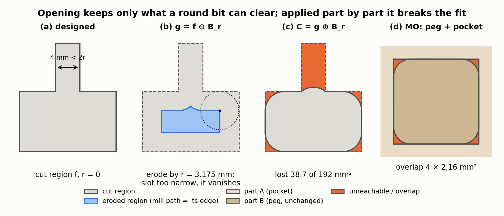
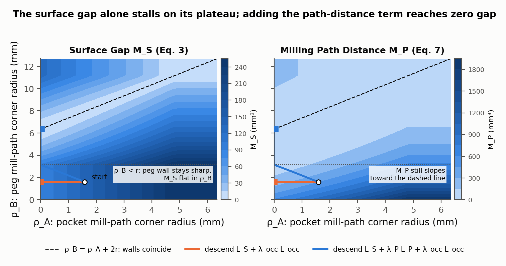
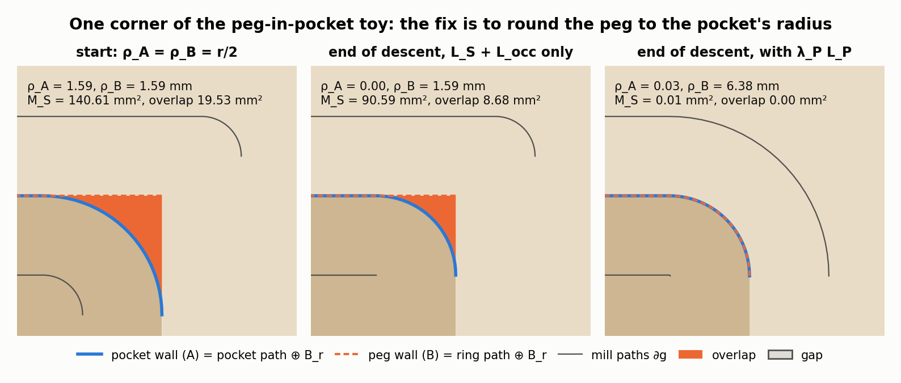
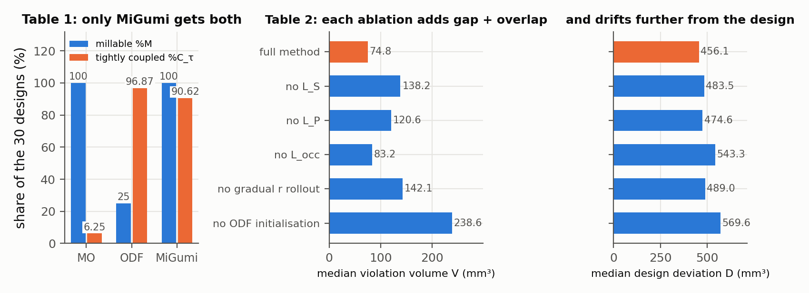

# MiGumi: Making Tightly Coupled Integral Joints Millable

Aditya Ganeshan, Kurt Fleischer, Wenzel Jakob, Ariel Shamir, Daniel Ritchie, Takeo Igarashi, Maria Larsson — *ACM Transactions on Graphics 44(6), 2025 (SIGGRAPH Asia 2025)*

[Paper](https://arxiv.org/abs/2510.13168) · [Project page](https://bardofcodes.github.io/migumi/) · [Code](https://github.com/bardofcodes/migumi/)

**Stability question:** None directly (Kinematic only indirectly) — it optimizes geometric fit (no gaps, no overlaps) under CNC milling constraints. It does not model forces, friction or material strength, and it does not enforce assemblability.

**Source read:** full text (local `docs/Ganeshan et al. - MiGumi Making Tightly Coupled Integral Joints Millable.pdf`, same as https://bardofcodes.github.io/papers/migumi/paper.pdf), plus the supplement (https://bardofcodes.github.io/papers/migumi/supp.pdf) for implementation and fabrication details.

## TL;DR
Traditional integral joints have sharp inside corners, but a flat-end CNC bit leaves them rounded. If each part is milled on its own, the parts overlap and won't assemble. MiGumi writes each part as stock minus a set of planar 2D-profile extrusions, each guaranteed millable at a given bit radius. It then optimizes the 2D profiles of all parts together, on a few representative slices, so mating surfaces touch again. On the 30-joint dataset it is the only method tested that is both always millable (100%) and usually tightly coupled (90.62%).

## The problem
Input: a joint designed for an ideal zero-radius tool, written as an MXG⁰ program. Output: a program for a real radius (3.175 mm in all experiments) that (a) is millable by a flat-end bit and (b) stays **tightly coupled**: every internal surface touches the mating part, with no gaps and no overlaps. This is hard because passes from different directions interact, and some joints have 3 parts.

## Why it matters
For this repo, MiGumi *is* the source representation. An LHF cut corresponds to an MXG extrusion, and `Difference(stock, Union(cuts))` is the MXG part program. The dataset's `base`, `mill`, `odf` and `ours` variants are exactly the paper's inputs, two baselines and results. Knowing what "tightly coupled" does and doesn't guarantee is a prerequisite for asking whether these joints are stable.

## Contributions
1. **MXG (Millable Extrusion Geometry)**: parts written as flat-end milling operations, millable by construction, with explicit tool radius and direction.
2. **A differentiable optimization** with *Surface Gap* and *Milling Path Distance* losses, reduced from 3D to 1D contour integrals on a few planar slices.
3. **A dataset of 30 traditional joints** modeled in MXG⁰ from a Japanese joinery catalog (Bracht 2024). Authoring took about 40 person-hours. About 80% of the catalog's designs could be modeled with flat subtractive extrusions.

## Key intuitions
1. **Model the milling process, not just the final shape.** A part is $P = M - \bigcup_i E_i$: stock minus removed volumes. If each removed volume is something the tool can sweep, the part is millable automatically, and turning up the radius shows exactly where artifacts appear.
2. **Morphological opening gives "what a round bit can clear".** Shrink a 2D region by a disk of radius $r$, then grow it back by the same disk. What survives is exactly the area a bit of radius $r$ can sweep; corners the bit can't reach disappear.
3. **Extrusions make the problem 2D.** The side walls of an extrusion are its 2D profile swept along the milling direction. So contact can be checked on 2D slices, and slices that look identical need to be evaluated only once. Most joints need 1–3 representative slices.
4. **Mating surfaces coincide when their mill paths are $r_i + r_j$ apart.** Each milled wall is its mill path offset by the bit radius. Constraining the gap between the two mill paths fixes a failure of the surface loss alone: when many mill paths produce nearly the same wall, the surface loss gives no gradient.
5. **Ease into the radius.** The radius is increased from 0 in small steps, and the optimization is initialized from a simple heuristic (ODF, below) at half the target radius. Removing either step hurts results substantially.

## Technical crux, explained simply

**Analogy.** A round-tipped router is like drawing with a fat marker: you can't draw a sharp inside corner. A pocket cut with it always has rounded corners. The peg meant to fill the pocket still has sharp corners, so it no longer fits.

**Tiny example (Figure 1): what the bit can and cannot clear from one cut profile, and then a square peg in a square pocket, both milled from above.**

*Figure 1. Opening (Sec. 3.2, the paper's Fig. 4), computed exactly with polygon offsets at the paper's r = 3.175 mm (our computation). (a–c) A cut profile with a 4 mm slot: eroding by r makes the slot vanish because it is narrower than the bit, and dilating back leaves 38.7 of 192 mm² unreachable (orange) — the whole slot plus the sharp corners. (d) The same operation applied part by part to a square peg in a square pocket: the pocket's corners round off, the peg's cut region wraps around it so the bit reaches its corners and it stays sharp, and the two overlap by (4 − π)r² ≈ 8.6 mm² in total.*

- **Opening only (MO).** Open every cut region at radius $r$. The pocket's corners get rounded. The peg's cut region wraps *around* the peg, so the bit can reach right up to its corners and opening leaves them sharp. Result: millable, but the parts overlap at four corners.
- **Opening & Diff-Flip (ODF).** The shape change that opening made to one part is transferred to its mating part. Here that amounts to rounding the peg's corners (our reading), which works. For complex joints, the authors report that this heuristic often creates subtractions the bit can't actually make.
- **MiGumi.** Treat the 2D mill paths as the unknowns and optimize all parts at once.

**The actual method.** An extrusion field $E_i$ has a 2D signed distance function $f_i$ (the profile), a plane with origin $o_i$ and normal $n_i$, a height $h_i$ and a radius $r_i$. It removes the profile region swept from $-\infty$ to $h_i$ along $n_i$; the semi-infinite sweep guarantees access from outside. Millability comes from opening: erode $g_i = f_i \ominus B_{r}$, then dilate $C_i = g_i \oplus B_{r}$. The zero contour of $g_i$ is the **mill path**, roughly where the bit's centre travels (the paper notes it is not the actual fabrication toolpath).

*Surface Gap.* Let $\Omega$ be the interior of the joint (exposed faces excluded). Then

$$M_S = \sum_a \int_{\partial P_a \cap \Omega} \min_{b\ne a} D(x, P_b)\, dA$$

In words: for every surface point of part $a$ inside the joint, measure the distance to the nearest *other* part, and add it all up. The paper calls the joint **tightly coupled** when $M_S = 0$. Part surfaces fall into stock faces, cap faces (the flat end of a cut) and lateral faces (a cut's side walls). Lateral faces are sweeps of 2D contours, so the integral becomes 2D contour integrals on slices, using 2D distances. A 2D distance is never smaller than the 3D one, so driving it to zero drives the true gap to zero. Contours where extrusions from different directions meet are held fixed, which keeps the slices independent. The paper argues that if the initial design is coupled and only profiles change, zero gap on these slices implies zero gap overall.

*Milling Path Distance.* For two parallel extrusions that form one mating surface,

$$M_P = \int_{\partial g_i} \big(D(x, g_j) - (r_i + r_j)\big)^2\, ds$$

In words: the two mill paths should stay exactly the sum of the two bit radii apart. It is applied symmetrically and only in slices where the paired extrusions share an axis.

*Figure 2. Why the second loss is needed, on a two-parameter toy of the peg-in-pocket slice whose only unknowns are the corner radii of the two mill paths (our computation, not the paper's experiment). Both walls coincide exactly on the dashed line ρ_B = ρ_A + 2r. Left: the Surface Gap $M_S$ (Eq. 3) is flat in ρ_B below ρ_B = r, because a peg mill path rounder than the bit still yields a sharp wall — gradient descent on $M_S$ alone (orange) slides along that plateau to ρ_A = 0 and stops with $M_S$ ≈ 90 mm². Right: the Milling Path Distance $M_P$ (Eq. 7) still slopes toward the dashed line there, and descending $L_S + λ_P L_P$ (blue) lands on it with $M_S$ ≈ 0.01 mm².*

*Objective.* $L = L_S + \lambda_P L_P + \lambda_{occ} L_{occ}$, where $L_{occ}$ penalizes changes to each part's occupancy on a grid over the slice. According to the supplement, it is implemented in PyTorch with AdamW (learning rate 0.003) for 250 iterations per slice, keeping the iteration with the lowest boundary loss.

*Figure 3. The same two descents seen as geometry, zoomed on one corner (our computation). At the start both mill paths carry the radius from a half-size bit and the peg overlaps the pocket by 19.5 mm². Descending the surface gap alone only straightens the pocket path (ρ_A → 0) and halves the overlap to 8.7 mm². With the path-distance term the peg path opens to ρ_B = 6.38 ≈ ρ_A + 2r, the two walls land on top of each other, and both gap and overlap go to zero — i.e. the fix is to round the peg to the pocket's milled radius, which is what the ODF heuristic does by hand for this simple case.*

**What "tightly coupled" does and doesn't say about physical stability.**
- *It says:* nominal geometry has no gaps inside the joint ($M_S$), and overlap volume is below a threshold ($C_\tau$), so parts don't interpenetrate. Every intended contact face exists, which any contact-based analysis needs.
- *Not kinematic:* it says nothing about which ways parts can move. A perfectly coupled joint still has at least its assembly motion free. The metric can't tell a joint locked in all but one direction from one that slides several ways. Assemblability isn't checked, and 1 of 30 joints became unassemblable after optimization. The paper itself separates the two ideas: interlocking "allow[s] local gaps as long as global motion is blocked," while integral joints rely on precise surface mating.
- *Not static:* no gravity, loads, friction or contact forces. Touching surfaces are necessary for a face to carry load, but whether the joint holds depends on how contact normals sit relative to the loads (see [yao2017-decorative-joinery.md](yao2017-decorative-joinery.md)).
- *Not structural:* no stress, stiffness or grain. The authors say explicitly that their objective "is not structural stiffness or load-bearing performance, but rather surface coupling fidelity." Design deviation $D$ counts changed voxels, not lost strength.
- *Not the physical fit:* coupling is computed at nominal size. The fabricated joints were deliberately over-cut: the bit size was entered about 0.05 in smaller than the real 1/4 in (supplement). So their real tightness was set in fabrication, not by the metric.

## What the results do well
- **Main comparison** (30 designs, $r_d = 3.175$ mm, 3×3 cm stock). Tight coupling is judged on voxels of side 30/256 ≈ 0.11 mm, with threshold $\tau = 135$ mm³ (0.5% of a 30 mm cube):

| Method | Millable %M | Coupled %C_τ |
|---|---|---|
| Opening-only (MO) | 100% | 6.25% |
| Opening & Diff-Flip (ODF) | 25% | 96.87% |
| Ours | 100% | 90.62% |

- **Ablation** (median violation volume V / design deviation D, mm³): full method 74.82 / 456.14. Removing any single component makes both numbers worse, most of all removing ODF initialization (238.64 / 569.59).

  
  *Figure 4. The paper's Table 1 (left) and Table 2 (middle and right). MO is always millable but almost never coupled and ODF is the reverse, so MiGumi is the only method with both numbers high; in the ablation every removed component raises both the violation volume and the design deviation, and dropping the ODF initialization is by far the worst (3.2× the violation volume of the full method).*
- **Speed:** about 5 min per slice; most joints need 1–3 slices, typically about 10 min in total.
- **Fabrication:** 8 joints milled on a 3-axis CNC with a quarter-inch flat-end bit (3 cm square stock, 4 cm cylindrical), in 18–25 min each, assembled without glue or fasteners. The authors report no visible gaps or overlaps, with corner radii matching the model. Some joints needed a 45° jig or repositioning.

## Limitations
*Stated by the authors:*
- Where several concave subtractions meet at sharp internal angles (e.g. three mill paths meeting at a corner), or two extrusions meet a fixed boundary, small gaps are unavoidable.
- About 20% of catalog joints can't be expressed with flat-end extrusions (e.g. the Osaka-Jo Otemon joint).
- MXG⁰ programs are authored by hand.
- Assembly sequencing is ignored, so 1 of 30 joints can't be assembled after optimization. They suggest putting directional blocking analysis into the loop.
- Carpenters' tricks such as intentional tiny misalignments and driven wedges are out of scope.

*Our observations:*
- The introduction says 9 joints were fabricated; Section 6, the conclusion, Fig. 15 and the supplement say 8.
- The %C_τ values (6.25, 90.62, 96.87) and %M = 25% are multiples of 1/32, not 1/30, so the number of evaluated cases isn't clear from the text. The coupling definition says both overlap and gap volume are measured, but the threshold is stated only for overlap ("intersection volume"). The ablation text says "average surface gap," while Table 2 reports median violation volume.
- Physical validation is visual only: no measurement of fit, pull-out or load.

## Relevance to joint stability in this repo
- **LHF = MXG extrusion at $r=0$, with one difference.** MXG sweeps from $-\infty$ to $h_i$, which guarantees tool access. The repo's `LHF` has a finite signed `amount`. For both millability and slide-out reasoning, check that each cut actually opens to the outside (our observation).
- **MXG structure gives contact normals for free** (our observation). In a 2-part LHF joint every contact face is a cap (normal ∥ the cut normal), a lateral wall (normal in the sketch plane, perpendicular to the cut normal), or a stock face. That finite, structured set of normals is exactly the input a blocking or non-penetration analysis, or Yao's static solver, needs. Following MiGumi's slicing argument, in-plane blocking between cuts that share a direction can be read from a 2D slice. Motion along that direction, and blocking across directions, needs the caps and the contours where extrusions from different directions meet.
- **Treat coupling as a precondition, not a verdict.** Use $M_S \approx 0$ (and overlap below τ) to check that a repaired part still mates. Then evaluate stability separately: kinematic (free directions, e.g. the column test in [larsson2020-tsugite.md](larsson2020-tsugite.md)), static (friction and loads) and structural (grain; MiGumi has no grain model).
- **Test beds ready in the dataset.** Each joint's `info.json` records `n_parts` and `assembly_steps`; 26 of the 30 joints have 2 parts. Comparing stability across `base` / `mill` / `odf` / `ours` would show whether milling adaptation changes stability, not just fit. The 1-in-30 assembly failure suggests any geometry edit, repair included, can change the kinematics, so rerun a blocking check after every edit.
