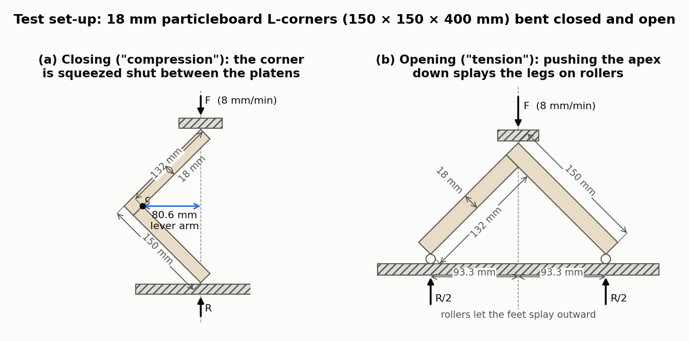
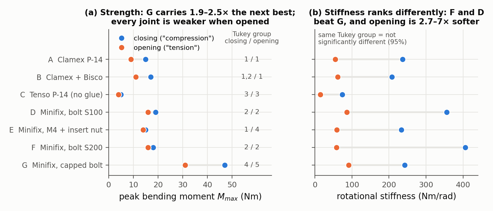
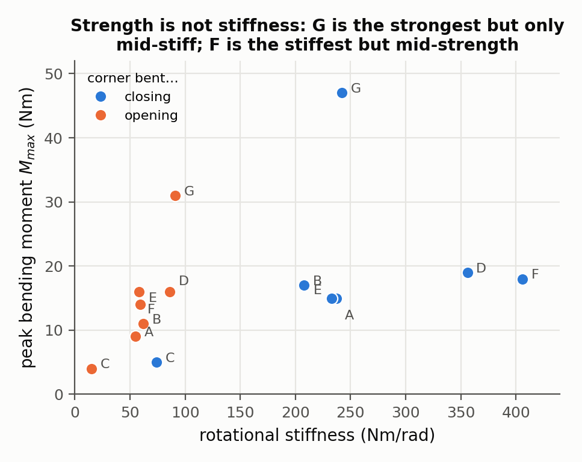

# Comparative Study on Strengths of Ready-to-Assemble and Eccentric Furniture Joint

Nikola Janíková, Adam Kořený, Milan Gaff, Josef Hlavatý — *Materials (MDPI) 18(9), article 2114, 2025*

[Paper](https://pmc.ncbi.nlm.nih.gov/articles/PMC12072453/)

**Stability question:** Structural (plus one Kinematic failure) — measures the peak bending moment and rotational stiffness of seven hardware-based corner joints in particleboard; in one of them the two members separate before the board is damaged.

**Source read:** full text via the PMC HTML (https://pmc.ncbi.nlm.nih.gov/articles/PMC12072453/), including tables and figure images; the PMC PDF (https://pmc.ncbi.nlm.nih.gov/articles/PMC12072453/pdf/materials-18-02114.pdf) returned a bot-check page to scripted fetches.

## TL;DR
The authors built 140 L-shaped corners from 18 mm particleboard. Three joint types used plastic Lamello "ready-to-assemble" (RTA) connectors, and four used Minifix eccentric cam fittings that, per the authors, differ only in the bolt. A universal testing machine bent the corners closed ("compression") and open ("tension"). The cam fitting with a metal-capped bolt (G) carried by far the largest moment (47 Nm closing, 31 Nm opening). The glue-free Tenso P-14 (C) carried the least (5 / 4 Nm) and came apart without damaging the board. The strength and stiffness rankings do not agree.

## The problem
Lamello plastic connectors (Clamex P-14, Tenso P-14) cost more and need special groove milling, but they allow quick assembly, disassembly and repositioning. Eccentric cam joints are cheap and widespread. Earlier studies tested the two families separately with different materials and set-ups, so they could not be compared directly. This study tests both "under identical testing conditions" and checks whether a Bisco P-15 biscuit added mid-joint strengthens Clamex P-14.

## Why it matters
- Manufacturers want to know whether the pricier RTA connectors are stronger. The authors conclude they are not.
- The authors stress that joint strength stays crucial as manufacturers push for faster, cheaper connections.
- The authors propose the data as a reference for validating finite-element models of joints.

## Contributions
1. A side-by-side test of 7 joint configurations (3 RTA, 4 cam) with the same board, geometry, machine and rate: 20 specimens per type, 140 in total.
2. Mean peak bending moment and rotational stiffness in closing and opening angular bending.
3. One-way and two-way ANOVA, plus Tukey HSD grouping of statistically indistinguishable joints.
4. A photo and a description of the damage pattern for each joint type.
5. Practical conclusions: the capped-bolt cam fitting is strongest; the Bisco biscuit adds 13% (closing) and 22% (opening) to Clamex P-14; Tenso P-14 needs adhesive; price does not predict strength.

## Key intuitions
What physically makes one joint stronger. These are mostly the authors' observations; our own interpretations are marked.

1. **A joint is only as strong as the board around its connector.** For most joint types, the damage was in the particleboard around the connector. The plastic Clamex connectors tore through the sheet toward the inside of the L (A, B). In the cam joints, the Euro screw (D, F) or insert nut (E) tended to pull out, and the top chip layer cracked in D and F. Capacity is set by how much surrounding material the connector engages.
2. **Joints that spread the load into more material are stronger.** In G, the bolt head pressed into the board surface, the cam was pushed into the rear member, and the bolt itself bent. Our reading: failure involved the steel bolt and a larger bearing zone, not a local pull-out. The authors conclude that the joint that "connected the two parts of the specimen through the materials themselves" performed best.
3. **A joint that can disengage fails by motion, not by breaking.** The unglued Tenso P-14 (C) separated with no damage to the board, meaning less force was needed to pull the parts apart than to break them. Our generalization: if the geometry lets the parts slide apart, strength is capped however strong the material is.
4. **Closing is stronger than opening (our interpretation of the numbers).** Every joint carried more moment in closing than in opening, and was about 2.7–7× stiffer (for example, D: 19 vs. 16 Nm and 356 vs. 86 Nm/rad). The paper does not explain this. A likely reason is that when the corner closes, the edge of one board presses against the face of the other, adding a contact load path; when it opens, only the fastener holds the joint together.
5. **Strength ≠ stiffness.** G is about 2.5× stronger than D in closing but less stiff (242 vs. 356 Nm/rad). F is the stiffest (406 Nm/rad) but only mid-strength (18 Nm). Our reading: early rotation depends on seating and play, while final capacity depends on the failure mechanism.
6. **An extra connector adds little when failure is local.** Adding a Bisco P-15 in the middle of the 400 mm joint raised the means by 13% and 22%, but A and B share a Tukey group in both tests, so the difference is not statistically significant.

## Technical crux, explained simply
*(For this empirical paper, the "crux" is the test set-up and how to read the results.)*

**Analogy.** Think of the corner where a bookcase side meets its top. Leaning on the top tries to close or open that corner like the spine of a book. The test measures how hard you must twist the corner before the connection gives way, and how much it rotates along the way.

**Specimens.**
- *Material:* 18 mm three-layer particleboard (softwood chips bonded with urea–formaldehyde; EN 312 type P2) with 0.5 mm ABS edge banding glued with PUR adhesive.
- *Geometry:* an L of two 150 mm legs, 400 mm long along the joint, joined at 90°.
- *Manufacture:* Lamello Zeta P2 groove cutter for A–C, Red Jig drilling template with depth stops for D–G.
- *No adhesive anywhere:* the beech dowels were unglued, and Tenso P-14 was used without its recommended glue so it stayed demountable, which the authors say is common practice.

| Type | Connection (from Table 1 and the text) |
|---|---|
| A | 2 × Clamex P-14 (plastic RTA) |
| B | 2 × Clamex P-14 + 1 × Bisco P-15 biscuit in the middle |
| C | 2 × Tenso P-14 (plastic RTA, no glue) |
| D | 2 × Minifix 15 cam + steel bolt S100 (Euro screw) + beech dowel |
| E | 2 × Minifix 15 cam + steel bolt S100 M4 + M4 insert nut + beech dowel |
| F | 2 × Minifix 15 cam + steel bolt S200 (with plastic part, Euro screw) + beech dowel |
| G | 2 × Minifix 15 cam + metal-capped bolt (Euro screw) + beech dowel |

**Loading** (Fig. 4). An Instron 3365 moved at a constant 8 mm/min, and force and displacement were recorded. Figure 1 redraws the two set-ups to scale.

*Figure 1. The two loading cases of the paper's Fig. 4(b), drawn to scale from its dimensions (150 mm outer legs, 18 mm board, 90° corner, legs at 45° to the load axis). Closing: the L lies like a "<" and the ram pushes the two leg ends together. Opening: the L stands as a "Λ" on rollers and the ram pushes the apex down. (our observation) With this geometry the paper's 80.6 mm lever arm is exactly the horizontal distance from the inner corner c to the load line through the leg-end corners ($150\cos45° - 18\sqrt2$), and the 93.3 mm half-spacing is exactly where the lowest foot corners land ($150\cos45° - 18\sin45°$), so $M = F \times 80.6$ mm in closing and $M = (F/2) \times 93.3$ mm in opening is the natural reading, although the paper does not write the conversion out.*

- *Compression:* the L lies like a "<", and the ram pushes the two free ends toward each other. The schematic gives legs of 150 and 132 mm and a lever arm of 80.6 mm.
- *Tension:* the L stands as a "Λ" on sliding plates. Pushing down on the corner splays the legs, so the angle opens. The supports are 93.3 mm either side of the centre.

**What is measured.**
- *Bending moment capacity* $M_{max}$ (Nm): the largest twisting effect at the corner, i.e., force times lever arm. The text gives no conversion formula; the lever arms appear only in the schematic.
- *Stiffness* (Nm/rad): how much moment it takes to rotate the corner by one radian, i.e., how steeply the moment–rotation curve rises. The text does not say which part of the curve was used.

**Reading the statistics.** A one-way ANOVA asks whether all seven means could be equal up to scatter. No: F = 444.23 in compression and 270.21 in tension, against a critical value of 2.25. Tukey's HSD test then sorts the joints into "homogeneity groups". Joints in the same group are *not* significantly different at 95% confidence. In compression, for example, A (15), E (15) and B (17) form one group, and B, F (18) and D (19) form another. C and G each stand alone.

**Results** (Tables 2, 3, 6, 9). Each cell has N = 10 specimens (9 for F in compression). Means are given to whole Nm.

| Type | Closing $M_{max}$ (Nm) | Closing stiffness (Nm/rad) | Opening $M_{max}$ (Nm) | Opening stiffness (Nm/rad) | Tukey group (closing / opening) |
|---|---|---|---|---|---|
| A | 15 | 237 | 9 | 55 | 1 / 1 |
| B | 17 | 208 | 11 | 62 | 1, 2 / 1 |
| C | 5 | 74 | 4 | 15 | 3 / 3 |
| D | 19 | 356 | 16 | 86 | 2 / 2 |
| E | 15 | 233 | 14 | 59 | 1 / 4 |
| F | 18 | 406 | 16 | 58 | 2 / 2 |
| G | **47** | 242 | **31** | 91 | 4 / 5 |

The abstract's headline claims are consistent with these means. It says G is 147% above "a standard eccentric joint with a euro screw bolt" (47/19 for D) and 213% above the Clamex P-14 joint (47/15 for A) in closing. Damage was mostly board tear-out for A and B, no board damage and separation for C, Euro screw pull-out with cracking of the top layer for D and F, insert-nut pull-out with little damage for E, and bolt-head crushing, cam push-in and bent bolt for G.

*Figure 2. Means from Tables 2 and 3 (N = 10 per cell, 9 for F closing) with the Tukey HSD homogeneity groups of Tables 6 and 9; joints sharing a group number are not significantly different at 95%. (a) Peak bending moment: G (capped bolt) is in a group of its own in both directions, C (unglued Tenso) is alone at the bottom, and A, B and E are indistinguishable in closing. (b) Rotational stiffness: F and D are the stiffest although only mid-strength, and every joint is 2.7–7× softer in opening than in closing (ratios are our computation from the table means).*

## What the results do well
- **Controlled comparison.** Board, geometry, machine and rate are fixed, with 10 replicates per test, so differences can be attributed to the joint.
- **Both loading directions.** Closing and opening are both measured, revealing a consistent asymmetry.
- **Strength and stiffness reported separately,** which shows that their rankings differ.
- **Tukey grouping** prevents over-reading small gaps (A vs. B vs. E).
- **Documented failure modes** link the numbers to mechanisms.
- **A clear practical finding:** the pricier plastic connectors were not stronger.

*Figure 3. (our observation) The same means plotted against each other: strength does not follow stiffness. In closing, G carries 2.5× the moment of D at two-thirds of D's stiffness, and F is the stiffest joint but only mid-strength; in opening, every joint but G clusters at 4–16 Nm and 15–91 Nm/rad. Data from Tables 2 and 3.*

## Limitations
**Stated by the authors:**
- Only one board material and a limited set of joints. They propose plywood, solid wood and MDF next.
- Only monotonic static loading. Cyclic and environmental loading are left for future work.
- The cost–performance trade-off was not analysed.
- Tenso P-14 was tested without its recommended adhesive, which contributed to its poor result.
- The data are available only on request.

**Our observations:**
- (our observation) The tables give means rounded to 1 Nm and a "Variance (%)" column that is not defined; standard deviations appear only as error bars in the figures.
- (our observation) Neither the force-to-moment conversion nor the stiffness computation (curve segment, how rotation was measured) is written out.
- (our observation) There are reporting slips:
  - One-way ANOVA p-values are printed as "5.74" and "5.64", apparently with the exponent lost.
  - The text gives the A–B compression difference as 16%, while the abstract says 13%.
  - The tension Tukey text says "four groups", but Table 9 has five and the text leaves E out of the single-joint groups.
  - The two-way ANOVA factor "Columns" is never defined.
  - The Fig. 7 axis is labelled rad/Nm while the tables use Nm/rad.
- (our observation) In the representative closing curves (Fig. 5), G's moment is still rising where its curve ends, at about 23 mm displacement, while the others level off. G's $M_{max}$ may reflect where the test stopped rather than a true peak; the text does not say.
- (our observation) Comparisons with prior studies mix specimen sizes and materials, and mechanisms are described but not quantified: nothing (bearing area, withdrawal force) explains *why* G is stronger.

## Relevance to joint stability in this repo
- **What empirical testing offers.** Realistic magnitudes and, above all, *failure modes*. Capacity was usually limited by material right around the connection, and one joint (C) failed by disengaging before anything broke. A computational stability study of MiGumi joints therefore needs both a kinematic check (can the parts separate?) and a structural check (does material near the contact faces fail first?). The closing/opening asymmetry means scores should depend on load direction, which a single scalar like $\lambda_1$ in [liu2022-worst-case-rigidity.md](liu2022-worst-case-rigidity.md) hides. The strength/stiffness divergence warns against treating stiffness as a stand-in for capacity.
- **A validation template.** If dataset joints are milled, this protocol can check simulations: an L-corner bent closed and open, fixed lever arms, 10 or more replicates, ANOVA with Tukey grouping.
- **What it does not offer.** Every joint here relies on hardware (plastic clips, bolts, cams, loose dowels) in particleboard, which has no grain. Integral joints such as `CJ_DT` or `CJ_AKT` carry load through friction and wood-on-wood contact in anisotropic solid wood. Their likely failures (splitting along the grain, short-grain shear, crushing across the grain) differ from screw pull-out in chipboard (general wood mechanics, not from this paper). No geometric parameters are varied, so nothing maps onto LHF quantities such as cut depth or sketch shape.
- **Evidence strength.** Only per-type means are published (raw data on request): enough for qualitative guidance, not for calibrating a model.
