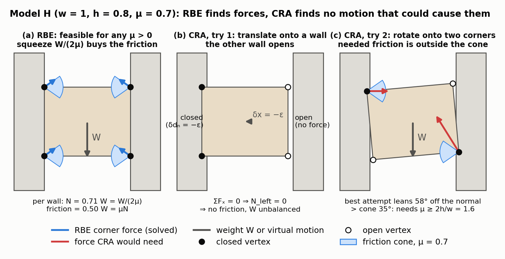
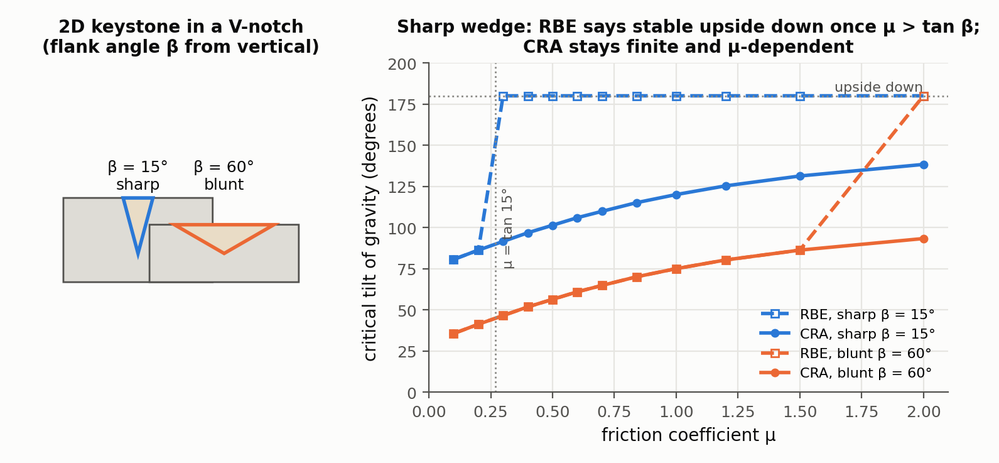
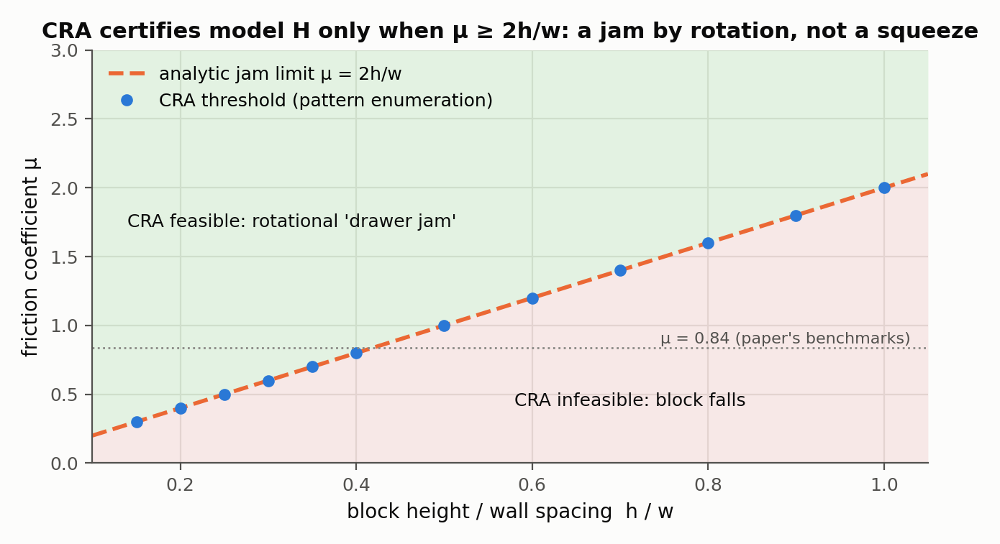
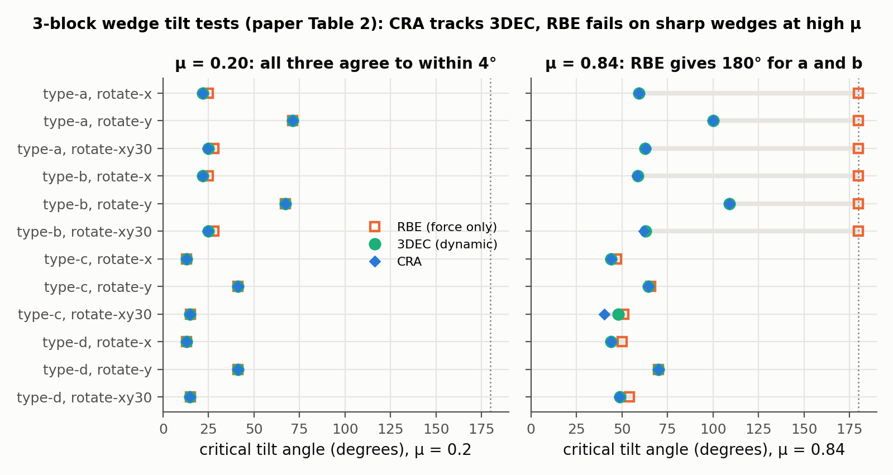

# Coupled Rigid-Block Analysis: Stability-Aware Design of Complex Discrete-Element Assemblies

Gene Ting-Chun Kao, Antonino Iannuzzo, Bernhard Thomaszewski, Stelian Coros, Tom Van Mele, Philippe Block — *Computer-Aided Design 146, 103216, 2022*

[Paper](https://doi.org/10.1016/j.cad.2022.103216) · [Code](https://github.com/BlockResearchGroup/compas_cra)

**Stability question:** Static + Kinematic — equilibrium forces are accepted only if a compatible infinitesimal rigid-body motion could produce them (push only where a contact closes, friction only against the slip), so "does it hold?" and "how would it move?" are answered together.

**Source read:** full text (https://crl.ethz.ch/papers/CRApreprint.pdf, the typeset open-access article, 20 pages; Table 1 is an image and was read from the rendered page).

## TL;DR
The rigid-block equilibrium (RBE) method of [Whiting 2009](whiting2009-structurally-sound-masonry.md)/[2012](whiting2012-structural-optimization-masonry.md) calls an assembly stable if *some* set of compressive, friction-bounded forces balances the loads. With non-planar interfaces (wedges, grooves, concave joints), that test certifies blocks that plainly fall. CRA adds a virtual rigid-body displacement for every block and requires each contact force to be consistent with it. The resulting nonlinear program matches tilt-test limits from the engineering codes 3DEC and Sofistik on wedge, concave and curved-interface benchmarks. It also keeps RBE's penalty form, so it still shows where an unstable design needs help.

## The problem
RBE is "a purely force-based formulation, and it incorrectly describes stability when complex interface geometries are involved"; finding equilibrium forces is necessary but not sufficient for stability. The alternatives fall short: standard FEM is inaccurate when contacts can only push, discrete-element codes such as 3DEC need parameter tuning, long runs and convex decomposition of concave blocks, and the variational static analysis of [Yao et al. 2017](yao2017-decorative-joinery.md) is, in this paper's words, over-conservative. The goal is a fast, tuning-free static method that stays correct for complex interfaces.

## Why it matters
Digital fabrication makes blocks with complex interfaces cheap, for scaffold-free structures, furniture, puzzles and robotic assembly. When RBE fails, "it falsely claims a non-prestressed and unstable structure is safe", which is the dangerous kind of error. RBE also underlies later shape optimization: Kao et al. describe [Wang et al. 2019](wang2019-topological-interlocking.md) and [MOCCA](wang2021-mocca.md) as building on RBE analysis without friction.

## Contributions
1. A diagnosis of RBE's failure using three minimal 2D examples: a block between walls ("model H"), a wedge that should fall out ("model A"), and a tilted wedge.
2. **CRA**: equilibrium coupled with infinitesimal rigid-body kinematics through two nonlinear constraints: normal force complementary to contact opening (with a tiny overlap $\varepsilon$), and friction aligned against virtual sliding.
3. A penalty version that locates and quantifies unstable regions.
4. An extended COMPAS assembly graph storing non-planar interfaces as planar sub-interfaces, without convex decomposition.
5. Benchmarks against analytic results, 3DEC, Sofistik and an in-house RBE, plus an interactive design workflow, the 399-block Armadillo Vault, and 3D-printed models.

## Key intuitions
1. **Rigid plus force-only means free squeeze.** A rigid contact can carry any compressive force without moving. When two contacts can press on a block from opposite sides, an equal-and-opposite "squeeze" can be added to any solution at no cost, and it raises the friction limits. RBE never asks where that squeeze comes from.
2. **Forces must be caused by a motion.** Real contact forces appear because blocks try to move: pushes where they try to close in, friction against the direction they try to slip. Requiring one virtual motion per block that explains *all* its forces removes squeezes that no rigid motion could create.
3. **The kinematics comes for free.** Relative displacements at contact vertices are $A_{eq}^\top$ times the block motions (virtual-work duality), so no new geometry code is needed.
4. **A tiny overlap makes "force only if in contact" solvable.** Allow interpenetration up to $\varepsilon$ and permit force only where it is reached; bound motions by $\eta$ to stay near the given configuration.

## Technical crux, explained simply
**Analogy.** Hold a book between your palms and squeeze: friction keeps it up. Now replace your palms with two bookends that merely *touch* the book. On paper, "two equal pushes plus friction" still balances the weight, but nothing is squeezing, and the book drops. A force-only check can't tell these two situations apart. Asking "which way would the book move, and would that motion press it into the bookends?" can.

The paper's two minimal examples are model H, a block between two fixed parallel walls, and model A, a block between walls that lean in at the top, so that sliding down opens both contacts. Figure 1 sets model H up in numbers.

**Model H in numbers (2D).** Take a block of weight $W$ with friction coefficient $\mu$. The unknowns are normal forces $N_L, N_R \ge 0$ and friction forces $F_L, F_R$.
- Horizontal balance: $N_L = N_R$. Vertical balance: $F_L + F_R = W$. Friction limits: $|F_L| \le \mu N_L$ and $|F_R| \le \mu N_R$.
- Choose $N_L = N_R = W/(2\mu)$ and $F_L = F_R = W/2$. Every equation holds for **any** $\mu > 0$ and any $W$, so RBE says "stable". In the paper's Table 1, both Shin et al.'s RBE and the authors' own implementation say *Stable*, while the analytic answer, VSA, 3DEC and CRA say *Unstable*.

*Figure 1. Model H in 2D (block w = 1, h = 0.8 between two fixed walls, μ = 0.7), our computation (our observation). (a) The RBE program (Eq. 7) returns corner forces that balance W: each wall squeezes with N = W/(2μ) and every corner force sits exactly on its friction cone. (b, c) CRA (Eq. 11) must explain every force by one virtual rigid motion that closes the contacts by ε. A translation closes only one wall, so horizontal balance kills that wall's normal force and with it the friction. A rotation closes two opposite corners, but the force that would then carry W leans 58° off the normal, outside the 35° cone. We decided CRA feasibility by enumerating every closed-vertex/slip-sign pattern as a linear program, so "no compatible motion" is exact for this model rather than a local-solver result.*

**Why exactly this goes wrong.** Set $W = 0$: then $N_L = N_R = \sigma$, with zero friction, satisfies all the equations for any $\sigma \ge 0$. That is a **self-balanced compressive state**: a squeeze with no load behind it. Because the structure is statically indeterminate (6 equations per block, 3 unknowns per contact vertex), such a state can be added to any solution to buy friction. Physically it needs *prestress*, such as a gripper clamping the block. Our framing, not the paper's: a squeeze needs contacts pressing against each other from opposite sides. A block on a single flat bed joint has all its contact normals pointing the same way and cannot be squeezed; the risk appears wherever a part is held between opposing faces, which is exactly what wedges, grooves, concave joints and tenon-in-mortise shapes create. A squeeze only misleads when friction is what holds the part: the authors confirm RBE is theoretically correct for their benchmark arch, where no interface reaches its friction limit and failure involves no sliding.

**Model A.** A block sits between fixed faces that lean inward at the top. Its only possible motion is straight down, and that opens both contacts, so the correct contact forces are all zero. RBE still finds pushes pointing downward-inward plus upward friction, placed exactly at contacts that would separate. The paper's tilted-wedge example (Fig. 4) makes the same point: an RBE solution carries force at a vertex where the block's motion would lift off. In the benchmarks, for the sharp V-wedges (Table 2, types a and b) at $\mu = 0.84$, RBE reports a critical tilt of 180°, meaning stable even upside down, while 3DEC and CRA give 58–109°.

*Figure 2. A 2D analogue of the wedge benchmarks (Table 2) and of model A, our computation (our observation): a triangular keystone with flank angle β sits in a matching V-notch, and gravity is rotated until each program becomes infeasible (bisection to 0.35°). For the sharp wedge (β = 15°) RBE reports 180°, stable upside down, which is exactly model A, as soon as μ > tan β = 0.27, because the two opposing flank normals can squeeze. CRA gives 90° + arctan μ − β, the limit for sliding along a single flank, which keeps rising with μ. For the blunt wedge (β = 60°) the two methods agree until μ exceeds tan 60° = 1.73, where RBE again jumps to 180°. On a flat contact the two programs agree exactly (checked in the script).*

**What CRA adds.** Each block $k$ gets a virtual motion $\delta q_k \in \mathbb{R}^6$ (3 translations and 3 rotations). The relative displacement at every contact vertex is $\delta d = A_{eq}^\top \delta q$, split into an opening component $\delta d_n$ and a sliding component $\delta d_t$. On top of RBE's equilibrium $A_{eq} f = -p$ ($p$ = external loads) and the linearized friction cone $A_{fr} f \le 0$, CRA requires:

$$f_n\,(\delta d_n + \varepsilon) = 0,\quad f_n \ge 0,\quad \delta d_n + \varepsilon \ge 0 \qquad \text{(push only where closed by exactly } \varepsilon\text{)}$$
$$f_t = -\alpha\,\delta d_t,\quad \alpha \ge 0 \qquad \text{(friction opposite the slip; no slip, no friction)}$$
$$|\delta d| \le \eta,$$

and minimizes $\lVert f_n\rVert^2 + \lVert\alpha\rVert^2$. Here $\varepsilon$ is $10^{-5}$–$10^{-4}$ of the block size and $\eta$ is $10^{-3}$–$10^{-2}$ of it. **If this program has no solution, the assembly is unstable.** The paper's reasoning for model H: a rigid block cannot overlap both walls at once, so at most one wall pushes. Horizontal balance then forces that push to zero too, leaving no friction to hold the weight, and CRA reports the block unstable (Table 1). See our observation on rotations below. The paper also shows (Appendix C) that the constraints imply $p^\top \delta q \ge 0$: the virtual motion is one on which the loads do non-negative work.

*Figure 3. (our observation) When CRA does certify model H: the rotational "drawer jam" of Figure 1(c) becomes feasible once μ ≥ 2h/w. Dots are the smallest feasible μ found by bisection on our exact pattern enumeration of Eq. 11; the dashed line is the closed-form condition from moment balance (the corner carrying the weight needs F = W with N ≤ (w/2h)·W). For any block at least half as tall as the gap this needs μ ≥ 1, so the paper's "Unstable" verdict for model H holds at realistic friction; thin, wide parts between opposing faces are the exception. RBE is feasible everywhere in this plane.*

**Penalty version.** Write $f_n = f_n^+ - f_n^-$ and add $f_n^+ f_n^- = 0$. The contact rule uses $f_n^+$, so tension gets no friction. Minimize $\lVert f_n^+\rVert^2 + \gamma\lVert f_n^-\rVert^2 + \lVert\alpha\rVert^2$ with a large weight $\gamma$. The design workflow runs the plain CRA program first and, if it is infeasible, runs the penalty version to show which interfaces need extra force.

**Implementation.** Python with Pyomo and the IPOPT solver, on COMPAS; timings below are from a MacBook Pro (6-core i9, 16 GB).

## What the results do well
- **Classic cases agree.** For the thick arch (t/r = 0.150, 36 free blocks) and a 3-legged π frame, CRA gives 8.2° and 19.5° respectively, matching 3DEC on both and the analytic 8.2° for the arch. Shin et al.'s physical experiments gave lower values (4.7° and 14.3°), which the authors attribute to imperfections in small-scale models.
- **Wedges (3 blocks, μ = 0.2 and 0.84).** CRA matches 3DEC to within 1.1° in 23 of 24 tilt tests, while RBE reports 180° for the sharp wedges at μ = 0.84. The exception is type-c at μ = 0.84 about the (√3, 1, 0) axis (3DEC 48.1°, CRA 40.2°): in 3DEC the block slides slightly and settles between 40° and 48°, and CRA run on that settled geometry gives the same result.

  
  *Figure 4. Critical tilt angles for the four 3-block wedge models about three axes, from the paper's Table 2. At μ = 0.20 the three methods agree to within about 3°; at μ = 0.84 RBE returns 180° for every test on the sharp wedges (types a, b), while CRA stays within 1.1° of 3DEC except for type-c about the (√3, 1, 0) axis (40.2° vs 48.1°).*
- **Concave two-block joints (μ = 0.84 / 0.10).** Short joint: 3DEC 40°/5°, CRA 40°/5°. Long joint: 3DEC 56°/10°, CRA 54°/9°.
- **Curved interfaces.** On the two-block curved "cube" joints, RBE reports 180° in every test. CRA mostly lands within a few degrees of 3DEC and Sofistik; the largest gap is 51° against 59° (3DEC) and 58° (Sofistik), where CRA is more conservative.
- **Shelf example (from Yao et al.).** RBE calls it stable. CRA finds it infeasible, and the penalty version identifies the two unstable pieces and the extra force each needs. For one piece, the authors show three fixes: add a support, or reshape its lower or upper interface.
- **Speed.** Most benchmarks solve in 0.05–2.38 s (for example, 2 blocks with 72 sub-interfaces take about 1.1 s). The Armadillo Vault (399 blocks, 1014 interfaces) takes 2424.44 s and is correctly found stable.
- **Physical models.** A 3-piece cantilevered "snake" (μ = 0.66) and a bridge (11 blocks in the analysis model, 40 cm span) were assembled without scaffolding. The bridge (319 g) carried 1208 g of extra load, and CRA predicted it could not be built scaffold-free with friction below 0.35.

## Limitations
Stated by the authors:
- The problem is a nonconvex nonlinear program with no guarantee of global convergence, and different starting points can reach different local optima. Speed-ups are left to future work.
- Only the initial configuration is checked, which makes CRA slightly conservative when small settling would reach a new equilibrium. A sequence of small-displacement steps is proposed as future work.
- Interfaces must be split into sub-interfaces, manually or by auto-triangulation.
- Physical models are sensitive to tolerances and friction: the snake's head moved slightly, and the bridge needed sandpaper because the printing material's friction is around 0.3. For conservative results the authors suggest a lower friction value or reduced interfaces.
- By design (Section 2.2), equilibria that would need prestress are treated as physically unrealisable.

Our observations:
- (our observation) Feasibility asks whether *some* virtual motion exists, and rotations count. Enumerating every contact pattern of a 2D model H (Figure 3) settles this: CRA does admit a "jammed-drawer" equilibrium, a small rotation that presses opposite corners into the two walls while the block slips down, exactly when $\mu \ge 2h/w$ ($h$ = block height along the walls, $w$ = wall spacing). For a block at least half as tall as the gap that needs $\mu \ge 1$, so the paper's "Unstable" verdict for model H stands at any realistic friction. A thin, wide part between opposing faces is different: CRA can certify it stable through this jam, and whether the jam is physically real depends on clearances the rigid model ignores, which matters for tight-fitting joints. (This is our 2D pattern enumeration, not the authors' IPOPT code.)
- (our observation) Answers depend strongly on $\mu$ (type-a wedge about x: 21.8° at μ = 0.2 vs 59.2° at μ = 0.84), so any use needs a defensible friction value.
- (our observation) RBE results aren't reported for the concave-joint benchmark (Table 3), and there is no study of how sensitive results are to $\varepsilon$ or $\eta$.

## Relevance to joint stability in this repo
- **Most directly usable of the three papers.** A 2-part joint maps to one support plus one free block, and CRA's boundary conditions select supports exactly this way (the paper uses it for local stability). Tilt tests about several axes give a physically meaningful per-joint label ("critical tilt angle vs. axis"), and 2-block runs take about a second, so sweeping the dataset's 2-part joints is cheap. `compas_cra` is pip-installable.
- **Geometry fit.** LHF cut faces are planar polygons, so contact interfaces can be computed as face-face overlaps and passed in as sub-interfaces. Curved sketch segments, such as milling fillets, need faceting first. Dovetail-style flanks are the kind of wedge-shaped, opposing-contact interface where the paper shows RBE failing and CRA matching 3DEC, so don't rely on plain RBE for these joints.
- **It bridges the kinematic and static questions.** $\delta q$ is an infinitesimal motion of the free part, the same object kinematic interlocking analysis reasons about. CRA says whether the loads can be carried by forces that some such motion would actually activate.
- **What won't transfer:** press-fit, wedged-in or pegged joints, where prestress is the mechanism; CRA rules prestress out unless it is modeled as a load. Also out of scope: wood crushing, tenon bending and grain effects (the structural question), and the jamming ambiguity noted above for zero-clearance fits.
