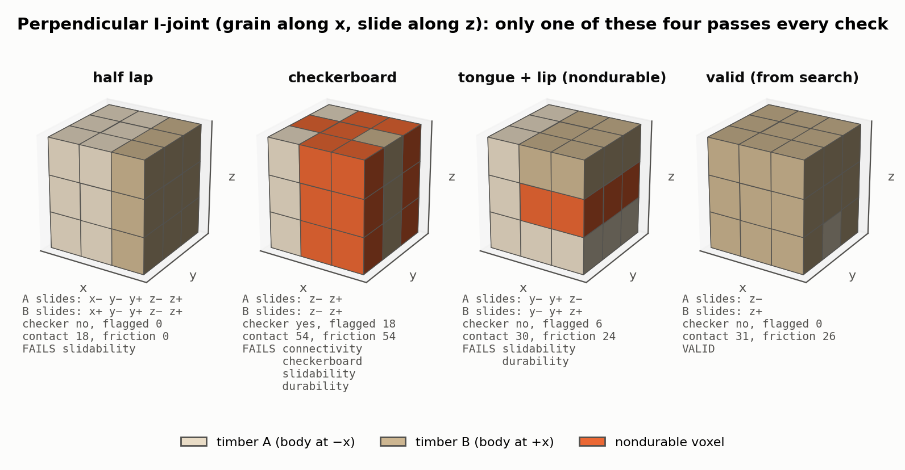
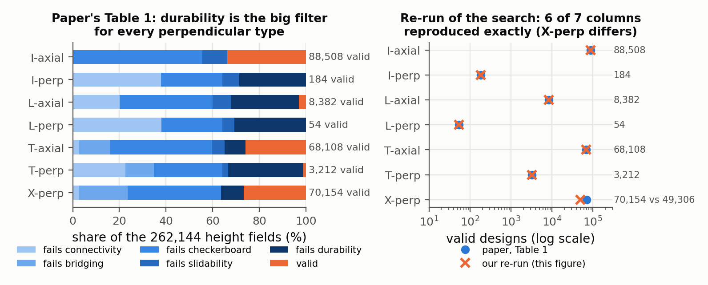
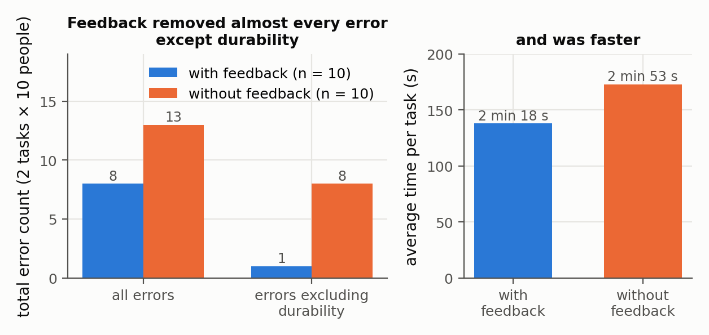

# Tsugite: Interactive Design and Fabrication of Wood Joints

Maria Larsson, Hironori Yoshida, Nobuyuki Umetani, Takeo Igarashi — *UIST 2020 (ACM Symposium on User Interface Software and Technology)*

[Paper](https://www.ma-la.com/tsugite/Tsugite_UIST20.pdf) · [Code](https://github.com/marialarsson/tsugite)

**Stability question:** Kinematic, Structural (heuristic) — kinematic through a per-direction voxel-column slidability test; structural through a binary rule based on grain (fiber) direction. Static stability appears only as proxies: contact and friction *area*, not forces.

**Source read:** full text (https://www.ma-la.com/tsugite/Tsugite_UIST20.pdf, 11 pages). Slidability, durability and milling-direction checks were cross-checked against the released code (`setup/Evaluation.py`); details taken from the code are marked as such.

## TL;DR
Tsugite designs joints between rectangular timbers on a coarse voxel grid (3×3×3 by default), with every timber a height field along one shared sliding axis. Eight cheap metrics (connectivity, bridging, milling direction, checkerboard, slidability, durability, contact area, friction area) update in real time and drive suggestions and a precomputed gallery. A path planner rounds outer corners so 3-axis CNC-milled parts fit.

## The problem
Joints are hard to design and slow to cut by hand. A 3-axis CNC has two constraints: a cylindrical bit can't cut sharp inside corners parallel to the bit, and it reaches the wood only from above. Milled independently, one timber's rounded inside corners collide with its mate's sharp outside corners, and the joint won't assemble. Earlier voxel-based interlocking methods ([song2012-recursive-interlocking-puzzles.md](song2012-recursive-interlocking-puzzles.md), [fu2015-interlocking-furniture-assembly.md](fu2015-interlocking-furniture-assembly.md), [song2017-reconfigurable-interlocking-furniture.md](song2017-reconfigurable-interlocking-furniture.md), [wang2018-desia.md](wang2018-desia.md)) ignore CNC constraints and grain direction, and have no interface.

## Why it matters
Tsugite shows that a small, discrete joint space can be searched exhaustively under fabrication and grain constraints. For example, all 262,144 two-timber designs at 3×3×3 were enumerated in 30 min. It also states a basic fact linking fabrication and motion: whatever a 3-axis mill can carve from one side can also be pulled out toward that side.

## Contributions
1. A height-field voxel representation (sliding axis = milling axis) for 2–6 timbers, resolutions 2–5, angled intersections and non-square sections.
2. Eight metrics (six binary validity checks, two ranking scores) with live feedback, one-edit suggestions and a gallery.
3. Exhaustive failure-mode statistics for the seven 2-timber joint types.
4. CNC path planning with selective outer-corner rounding, and a ban on checkerboard patterns.
5. A 20-person user study and fabricated furniture and samples.

## Key intuitions
1. **Milled from one side ⇒ height field ⇒ slides out that way.** Every timber is a height field along the milling axis, so it can always slide along that axis. A Tsugite joint therefore always has two movable pieces (the first and the last) and never interlocks on its own. Interlocking has to come from how joints are arranged in the whole structure.
2. **Height fields make exhaustive search possible.** Two timbers in a 3×3×3 grid have $2^{27} = 134{,}217{,}728$ voxel assignments but only $4^9 = 262{,}144$ height fields (9 columns, each of height 0–3).
3. **Wood splits along the grain.** The paper cites fiber-direction strength as 10–20× the cross-fiber strength. A chunk attached to its timber only across a plane parallel to the fibers has no continuous fibers into the body, so it tends to break off. That is a purely topological test.
4. **Round the outside corners, not the inside ones.** Over-cutting inside corners would leave air pockets. Rounding the mating outside corners doesn't, and it keeps more friction area and strength.

## Technical crux, explained simply

**Analogy.** Picture a 3×3×3 cube made of 27 small blocks, each painted with the ID of the timber it belongs to. With sliding axis *z*, look straight down: each of the 9 vertical columns holds timber A up to some height and timber B above that, like a city skyline. Those 9 heights describe the whole 2-timber joint.

**Tiny example (Figure 1): four perpendicular I-joints on the default 3×3×3 grid, grain running along x, sliding axis z, timber A's body extending to −x and B's to +x.**

*Figure 1. Our re-implementation of Tsugite's validity metrics (following `setup/Evaluation.py`) run on four concrete perpendicular I-joints. Each panel prints the free sliding directions of both timbers, whether a checkerboard vertex exists, how many voxels the durability rule flags (orange), and the contact and friction face counts. Only the fourth design — taken from the exhaustive search — passes all of them; the half lap leaves five free directions for each timber and fails slidability.*

- **Slidability** (paper). Test each of the 6 axis directions separately. For each timber, walk every voxel column in that direction. If the timber's ID is ever followed later by a *different* timber's ID, the timber is blocked that way. In Figure 1's half lap, neither timber ever has the other's material in front of it along y or z, so five of the six directions stay free for each and the design is rejected; in the valid design only z− is free for A and z+ for B. *Released code:* before testing, each fixed side is padded with one layer of its own timber's ID, so the timber bodies take part in the test. A design passes if the end timbers have at most 1 free direction and middle timbers have none.
- **Durability** (paper). A timber is nondurable if some plane parallel to the fiber axis splits it into two connected pieces, one touching a fixed side (the timber body) and one not. In Figure 1's third design, a grain-parallel plane cuts a lip loose from its timber's body, so its 6 voxels are flagged (orange in Figure 1; yellow in the paper's interface). The paper notes that such a group is more fragile the further it sticks out and the smaller its attachment area, but the metric itself is binary. The authors say it is not a substitute for finite-element analysis (FEA). *Released code:* the check runs layer by layer in planes containing the grain axis. Within a layer, it finds regions of the timber that don't reach a fixed side, and flags each one unless non-flagged material of the same timber anchors it in the neighbouring layers on both sides. It is skipped when the grain axis equals the sliding axis. That makes sense: every voxel then sits on an unbroken column of fibers running into the body (our reading).
- **Fabricability** comes in three parts:
  1. *Direction.* Each timber must be millable from a single side, which the height-field data structure guarantees for 2 timbers. With 3 or more timbers, a middle timber must be millable from the top or from the bottom along the sliding axis. It fails if it needs both. *Released code:* walking the column from one side, once the timber's material starts, nothing else may follow.
  2. *Inside corners.* The planner rounds an outer corner only where it sits in the inside corner of a mating timber, i.e. where the two adjacent void cells belong to the same timber. Otherwise the corner stays sharp. The fillet radius equals the bit radius.
  3. *Checkerboard ban.* At every interior vertex, look at the four cells around it in the plane perpendicular to the milling axis. A pattern like `1 0 / 0 1` (both diagonals matching) is forbidden: without rounding the parts can't assemble, rounding one side leaves a gap narrower than the bit, and widening the gap adds rules and removes a lot of material. A pattern like `1 0 / 0 2` only looks like a checkerboard and is allowed.
- **Connectivity and bridging.** A flood fill from the fixed sides must reach every voxel of the timber. For a timber with two fixed sides (a joint mid-timber), a flood fill from one side must reach the other.
- **Contact area.** The total area of a timber's faces that touch other timbers. **Friction area:** only those faces that are *not* perpendicular to any of the timber's free sliding directions, i.e. faces that rub while the timber slides. For ranking, the joint's score is the minimum over its slidable timbers ("a chain is not stronger than its weakest link"). The authors stress that this measures area, not force.

The first six metrics decide validity; the two areas only rank valid designs. Suggestions are up to four valid designs one edit away, computed in real time; the gallery is precomputed up to 3×3×3.

## What the results do well
- **Exhaustive 2-timber statistics** (all 262,144 height fields; failure modes removed in order, top to bottom):

| type | connectivity | bridging | checkerboard | slidability | durability | valid |
|---|---|---|---|---|---|---|
| I-axial | 0 | 0 | 145,608 | 28,028 | 0 | 88,508 |
| I-perp | 99,152 | 0 | 68,822 | 19,114 | 74,872 | 184 |
| L-axial | 52,884 | 0 | 104,020 | 20,500 | 76,358 | 8,382 |
| L-perp | 99,690 | 0 | 68,390 | 13,506 | 80,504 | 54 |
| T-axial | 7,083 | 35,146 | 114,494 | 13,691 | 23,622 | 68,108 |
| T-perp | 59,046 | 31,864 | 76,986 | 6,870 | 84,166 | 3,212 |
| X-perp | 7,083 | 54,829 | 104,864 | 0 | 25,214 | 70,154 |

  The milling-direction check removed 0 designs for every type. Durability removes many designs for every type except I-axial. The authors had expected all perpendicular I- and L-joints to fail it, but the search found a few that pass.

  
  *Figure 2. Left: the table above as shares of the 262,144 height fields, in the order the paper removes failures — durability (dark blue) is the dominant filter for every perpendicular type, leaving I-perp and L-perp with almost nothing. Right: we re-ran the full enumeration with our own implementation of the five checks (our computation); 6 of the 7 types reproduce the paper's whole column exactly, and only X-perp differs (49,306 valid instead of 70,154), so one of the two implementations reads that configuration's fixed sides differently.*
- **3-timber joints** (3×3×3): 1,000,000+ (search stopped), 40,452 and 913 valid designs for three configurations. No valid 5- or 6-timber joints exist at the default resolution. Search took 30 min per 2-timber type and 3–9 h per 3–6-timber joint.
- **User study** with an earlier version (20 participants, 10 per condition). With feedback: average time 2 min 18 s, 8 errors (1 excluding durability). Without: 2 min 53 s, 13 errors (8 excluding durability). Every participant preferred having feedback. Six asked for a physical simulation of strength.

  
  *Figure 3. The user study numbers (the paper's Table 3). Live feedback cut errors from 13 to 8 overall, but once durability errors are excluded it cut them from 8 to 1 — feedback removed nearly every error it could point at, and durability is the one people still got wrong. Average task time fell from 2 min 53 s to 2 min 18 s. Note n = 10 per group and no statistical test is reported.*
- **Fabrication:** a chair of 12 timbers with nine joints "held together by friction only", stable enough to sit on; a 10-timber table with 14 joints; samples of all 7 two-timber types. Milling took 12–25 min per timber.

## Limitations
*Stated by the authors:*
- Single joints only; one shared sliding axis; frames, not plates; gallery limited to 3×3×3; interlocking global arrangement not automated.
- Voxels can't make angled faces, so the dovetail is out of reach.
- The durability metric is lightweight feedback, not a faithful strength evaluation. Friction area isn't friction force. Structural topology optimization is hard because FEA is expensive and unreliable when contacts change with small edits.
- Real joints also depend on moisture-driven deformation and growth-ring density, which no current model captures.

*Our observations:*
- **Slidability** considers only the 6 axis-aligned translations, not rotations, diagonal translations or multi-step motions.
- **Durability** ignores load direction and size, and its result depends on grid resolution (a 1-voxel ledge at 3×3×3 is a large chunk of the timber).
- **Friction.** The chair holds together by friction, which depends on how tight the fit is, and the model has no notion of preload or tolerance. The paper handles fit only in fabrication practice (entering a slightly smaller width than the real stock to absorb origin-setting error, then sanding the sides), not in the metrics.
- **User study.** The error difference (8 vs 13, n=10 per group) is reported without a statistical test.

## Relevance to joint stability in this repo
- **The slidability test transfers directly** as a cheap kinematic check. Voxelize both parts of a 2-part LHF joint in a shared grid (plus a padding layer standing in for each member's body, as the code does). Then run the column test along candidate directions: the stock axes plus each cut's normal ±n. This gives the set of free translations and flags joints that can come apart in unwanted directions.
- **Height field ⇒ slidable** (our observation, adapted). If every cut on a part shares one normal and opens to the outside, the part is a height field along that normal, and its mate can slide along it, subject to where the mate's body attaches. Blocking in other directions has to come from cuts along different normals or from a third part, such as the key in `CJ_AKT`. Since a 2-part joint always keeps some free motion (see [yao2017-decorative-joinery.md](yao2017-decorative-joinery.md)), the design question is which direction stays free relative to the loads.
- **The durability rule is a cheap structural screen for LHF parts,** but it needs a grain axis for each stock. MiGumi's paper doesn't model grain ([ganeshan2025-migumi.md](ganeshan2025-migumi.md)), so a grain axis would have to be assumed, e.g. along the stock's long axis. A continuous version could measure cross-grain attachment area instead of returning a binary flag.
- **What doesn't transfer:** the voxel grid itself (LHF sketches are continuous and include angled faces such as dovetails), the single shared sliding axis, and the CNC path planner, which MiGumi's representation replaces. Contact and friction *area* are fine for ranking, but they are not an equilibrium check. Use force-based analysis for that.
