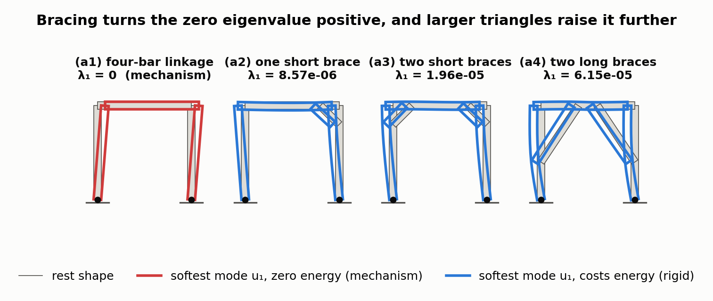
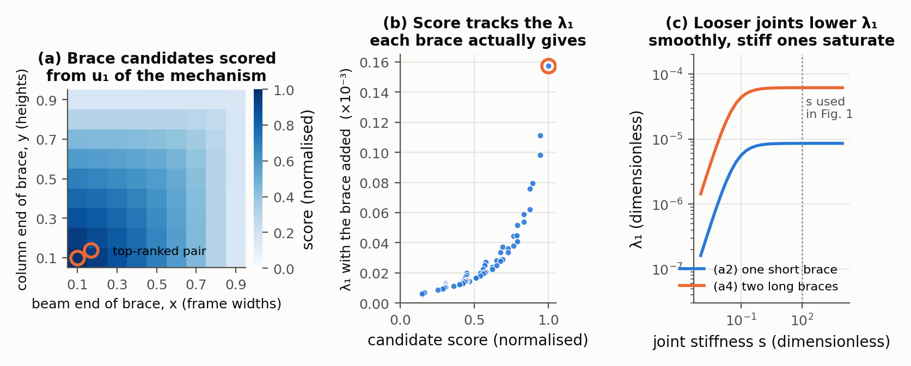
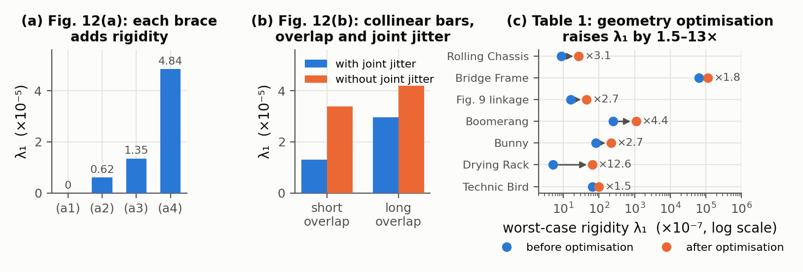

# Worst-Case Rigidity Analysis and Optimization for Assemblies with Mechanical Joints

Zhenyuan Liu, Jingyu Hu, Hao Xu, Peng Song, Ran Zhang, Bernd Bickel, Chi-Wing Fu — *Computer Graphics Forum 41(2) (Eurographics 2022), 2022*

[Paper](https://sutd-cgl.github.io/supp/Publication/papers/2022-EG-AssemblyRigidity.pdf) · [Project page](https://www.desmondlzy.me/publications/rigidity/)

**Stability question:** Structural + Kinematic — scores how far an assembly of elastic parts and compliant joints can deflect under the worst load of a given size; a zero score flags a mechanism, and the matching eigenvector shows how it moves.

**Source read:** full text (https://sutd-cgl.github.io/supp/Publication/papers/2022-EG-AssemblyRigidity.pdf)

## TL;DR
Classical rigidity theory only answers "can this framework move?" This paper models parts as elastic finite-element (FEM) bodies and mechanical joints (hinges, sliders, ball joints, LEGO Technic pins) as penalty springs on the relative motions each joint forbids, all in one stiffness matrix $K+J$. The smallest eigenvalue is the *worst-case rigidity*. Its eigenvector is the easiest deformation to cause and gives the load that causes it. The score is differentiable, so it can drive edits to linkage geometry and suggest where to add a brace.

## The problem
The input is an assembly of parts joined by mechanical joints that should act as a static structure (a furniture frame, a LEGO Technic model, a folding rack). The goal is to measure *how* rigid it is without anyone specifying loads, and to suggest changes that make it stiffer. Combinatorial rigidity tests (Laman counting, body-and-hinge theory) assume perfectly rigid parts and joints. They call a weakly braced frame and a well-braced frame both "rigid" (Fig. 2b vs. 2c), so they cannot guide design.

## Why it matters
- Real loads are unknown in advance. Running forward FEM on many sampled load cases is expensive trial and error.
- Rigidity emerges from all parts and joints together, so intuition fails on large models (e.g., 153 bricks).
- A cheap, differentiable score turns "make it stiffer" into an optimization objective.

## Contributions
1. A worst-case rigidity measure for static assemblies with mechanical joints: parts are linear-elastic FEM bodies, joints are soft constraints, and one eigenproblem gives both the score and the worst-case load.
2. A single recipe that builds constraints for any joint type from null spaces of "allowed motion" matrices, with joint stiffnesses fitted to physical tests.
3. Detection of flexible assemblies (zero eigenvalue) and their infinitesimal motions from the same computation.
4. Geometry optimization (gradient descent on linkage vertices) and topology suggestions (which part to add).
5. Validation on frameworks, mechanisms, LEGO Technic models, and fabricated prototypes.

## Key intuitions
1. **Worst-case load = softest direction.** In a linear spring system, the fixed-size load that causes the biggest displacement points where the system is softest. Finding that direction is an eigenvector problem, so no loads need to be enumerated.
2. **Describe a joint by what it allows, then take the complement.** Listing what a hinge forbids is awkward; listing what it allows (moving together, rotating about the pin, each part deforming) is easy. The null space of the allowed motions is exactly the forbidden motions, which become spring penalties.
3. **Soft constraints instead of hard ones.** Springs of finite stiffness model joint play, so a looser joint lowers the score smoothly instead of flipping a yes/no answer.
4. **Zero energy means a mechanism.** If some displacement costs no energy, nothing resists it. The eigen-solve that scores stiffness also answers the kinematic question.
5. **A bar only resists motion along its own axis.** A new brace helps in proportion to how much its endpoints move toward or away from each other in the worst mode, which ranks candidates almost instantly.

## Technical crux, explained simply

**Analogy.** Picture a bookshelf of sticks joined by slightly wobbly screws. With a fixed total effort, where should you push to make it sway the most? A carpenter finds that by feel; the paper computes it.

**Tiny example.** Hold a single point with two springs: a stiff one horizontally ($k_x = 100$) and a soft one vertically ($k_y = 1$). Moving the point by $(d_x, d_y)$ costs energy $E = 100\,d_x^2 + 1\cdot d_y^2$. Among all moves of length 1, moving straight up is cheapest ($E = 1$) and moving sideways is most expensive ($E = 100$). A unit push upward moves the point by 1, while a unit push sideways moves it by only 0.01. So the worst-case load is vertical, and the rigidity score is 1, the softer spring constant. With tilted springs the softest direction is diagonal, and the eigenvector finds it. If $k_y = 0$, the point slides up for free: the score is 0, which means a mechanism.

Now scale up to bars joined by hinges (a generic version of the paper's Fig. 12, recomputed in Figure 1):

*Figure 1. (our observation) The paper's Fig. 12(a) sequence recomputed on a toy: a unit portal frame of three bars pinned to the ground, then one short knee brace, two, and two long braces. Parts are thin rectangles meshed with plane-stress triangles ($E = 1$), every hinge is built with the Sec. 4.1 recipe ($A_k^{\text{allow}}$ → null space → $J_k = A_k^\top S_k A_k$, $s = 100$), and $\lambda_1, u_1$ come from `numpy.linalg.eigh(K + J)`. The grey outline is the rest shape, the coloured outline the softest mode $u_1$ (exaggerated). The four-bar linkage gives $\lambda_1 = 2\times10^{-15} \approx 0$ with a pure sway mode; the braced frames give $8.6\times10^{-6}$, $2.0\times10^{-5}$ and $6.2\times10^{-5}$, the same 1 : 2.3 : 7 progression as the paper's $6.17\times10^{-6}$, $1.35\times10^{-5}$, $4.84\times10^{-5}$ (Fig. 12 a2–a4). Units are arbitrary, so only ratios are comparable with the paper.*

Each hinge forbids separation and sliding (stiff springs) but allows rotation (no spring). The parallelogram can shear without stretching anything, so the smallest eigenvalue is 0 and its eigenvector is that shearing motion. A diagonal bar makes shearing stretch or compress the bar, so the eigenvalue becomes positive. The paper shows that adding a second bar, or lengthening the bars into large triangles, raises the value further.

**The actual method.**

1. *Parts.* Each part is meshed into bars, triangles, or tetrahedra and gets a standard FEM stiffness matrix $K_i$, with $f_i = K_i\,\Delta x_i$ (nodal forces = stiffness × nodal displacements). Stacking all parts gives a block-diagonal $K$, and the energy of part deformation is $E_P = \Delta x^\top K\,\Delta x$.
2. *Joints.* For joint $J_k$ between parts $P_i$ and $P_j$, take the two FEM nodes on each part that are closest to the contact surface. Build a matrix $A_k^{\text{allow}}$ whose rows span the allowed displacements of those nodes:
   - both parts moving together as one rigid body (3 rows in 2D);
   - one row per degree of freedom the joint permits, made by holding $P_j$ fixed and moving $P_i$ (for example, rotation about a hinge);
   - each part's own deformation, which is the complement of its rigid and joint-allowed motions.

   A basis of the null space of $A_k^{\text{allow}}$ gives $A_k$, whose rows are the forbidden directions. The amount of forbidden motion is $\Delta n_k = A_k\,[\Delta x_i^{\text{sel}};\,\Delta x_j^{\text{sel}}]$, and its energy is $e_k = \Delta n_k^\top S_k\,\Delta n_k$. Here $S_k$ is a diagonal matrix with one joint stiffness per forbidden direction. Summing over all joints gives $E_J = \Delta x^\top J\,\Delta x$ with $J = A^\top S A$.
3. *Score.* The worst-case rigidity is

   $$\lambda_1 = \min_{\Delta x \neq 0}\ \frac{\Delta x^\top (K+J)\,\Delta x}{|\Delta x|^2},$$

   the energy per squared displacement in the cheapest direction. By the Courant–Fischer theorem, this is the smallest eigenvalue of $K+J$, and the minimizing $\Delta x^*$ is its eigenvector $u_1$. The worst-case load is $f = (K+J)\,u_1$. Standard linear algebra, not spelled out in the paper, explains the "largest deformation under a load of fixed size" wording: $f = \lambda_1 u_1$, so a unit load along $u_1$ moves the nodes by $1/\lambda_1$, more than any other unit load. Fixed nodes are handled by deleting their rows and columns. $\lambda_1 = 0$ means the assembly is flexible, and $u_1$ shows the moving parts. For flexible assemblies, the smallest *positive* eigenvalue scores the largest rigid substructure.
4. *Geometry optimization.* For 2D linkages, the parameters $q$ are the bar endpoint positions $p_i$. The method minimizes $E(q) = w_{\text{rigid}}E_{\text{rigid}} + w_{\text{geom}}E_{\text{geom}}$. $E_{\text{rigid}}$ is the smallest non-zero eigenvalue. $E_{\text{geom}} = \big[\sum|p_i - p_j| - \sum|\bar p_i - \bar p_j|\big]^2$ is the squared change in total edge length. The weights are $w_{\text{rigid}} = -1$ and $w_{\text{geom}} = 0.002$. Eigenvalue gradients come from PyTorch autodiff, followed by plain gradient descent.
5. *Topology suggestion.* The user picks two parts. Every node pair between them is a candidate new bar, scored by projecting the pair's relative worst-case displacement onto the line joining them. The pair with the longest projection is recommended. Up to about 100 candidates are scored in under 0.01 s.
6. *Joint calibration.* For the LEGO beam–pin joint, axial translation is blocked by material and set to $10^8$ N/m. For the other directions, two pinned beams were loaded with 200 g in several poses, and simulated stiffnesses were searched until the deflections matched: 65625 N/m for pin shear and 14992 N/m for pin bending. Other models use a default of 10000 N/m.

*Figure 2. (our observation) Two more pieces of the method on the same toy. (a) The topology suggestion of step 5: every beam-node/column-node pair is scored by projecting the pair's relative worst-case displacement (from $u_1$ of the mechanism in Figure 1 a1) onto the line joining them; long, low braces score highest. (b) Adding each of the 81 candidate braces and recomputing $\lambda_1$ shows the score is a good but nonlinear proxy, and the top-ranked pair is also the best. (c) $\lambda_1$ of frames (a2) and (a4) as the joint stiffness $s$ is swept over seven decades: loose joints give $\lambda_1 \propto s$ ("jitter" lowers the score smoothly, cf. Fig. 12 b), stiff joints saturate at the value set by the parts' own elasticity.*

## What the results do well
- **Speed.** Python 3.8 with NumPy/SciPy on a dual-core i5-7200U laptop with 8 GB RAM: most models take under 1 s. ROLLING CHASSIS (153 parts, 190 joints, 4827 nodes) takes 22.1 s, of which 16.5 s is the eigenanalysis.
- **Unified.** Hinge and slider mechanisms, a body-and-joint framework, a spatial linkage and LEGO Technic models are all classified as rigid (Fig. 10). Free motions of a six-bar linkage and a LEGO model are found in 0.017 s and 0.468 s (Fig. 11, Table 1).
- **Matches intuition.** More or longer bracing and more overlap between collinear bars raise the score; joint jitter lowers it (Fig. 12).
- **Optimization gains** (Table 1, ×$10^{-7}$): ROLLING CHASSIS 8.656 → 26.91; BRIDGE FRAME 63000 → 113513; BOOMERANG 249.62 → 1097.59; BUNNY 80.95 → 216.31; DRYING RACK 5.11 → 64.6; TECHNIC BIRD 65.31 → 97.87. RODS BOAT and both Fig. 11 models went from 0 to positive after parts were added.
- **Physical checks.** Optimized 3D-printed linkages deform less under the same load. The lowest point of BOOMERANG under 800 g differs by 13 mm between initial and optimized designs, and BUNNY's by 7 mm (optimization took 125 s and 272 s). The initial drying rack fails in the predicted torsion. The reinforced chassis deforms less with two corners lifted and 200 g hung on each of the other two.

*Figure 3. Numbers reported by the paper. (a, b) Worst-case rigidity values printed in Fig. 12: each added or lengthened brace raises $\lambda_1$ (a1–a4), and for two collinear bars a longer overlap and the absence of joint jitter both raise it (b1–b4). (c) Table 1: $\lambda_1$ before and after geometry optimization for the seven models that started rigid (log axis; the ×n label is the gain). RODS BOAT and the two Fig. 11 models went from $\lambda_1 = 0$ to 2595, 1658 and 3918 ($\times10^{-7}$) after parts were added and are not shown.*

## Limitations
**Stated by the authors:**
- It handles only mechanical joints. Extending it to woodworking joints is named as future work.
- Joint imperfection is modeled only as a diagonal stiffness at the contact. More accurate joint physics would make the analysis more precise.
- Rigidity is the only design goal; desired motion and function are not considered.
- Continuous geometry optimization works only for simple linkage-based assemblies. General 3D geometry, such as 3D-printed parts, is open.
- Joint friction is ignored (an assumption stated in the overview, for mechanism detection).

**Our observations:**
- (our observation) The model is linear, infinitesimal and bilateral: joint springs resist pulling as much as pushing, and each joint is sampled with only two nodes per part. Separating contacts, friction and gravity are not represented. It measures stiffness only, with no equilibrium or strength limits.
- (our observation) The score is a stiffness-matrix eigenvalue with no mass matrix, so its absolute value depends on the mesh and on material parameters the text does not report. It is meaningful for before/after comparisons of the same model, which is how the paper uses it.
- (our observation) Most Fig. 10 models have no fixed nodes, so rigid-body motion of the whole assembly also has zero eigenvalues. The text does not explain how those modes are separated from real mechanisms.
- (our observation) The worst-case "load" pushes on every node, which is not necessarily a realistic load.
- (our observation) Validation is mostly qualitative, with no correlation between $\lambda_1$ and measured stiffness across designs. Minor table/caption mismatches: Fig. 11 (bottom) is 28 bricks in the caption vs. 25 parts in Table 1, and Table 1 swaps the Fig. 14 (d)/(e) labels relative to the caption.

## Relevance to joint stability in this repo
- **Transferable: a kinematic check and a stiffness score from one eigen-solve.** In a two-part joint such as `CJ_DT`, one could put springs on the forbidden relative motions at each LHF cut-face contact. The smallest eigenvalue flags the free assembly direction (λ = 0) and ranks how stiff the other directions are. This complements the yes/no blocking tests in [wang2019-topological-interlocking.md](wang2019-topological-interlocking.md) and [song2022-computational-assemblies-tutorial.md](song2022-computational-assemblies-tutorial.md).
- **Not transferable as-is: wood contacts are one-sided and frictional.** Pressed faces resist pushing but not pulling, so bilateral springs would call a joint rigid in a direction where a part can simply lift off. Glue-free joints need unilateral contact models ([whiting2009-structurally-sound-masonry.md](whiting2009-structurally-sound-masonry.md), [kao2022-coupled-rigid-block-analysis.md](kao2022-coupled-rigid-block-analysis.md), [nadeau2024-robustness-frictional-contact.md](nadeau2024-robustness-frictional-contact.md)). Our suggestion: apply the eigen-analysis only along directions blocked on both sides (e.g., a tenon between two cheeks) or around a known equilibrium contact set.
- **Joint stiffness $S_k$ maps to clearance and grain.** The "jitter" springs match milling tolerance and tool-radius fillets ([ganeshan2025-migumi.md](ganeshan2025-migumi.md)). They also match wood's direction-dependent contact stiffness: wood is much softer when crushed across the grain (general wood science, not from this paper). Like the LEGO pin values, these would need measuring.
- **Differentiable, with caveats.** With a fixed mesh morphed as LHF parameters change, $\lambda_1$ could be an objective for cut geometry. Changes in cut topology force remeshing and break the gradient, and the paper only optimized linkage vertices. Stiffness is also not strength; see [janikova2025-rta-eccentric-joint-strength.md](janikova2025-rta-eccentric-joint-strength.md), where the two rankings diverge.
