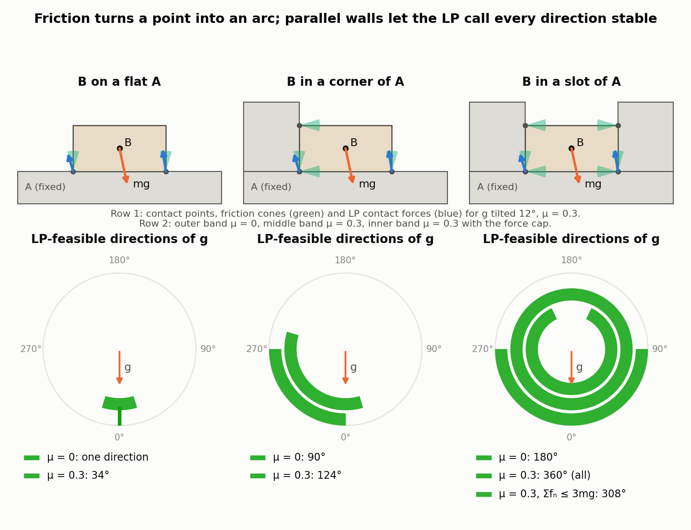
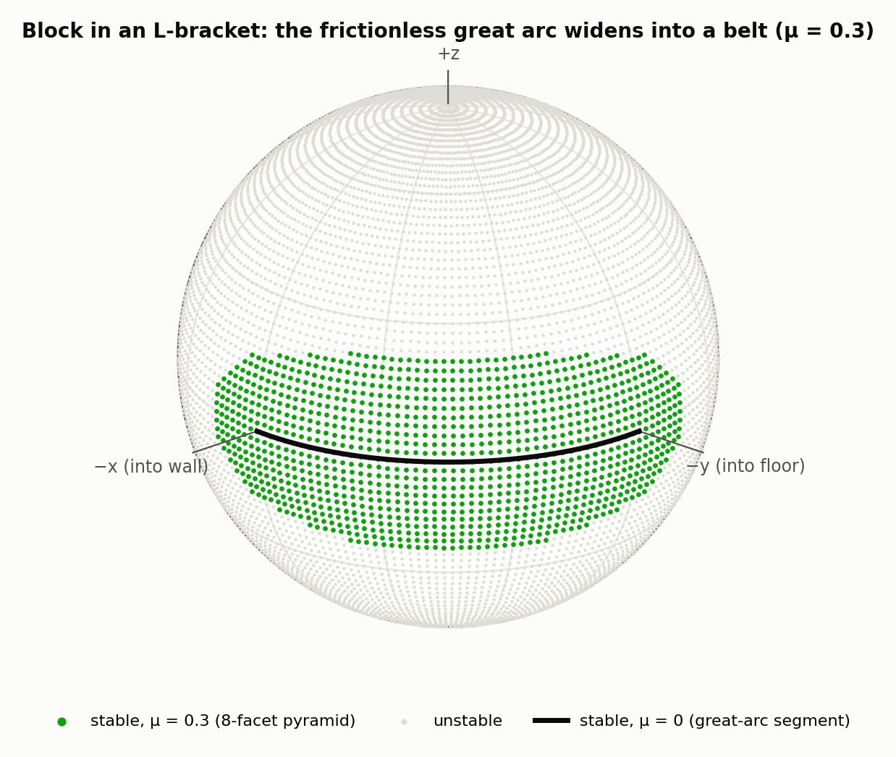
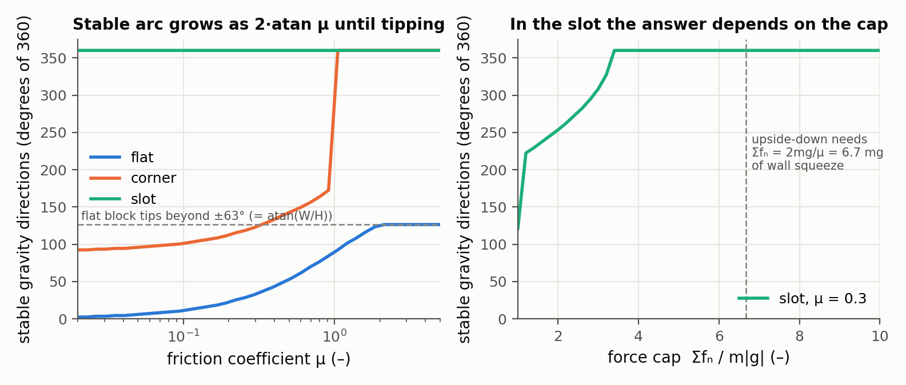

# Stability Analysis of Assemblies Considering Friction

Heiko Mosemann, Frank Röhrdanz, Friedrich M. Wahl — *IEEE Transactions on Robotics and Automation 13(6), pp. 805–813, December 1997*

[Paper](https://doi.org/10.1109/70.650159)

**Stability question:** Static — uses linear programming to decide whether frictional contact forces can hold a rigid assembly still under gravity, then maps every gravity direction (i.e., every assembly orientation) for which they can.

**Source read:** full text (IEEE Xplore PDF, institutional access: https://ieeexplore.ieee.org/stampPDF/getPDF.jsp?tp=&arnumber=650159). Metadata note: IEEE document 650159 is by Mosemann, Röhrdanz & Wahl (TU Braunschweig), not Mattikalli & Khosla. It builds on, and compares itself to, Mattikalli et al., "Finding all stable orientations of assemblies with friction" (IEEE T-RA, 1996).

## TL;DR
The paper recasts "is this set of rigid parts stable?" as a different question: do contact forces exist that push (never pull), stay inside friction limits, and cancel gravity on every part? With the friction cone approximated by a pyramid, that is a linear program (LP). Making gravity an unknown turns the same constraints into a description of *every* stable orientation. The authors enumerate that set exactly, and the enumeration stays correct even when the LP is degenerate.

## The problem
The setting is assembly planning by disassembly: a robot grasps, reorients and places subassemblies. The paper poses three problems:
1. Is the assembly stable under uniform gravity in a given orientation?
2. Find one orientation in which it is (potentially) stable.
3. Find the set of *all* such orientations.

Examples: a grasped subassembly must be turned to a stable orientation before it is set on a chamfered block (Fig. 1). Removing the upper block from an L-shaped part leaves the rest unstable (Fig. 2). The assumptions are:
- Bodies are rigid, bounded by planes, spheres or cylinders, and start at rest.
- Only static friction is modeled.
- At least one body is fixed (to a table or gripper).
- Contact normals are well defined.
- Gravity is the only load.

## Why it matters
Each reorientation or extra fixture adds cost, and an unstable intermediate state forces re-sensing of where the parts ended up. Prior methods left gaps:
- Blum et al. (1970) tested a single configuration with an LP, but gave neither the unstable objects nor the stable orientations.
- Boneschanscher et al. (1988) failed when the contact graph had loops.
- Mattikalli et al. used parametric LP (sensitivity analysis) to get the stable set. The authors report that with friction its termination is hard to guarantee under LP degeneracy. It also came with no complexity analysis and returned no force magnitudes.

The paper cites Palmer's 2D results: *potential* frictional stability is in **P**, while *infinitesimal* frictional stability is NP-hard. This paper computes potential stability.

## Contributions
1. An LP test for frictional stability in a fixed orientation. The friction pyramid has an adaptive number of facets, $l = 2^n$ with $n \ge 2$; the experiments use $l = 8$.
2. A search for a stable orientation with gravity as an LP variable, split into six LPs by the normalization $\|g\|_\infty = 1$.
3. The complete set of stable orientations, via reverse-search vertex enumeration (Avis–Fukuda). It handles degeneracy, uses no storage beyond the input, never repeats a vertex, and parallelizes.
4. A complexity analysis, plus force magnitudes at every vertex, which make it possible to filter out orientations that rely on huge opposing forces.

## Key intuitions
1. **Stable means "some valid forces exist."** A body at rest needs zero net force and torque, and the contact-force magnitudes enter those equations linearly. So existence is an LP feasibility question. The catch is that this is only *potential* stability, a necessary condition. With friction the force distribution is statically indeterminate, and reality may not pick the one the LP found.
2. **Rotate gravity, not the parts.** Turning the assembly is the same as turning $g$ the other way. Gravity appears as $m_j g$, which is linear, so $g$ becomes three more unknowns.
3. **Only the direction of gravity matters.** All constraints are linear with no constant term in (forces, $g$), so scaling a solution keeps it valid. Fixing $\|g\|_\infty = 1$ slices this cone of solutions with the six faces of a cube, and each slice is an ordinary polyhedron. Straight edges on a cube face project to great-circle arcs on the sphere. That is why adjacent vertices are joined by great arcs to draw convex regions.
4. **Vertices summarize a polyhedron, and reverse search lists them with no memory.** Bland's pivoting rule gives a unique simplex path from any vertex to the optimum. These paths form a tree, and walking it backwards from the root visits each vertex once.
5. **μ matters more than the linearization.** The authors argue that μ is ill-defined and partly random, so an exact nonlinear cone would not make results more reliable. They measured μ for their materials instead.

## Technical crux, explained simply
**Analogy.** A robot holds a small stack of parts and slowly turns its wrist. For which wrist angles does nothing slide or tip? Turning the wrist is equivalent to leaving the parts alone and swinging gravity around them. The paper computes the set of "safe gravity directions" as a region on a sphere.

**Tiny example (our illustration).** Block B sits flat on a fixed block A, in a corner of A, or in a slot of A; contact forces act at the corners of each contact patch.

*Figure 1. The paper's Problem-1 LP (minimise Σfₙ subject to force and torque balance, fₙ ≥ 0, |fₜ| ≤ μfₙ) solved with scipy for a 2 × 1 block B on a fixed block A while the direction of gravity is swept in 0.5° steps (our computation; in 2D the friction cone is exactly two half-planes, so no pyramid is needed). Top: contact points, friction cones and the solved forces for one direction. Bottom: the directions the LP accepts. On the flat block the frictionless set is a single direction, which friction widens to ±atan μ = ±16.7°; in the corner a 90° arc widens to 124°; in the slot the LP accepts every direction as soon as μ > 0, because the two parallel walls can squeeze each other without limit, the peg-in-hole artifact of the paper's Fig. 8. Capping Σfₙ ≤ 3mg, the authors' fix, removes 52° of that.*

- **Frictionless:** forces can only push along the normal, so B stays only if gravity points straight into the face. That is a single point on the sphere (one direction in Figure 1).
- **With friction μ:** the corners can also push sideways, up to μ times their normal push. Gravity may tilt until $\tan\theta = \mu$ (about 16.7° for μ = 0.3), so the point grows into a cap (the 34° band in Figure 1). The paper's examples follow the same pattern: arcs widen into belts and points into regions.
- **Tipping:** forces are placed only at the vertices of the contact region. If gravity's line through the centre of mass leaves that polygon, no set of pushing corner forces can cancel the torque, and the LP becomes infeasible.

**The method.** At contact $i$ the unknowns are a normal push $f_{n_i} \ge 0$ and two sideways components $f_{tx_i}, f_{ty_i}$. The Coulomb condition $\sqrt{f_{tx_i}^2 + f_{ty_i}^2} \le \mu f_{n_i}$ is replaced by $l$ linear inequalities $C\mu_i \le 0$. For each free body $j$:

$$\sum_i s_{ji}\,(f_{n_i}\vec n_i + f_{tx_i}\vec t_{x_i} + f_{ty_i}\vec t_{y_i}) + m_j \vec g = 0,\qquad \sum_i s_{ji}\,(\vec d_i - \vec c_j)\times(\dots) = 0$$

Here $s_{ji}\in\{-1,0,1\}$ says whether contact $i$ touches body $j$ and with which sign (action/reaction), $\vec d_i$ is the contact point, and $\vec c_j$ is the centre of mass. Stacking all of these gives $A\vec f + \vec c = 0$, with 6 rows per body and 3 columns per contact.
- **Problem 1:** minimize $\sum_i f_{n_i}$ subject to $A\vec f + \vec c = 0$, $f_N \ge 0$ and $C\mu_i \le 0$. Only feasibility matters.
- **Problem 2:** add $\vec g$ as unknowns. For cube face $j\in[0,5]$, fix one component of $g$ to $\pm1$, bound the other two to $[-1,1]$, and solve up to six LPs.
- **Problem 3:** each face's feasible set $P_j$ is a convex polyhedron in (forces, $g$) space. Enumerate its vertices, keep their $(g_x,g_y,g_z)$ parts, map them to the sphere, and join adjacent ones by great arcs. Projecting the polyhedron first is mentioned as an alternative.

**Vertex enumeration.** Every vertex corresponds to a simplex "dictionary" (basis). Following Bland's rule from any feasible dictionary reaches the optimum along a unique path, so the paths form a spanning tree. The algorithm starts at the optimum and tries "reverse Bland pivots" depth-first, in lexicographic order. A pivot counts as a child if Bland's rule would map it straight back. Each dictionary is visited once, and only the current one is stored. A degenerate optimum turns the tree into a forest, which a dual form of Bland's rule handles.

**Cost.** Time is exponential in the number of bodies and contacts: $O\big((m+n)\,m\,n\binom{n-2}{m-1}\big)$. For a polyhedron with $n_0$ inequalities in $d$ variables that is $O\big(n_0^2 d\binom{n_0}{d}\big)$, and a simple polyhedron costs $O(n_0 d)$ per vertex. Whether vertex enumeration can be polynomial is noted as open.

## What the results do well
The results are sphere plots of the stable set:
- **S-shaped part** (fixed, blocks in pockets, Fig. 6). Without friction only the antipodal points $(0,0,\pm1)$ are stable. With μ = 0.3 they grow into regions, and removing block $C_1$ enlarges the region.
- **Slide assembly** on a grounded part with two chamfer slopes (Fig. 7). No orientation is stable without friction. With μ = 0.2 an elliptical region appears.
- **Peg-in-hole** with μ = 0.5 (Fig. 8). The LP reports stability in *all* orientations, which is wrong. A force on one side face can be balanced by an equal and opposite force on the parallel face. Because vertices carry force magnitudes, orientations whose forces exceed a limit can be dropped, leaving a plausible reduced set.
- **L-shaped assembly** with μ = 0.3 (Fig. 9). A frictionless great-arc segment widens into a belt segment.
- **Industrial part:** a Yamaha motorcycle-engine subassembly (Fig. 10).
- **Speed:** with about 100 contact points the stable set takes "well under one second" on a SPARCstation 5. Degenerate cases take up to a few minutes.

*Figure 2. The 3D Problem-1 LP with an 8-facet friction pyramid (l = 8, as in the paper's experiments) for a 2 × 1 × 1 block resting on a floor and against one wall, the situation of the paper's L-shaped assembly (Fig. 9), sampled on a 2° grid of gravity directions (our computation). Without friction only the quarter great-circle between "into the floor" and "into the wall" is stable; with μ = 0.3 it widens into a belt about 2·atan(0.3) ≈ 33° wide. The paper enumerates the vertices of this region exactly; sampling the LP is the simpler substitute suggested below.*

*Figure 3. Left: how much of the circle of gravity directions the LP accepts as μ grows, for the three 2D toys of Figure 1 (our computation). The flat block's arc grows as 2·atan μ until tipping about a corner takes over at ±atan(W/H) = ±63°; the corner jumps to all directions once μ > 1, where the floor and wall can wedge each other; the slot is "all directions" for any μ > 0. Right: for the slot at μ = 0.3, the size of the stable set as a function of the cap on Σfₙ. The upside-down orientation needs 2mg/μ = 6.7 mg of wall squeeze, so with a cap the reported set depends entirely on where the cap is placed, which is the point made under Limitations.*

## Limitations
Stated by the authors:
- Potential stability is necessary, not sufficient. Guaranteeing stability for every legal force distribution needs exhaustive search.
- Only gravity is modeled. The authors say grasping and machining forces could be added easily.
- Worst-case time is exponential, and degenerate problems are slow. Parallelization is future work.
- μ is ill-defined and must be measured, and the friction cone is linearized.
- Bodies are rigid, limited to planes, spheres and cylinders, with well-defined contact normals.

Our observations:
- There is no rule for choosing the force limit in the peg-in-hole fix. The underlying problem is general: rigid, indeterminate contacts can supply unlimited internal squeeze, which the LP counts as friction.
- The output is a yes/no region with no margin: it says nothing about how close to failure an orientation is. [nadeau2024-robustness-frictional-contact.md](nadeau2024-robustness-frictional-contact.md) adds that.
- There is no physical or simulation validation, and material failure is not considered.

## Relevance to joint stability in this repo
- **A direct "which orientations hold?" test for a 2-part joint.** Fix the part cut from stock, make the LHF-cut part the single free body, and take contacts at the vertices of coincident faces (sketch-plane floors and swept side walls). That gives 3 unknowns per contact vertex and only 6 equilibrium rows. Comparing the stable set at μ = 0 with the set at a measured wood-on-wood μ separates what geometry guarantees from what friction supplies (our suggestion). Sampling gravity directions and solving the Problem-1 LP for each is a simpler substitute for exact enumeration (our observation; Figures 1–3 were made that way).
- **Expect the peg-in-hole artifact almost everywhere** (our observation). Integral joints are full of opposing parallel faces: dovetail sockets, tenon cheeks, the walls of a swept pocket. A rigid LP will call them stable in almost every orientation (the slot toy in Figures 1 and 3). Real tight-fit wood joints do carry preload, but its size comes from interference and wood stiffness, not from statics. Model preload explicitly, cap forces as the authors do, or choose forces by energy minimization as in [nadeau2024-robustness-frictional-contact.md](nadeau2024-robustness-frictional-contact.md) and [whiting2009-structurally-sound-masonry.md](whiting2009-structurally-sound-masonry.md).
- **Degenerate LPs are the normal case for milled joints** (our observation). Axis-aligned, coplanar LHF faces produce many contact vertices with parallel normals, which is exactly the situation the paper's enumeration is built to survive.
- **Does not transfer:** loads other than gravity, crushing and splitting (structural), and motion or sequencing (kinematic). For diagnosing sliding versus hinging, see [yao2017-decorative-joinery.md](yao2017-decorative-joinery.md) and [kao2022-coupled-rigid-block-analysis.md](kao2022-coupled-rigid-block-analysis.md).
