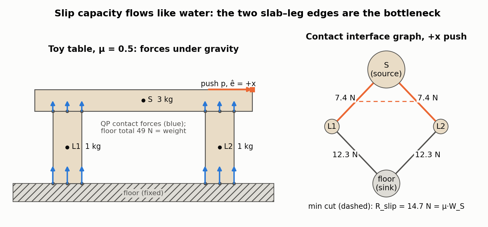
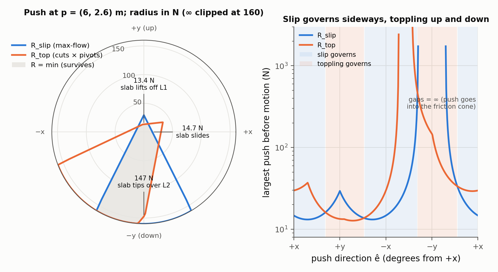
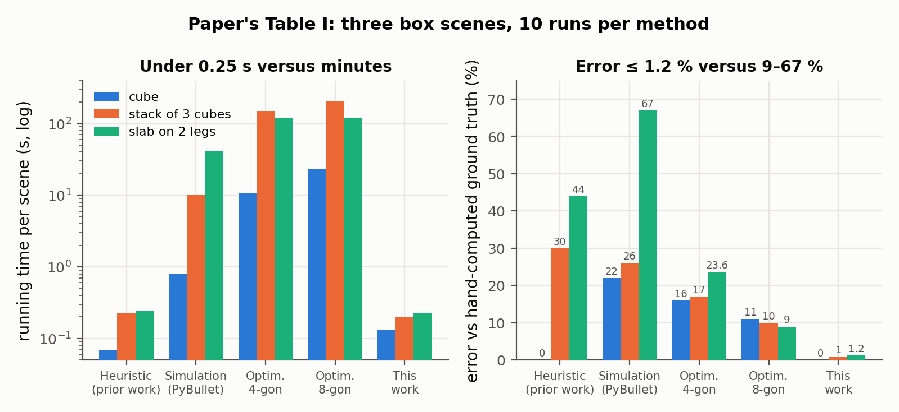

# Robustness Assessment of Assemblies in Frictional Contact

Philippe Nadeau, Jonathan Kelly — *arXiv preprint 2411.09810, 2024 (v2 June 2025; the arXiv page says "Submitted to IEEE Transactions on Automation Science and Engineering"; no published version found as of Sep 2026)*

[Paper](https://arxiv.org/abs/2411.09810)

**Stability question:** Static, with a kinematic side — computes the largest force that can be applied at a point, in a given direction, before objects in a rigid assembly slip or topple. Form-closed groups and kinematically blocked rotations come out as infinite robustness.

**Source read:** full text (https://arxiv.org/pdf/2411.09810, v2, 14 pages)

## TL;DR
The paper defines robustness $R(p,\hat e)$ as the largest push at point $p$ along direction $\hat e$ that an assembly survives without relative motion. Failure is split into slipping and toppling:
- **Slipping:** each contact's limit comes from a closed-form formula. Limits add up within an interface, and interfaces combine by max-flow / min-cut on a *contact interface graph*.
- **Toppling:** the method enumerates graph cuts and candidate hinge axes taken from contact geometry.

On three hand-solved scenes the error is 0–1.2% at 0.13–0.23 s. The simulation and optimization baselines had 9–67% error and took up to 205 s.

## The problem
Given known shapes, poses, masses and friction coefficients, what force can a rigid assembly withstand before something moves? Formally, the method computes $R:\mathbb{R}^3\times S^2\to\mathbb{R}^+$, the maximum force magnitude at a point in a direction. The intended users are mobile manipulators that place objects, carry stacks, and take assemblies apart.

## Why it matters
- Support-relation heuristics ignore mass and friction.
- Physics simulators combined with a binary search over force are slow. They are also inaccurate because they do not assume static equilibrium and use few contacts per step.
- Optimization methods (e.g., Maeda et al. 2009; Chen et al. 2021) solve one large program per query and inherit the error of a polygonal friction cone.
- Earlier graph methods (Boneschanscher et al. 1988) required loop-free contact graphs.

## Contributions
1. A robustness measure $R = \min(R_\text{slip}, R_\text{top})$, built on a standard minimum-energy contact-force QP (quadratic program). The authors note the QP is shared with earlier design work on rigid structures.
2. Slip robustness from an exact per-contact formula on the circular Coulomb cone, summed per interface and combined over the contact interface graph by **max-flow**.
3. Toppling robustness by enumerating feasible cuts (those not isolating a form-closed group) and candidate axes from convex hulls of contact points.
4. Validation against hand-computed ground truth and benchmarks against simulation, optimization and a prior heuristic.
5. Three applications: placement planning, maximum safe acceleration during transport, and disassembly ordering.

## Key intuitions
1. **Pick the forces nature picks.** Rigid contacts are statically indeterminate: many force sets balance a stack. Modelling contacts as very stiff springs gives stored energy $U=\|f\|^2/2\kappa$, which virtual work says the system minimizes. Minimizing $\sum\|f_i\|^2$ therefore selects one physically motivated distribution.
2. **Slipping and toppling are separate failures.** The smallest force that separates a group either slides it or rotates it. Toppling a group while it is sliding would take a strictly larger force. So the two limits are computed independently and combined with `min`.
3. **Friction capacity behaves like pipe capacity.** Interfaces that resist side by side add (Assertion 1). A chain of interfaces is as strong as its weakest link (Assertion 2), because action-reaction passes the same force along the chain. "Add in parallel, min in series" is exactly max-flow / min-cut.
4. **Geometry proposes the hinges.** Candidate toppling axes are the edges of the convex hull of contact points on the cut interfaces. If a contact kinematically prevents rotation about an axis, that axis is ruled out (∞).
5. **Decouple to go fast.** Contact forces are solved once for gravity. Each later query is closed-form algebra plus a graph algorithm, not a new optimization. This is what the abstract means by using "object shape information to decouple sub-problems."

## Technical crux, explained simply
**Analogy.** Think of water pipes running from the object you push (the *source*) to the ground (the *sink*). Each contact interface is a pipe whose width is the sideways force it takes before sliding. Parallel pipes add their flow, and pipes in a chain carry only what the narrowest allows. The most water that reaches the ground is the largest push the assembly absorbs. The narrowest cross-section, the *min cut*, shows *which* objects slide together.

**Tiny example (our numbers, for illustration).** A 3 kg slab S rests on two 1 kg legs L1 and L2 standing on the floor, μ = 0.5. Push S sideways.

*Figure 1. Our 2D toy run through the paper's pipeline (our computation): a 3 kg slab on two 1 kg legs, μ = 0.5, three contact points per interface. Left: the minimum-energy contact forces of eqs. (8)–(11), which split the slab's weight evenly between the legs and add up to the total weight at the floor. Right: the contact interface graph for a push in +x. Each edge's capacity is the sum of its contacts' closed-form slip limits (eqs. 16–21); the max-flow from S to the floor is 14.7 N = μ·W_S and the min cut (dashed) is the pair of slab–leg interfaces: the slab slides off both legs while the legs stay put.*

- The path through L1 carries $\min(7.4, 12.3) = 7.4$ N and the path through L2 the same, so slip robustness is $7.4 + 7.4 = 14.7$ N.
- The min cut is {S–L1, S–L2}: the slab slides over both legs. Had the legs been lighter than the slab's share, the leg–floor edges would have been the bottleneck instead.
- Toppling (e.g., the slab pivoting about a leg's edge, or the whole group about a leg's outer floor corner) is checked separately, and the smaller value wins (Figure 2).

**Step 1: contact forces under gravity.** Contact areas come from collision detection, and each interface is discretized into 20 points by approximate farthest-point sampling. Then

$$\min_f \sum_i\|f_i\|^2\quad\text{s.t.}\quad \sum_{k\in K_j}B_k f_k + w_{g_j}=0\ \ \forall j,\qquad C_i f_i\le 0,\qquad f_{i,n}\ge 0 .$$

Here $f_i$ is the 3D force at contact $i$, and $B_k$ turns it into a force-and-torque (wrench) on its object. $w_{g_j}$ is object $j$'s gravity wrench. $C_i f_i\le 0$ keeps friction inside an inscribed $N$-gon: a square covers about 65% of the circle, an octagon about 90%. If the QP has no solution, the assembly is certainly unstable.

**Step 2: one contact's extra capacity.** The contact force $f=(f_u,f_v,f_n)$ lies inside its friction cone. Add a push $s\hat e$ and track the *contact condition*

$$c(s)=\mu\,\|f_n+s\hat e_n\|-\|f_t+s\hat e_t\| ,$$

which stays positive while the total force is inside the cone. Setting $c(s)=0$ gives a quadratic in $s$ with a closed-form root $s_m$. Geometrically, $s_m$ is where the force tip, moving along $\hat e$, leaves the cone. If $s_m\ge 0$, that is the contact's slip robustness. If $s_m<0$, no amount of push along $\hat e$ causes slip, and robustness is $\infty$. Using the true circle avoids polygon error here.

**Step 3: interfaces, then the assembly.** An interface's capacity is $R_t=\sum_{k\in I_t}R_k$. The authors justify the sum with tribology results showing that all contact points are maximally stressed at the onset of bulk slip. The **contact interface graph (CIG)** has one node per object, with all fixed objects merged into one fixed node, and one edge per contact interface. Edges get capacity $R_t$, the pushed object is the source and the fixed node is the sink. Max flow gives $R_\text{slip}$, and the min cut lists the sliding interfaces. This costs $O(|J|^3)$ or better for $|J|$ objects.

**Step 4: toppling.** For each *feasible* cut (one separating the fixed node from a group that is not form-closed):
- Candidate axes are the convex-hull edges of the contact points on the cut interfaces. If all cut interfaces are parallel, an axis normal to them through the centre of friction is added.
- For each contact, $v_i=p_i\times\hat a$ describes how it moves under rotation about axis $\hat a$:
  - if $v_i\cdot\hat n_i<0$, the contact kinematically prevents the rotation ($\infty$);
  - if $v_i\cdot\hat n_i>0$, it contributes the moment of its current force, $f_i\cdot v_i$;
  - if $v_i\cdot\hat n_i=0$, friction resists, using the slip capacity from Step 2.
- These moments sum to the torque $\tau_c$ needed to topple. The robustness is $\tau_c/((p\times\hat e)\cdot\hat a)$, with $p$ measured from the axis, minimized over cuts and axes.

In the worst case this is $O(2^{|J|})$.

*Figure 2. R(p, ê) = min(R_slip, R_top) for a push at the slab's top-right corner over all 360 directions (our computation of eqs. 13–27 in 2D; toppling axes reduce to pivot points at the hull vertices of the cut interfaces' contact points, and the paper's extra "axis normal to parallel interfaces" has no 2D analogue). Left: the rose plot; the grey region is what the assembly survives. Right: the same curves on a log scale, shaded by which mechanism governs. Sideways pushes slip at 14.7 N; an upward push lifts the slab off L1 at 13.4 N (= W_S · 2.5 m / 5.5 m); a downward push tips it over L2 at 147 N (= W_S · 2.5 m / 0.5 m); pushes aimed into the friction cones are unbounded. Sign convention: ê is the push on the object, so the tip of the contact force moves along −ê in eq. (14); the paper's formulas are written for the increment of the contact force.*

## What the results do well
- **Accuracy and speed** (Table I; 10 runs per method/scene; scenes are a cube, a stack of three cubes, and a slab on two legs):

| Method | Time (s): cube / stack / table | Error (%): cube / stack / table |
|---|---|---|
| Approximate heuristic (authors' prior work) | 0.07 / 0.23 / 0.24 | 0 / 30 / 44 |
| PyBullet + binary search | 0.80 / 10.1 / 41.7 | 22 / 26 / 67 |
| Optimization, square cone | 10.9 / 151 / 118 | 16 / 17 / 23.6 |
| Optimization, octagon cone | 23.6 / 205 / 118 | 11 / 10 / 9 |
| **This work** | **0.13 / 0.20 / 0.23** | **0.00 / 1.00 / 1.20** |

  The optimization errors match the polygon-cone gap: on average a square sits about 20% of the radius inside the circle, an octagon about 10%.

*Figure 3. The paper's Table I redrawn: running time (log scale) and relative error against hand-computed ground truth for the three benchmark scenes. The optimization baselines' errors track the polygon-cone gap, and the simulator's binary search is both slow and inaccurate because it never assumes static equilibrium.*
- **Placement planning** (a drop-in for their planner, published separately as *Stable Object Placement Planning From Contact Point Robustness*): on six scenes (1,200 runs), time +2% and robustness +7% on average. On three harder scenes (600 runs), planning was 40% faster with 24% more robust placements.
- **Transport:** by D'Alembert's principle, acceleration is treated as a fictitious force at a group's centre of mass, so maximal sustainable acceleration $=R(c,-d)/m$. A cube on a slant sustains 11.8 m/s² in −Y (then slides) but only 3.27 m/s² in +Y (then topples). A second cube raises +Y by 30% but lowers ±X. For that two-cube scene the computation took 38 s (simulation), 3.6 s (optimization) and 0.63 s (this method).
- **Disassembly:** an object can be removed safely when the robustness to an upward force at its centre of mass equals its weight. The four-object example yields the order C, D, B, A.

## Limitations
Stated by the authors:
- Poses, shapes, masses and μ are assumed exact, although μ is known to vary across a contact area. Propagating uncertainty is future work.
- Only a single external force is handled; multiple forces are future work.
- Toppling is exponential in the number of objects. As a mitigation, heavy objects can be treated as fixed.
- Discretizing interfaces breaks the uniform-pressure assumption, which they consider the likely cause of the residual 1–1.2% error.
- Masses can be underestimated to build in a safety margin, since robustness grows linearly with mass.

Our observations:
- Accuracy validation uses only three box scenes, with no physical tests of robustness.
- The abstract claims no "heuristics or approximations," yet the method rests on modelling assertions: parallel-sum and series-min, slip and toppling treated independently, and $\hat e$ applied at each contact in Step 2. These are argued from cited tribology, not derived from full equilibrium.
- Form-closure detection, which feasible cuts depend on, is cited (Bicchi 1995) but not specified.
- Minimum-energy forces contain no preload.

## Relevance to joint stability in this repo
- **A scalar metric per joint** (our suggestion). With the stock-cut part fixed, a 2-part joint's CIG is a single edge. Slip robustness is then just the sum of contact capacities, and the exponential cut enumeration disappears. Sweeping $R(p,\hat e)$ over the free part's surface gives a robustness map (like the paper's Fig. 11, or the rose plot of Figure 2 at every surface point) for comparing joint variants under the same μ. For 3-part keyed joints such as `CJ_AKT`, the graph structure starts to matter.
- **Kinematic blocking shows up as ∞** (our observation). Interlocking geometry rules out many toppling axes and makes cuts form-closed. The finite values that remain isolate the load directions in which the joint relies on friction. You still need your own blocking test for LHF parts; see [wang2019-topological-interlocking.md](wang2019-topological-interlocking.md) and [yao2017-decorative-joinery.md](yao2017-decorative-joinery.md).
- **Preload does not transfer** (our observation). Tight-fit wood joints get much of their strength from interference. Under gravity alone, the energy-minimizing QP will typically put little or no normal force on vertical cheeks or dovetail flanks, so their friction capacity against sliding along them comes out near zero unless a preload term is added. This is the opposite failure from the unbounded squeeze of the pure-LP test in [mosemann1997-stability-assemblies-friction.md](mosemann1997-stability-assemblies-friction.md).
- **No material failure.** Crushing at a toppling pivot or shear along a short tenon's grain may limit capacity before sliding, and that needs a structural model. The same force QP underlies [whiting2012-structural-optimization-masonry.md](whiting2012-structural-optimization-masonry.md) and [kao2022-coupled-rigid-block-analysis.md](kao2022-coupled-rigid-block-analysis.md).
