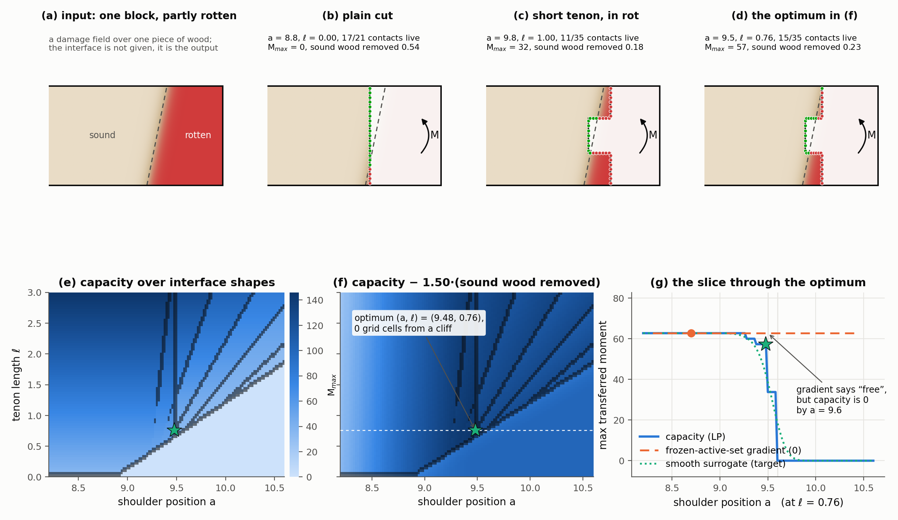

# Proposal: learned differentiable static stability for in-situ timber repair

**Status:** draft problem statement, not yet a method. Written to be argued with.

**Scope decisions already made** (see [Scope](#scope-three-commitments)): the stability question is **static equilibrium with friction**; the network is a **differentiable surrogate inside an optimization loop**; the member is repaired **in situ**, inside a standing structure.

---

## TL;DR

One timber block, partly rotten. **Input:** the block and its damage field. **Output:** an interface — the mating surface along which the rotten part is cut away and new wood is fitted — as a set of parameters. The interface should throw away as little sound wood as possible and, once the new wood is in, carry the load. Nothing about the interface is given up front; its shape is the design variable.

The obstruction is not cost — classical frictional-equilibrium tests are fast (milliseconds for an LP, ~1 s for a 2-block CRA run). The obstruction is that **changing the interface changes which faces touch**, and every classical static method loses its gradient exactly there. So we learn a differentiable surrogate for the static margin whose job is to be smooth *across contact-topology changes*, and descend on it in the interface parameters.

Two things then fall out that no method in the reviewed literature can do: geometry conditioned on a **spatially varying material-quality field**, and stability evaluated **in the member's structural context** rather than in isolation.

---

## 1. The problem

> **Given** (the core input)
> - a single timber block, initially one piece;
> - a voxel field of damage severity over it;
>
> **and** (context, from the in-situ scope decision in §3.3)
> - the block's boundary conditions and service loads as installed;
> - the obstacle geometry of the neighbouring members;
>
> **find an interface** — the mating surface between the wood that stays and the new wood that replaces the rest — written as an LHF stack of `K` slots, each a 2D sketch on a plane swept along its normal, such that
>
> 1. **conservation** — the volume of *sound* wood removed is minimized;
> 2. **load** — with the new wood fitted, the interface stays in frictional equilibrium under the service loads, maximizing a continuous margin rather than satisfying a predicate. Wood the interface leaves behind carries load only if it is sound: a contact backed by damaged material has reduced or zero capacity;
> 3. **in-situ insertability** — the new wood's motion cone intersected with the obstacle-free cone of the surrounding structure is non-empty;
>
> **where** the margin in (2) is a learned differentiable surrogate, so that (1)–(3) can be optimized jointly by gradient descent on the interface parameters.

Containment is not a separate axiom. (1) pulls the interface toward the rot to save wood; (2) pushes it back into sound wood because dead contacts carry nothing. Their balance is where the interface lands, and it is the whole content of Figure 1. If practice requires that everything above some severity go regardless (rot spreads), that is a hard threshold layered on (2)'s graded rule, not a fourth objective.

In the beam case the block is prismatic with a known grain axis, which fixes a dominant load case and a short list of real failure modes; the statement above does not need it.

## 2. This is not the joint-design problem

Everything in [stability-literature.md](stability-literature.md) is about **joint design**: two members meet for a functional reason, and the geometry at the meeting is free. Repair differs in three ways that change the formulation.

| | Joint design | Repair |
|---|---|---|
| What is given | the parts; geometry is free | one block and its **damage field**; the interface is the only unknown |
| Objective | lock it, or make it millable | carry the load **and** remove as little sound wood as possible |
| Where assembly happens | free space | a standing structure with obstacles and reactions |

An interface scored by the quality of the material it leaves behind, and an objective that pays for removed material, appear nowhere in the corpus. [whiting2012](whiting2012-structural-optimization-masonry.md) has a volume-minimization side term, and that is the closest anything comes.

## 3. Scope: three commitments

### 3.1 Static, with friction

Not kinematic: a 2-part joint can never be interlocking — the definition requires at least three parts ([wang2021-star](wang2021-star-assemblies-rigid-parts.md), [song2012](song2012-recursive-interlocking-puzzles.md)) — and any assemblable splice has a free reverse-assembly direction by construction. A purely kinematic target degenerates to "exactly one free direction, pointed away from the loads."

Not structural: the honest structural question (does the wood fracture at the scarf, shear short-grain at a step, crush at a bearing?) is where the literature is genuinely empty, but it requires a material model and validation data that no paper in the corpus supplies. It is the right *next* project, not this one.

Static equilibrium with friction is the level at which the geometry of the cut and the direction of the loads interact, which is the interaction we want to optimize.

### 3.2 The network is a differentiable surrogate

See [§4](#4-why-learn-anything-the-differentiability-argument). It is not a final answer generator and not a speed play.

### 3.3 In situ

The member is repaired where it stands. This is the load-bearing scope decision; see [§6](#6-in-situ-does-double-duty).

## 4. Why learn anything: the differentiability argument

The obvious objection is that a surrogate is only justified when the true objective is expensive, and frictional equilibrium is not. [DESIA](wang2018-desia.md)'s blocking-graph test runs in 0.5 ms on an 80-part assembly. RBE is a linear program. A 2-block [CRA](kao2022-coupled-rigid-block-analysis.md) run takes about a second, and `compas_cra` is pip-installable.

The justification is differentiability, and the corpus states the obstruction directly:

- **[whiting2012](whiting2012-structural-optimization-masonry.md)** obtains a closed-form gradient of the equilibrium QP only by *freezing the active set*. Its stated limitation: "Differentiability requires fixed topology: block adjacencies and the vertex count of each contact polygon must not change." Edits that change which faces touch — "typical when resizing a tenon or shifting a sketch" — break the derivation. The gradient is valid only inside one active-set region, so the landscape is piecewise and non-smooth at exactly the boundaries that matter.
- **[CRA](kao2022-coupled-rigid-block-analysis.md)** is a nonconvex nonlinear program solved with IPOPT: no convergence guarantee, start-point dependent local optima, and a feasible/infeasible verdict rather than a differentiable score.
- **[MOCCA](wang2021-mocca.md)** sidesteps this by splitting kinematic design from geometric realization, and its direct-gradient baseline only loses above roughly 16 parts. For a 2-part splice, direct optimization is a live competitor and must be run as a baseline.

*Figure 1. Block in, interface out; every number computed by [figures/proposal.py](figures/proposal.py). **(a)** The input: one piece of wood with a damage field (rot entering from the bearing end, further along the bottom; the dashed line is the severity-0.5 front). No interface is drawn because none is given. **(b–d)** Three outputs from one interface family, a mortise-and-tenon splice with shoulder position `a` and tenon length `ℓ`, drawn on the same block. Green contact samples are backed by sound wood; red ones sit against rot and carry nothing. A plain cut (b) keeps 17 of 21 contacts live and still transfers **no** moment: all its normals are parallel, so no couple balances. A short tenon pushed into the rot (c) transfers 32. The optimum from (f) (d) transfers 57 while removing 0.23 units of sound wood — and it does so with its lower shoulder entirely dead and only 2 of 7 bottom-cheek samples live: the optimizer accepts dead contacts to save wood. **(e)** Capacity over 121 × 76 = 9196 interfaces, `a ∈ [8.2, 10.6]`, `ℓ ∈ [0, 3]`, from a 2D frictional-equilibrium LP (μ = 0.5, Σfₙ ≤ 100, 7 samples per face). Inside a cell capacity grows linearly with `ℓ` — a real gradient exists there. The dark lines are cells where capacity jumps by more than 3% of the peak against a neighbour: 9% of the grid, and every one of them a place the active set changed. **(f)** The objective, capacity/peak − 1.5 · (sound wood removed)/peak. Its maximum is at `(a, ℓ) = (9.48, 0.76)`, **zero grid cells from a cliff**. The weight 1.5 is a design choice; the script reports the sweep. For weights ≤ 1 the pocket's cost never binds and the optimum runs to the longest tenon the box allows; for 1.5, 2, 2.5 and 3 it is interior and lands 0, 1, 0 and 0 cells from a cliff. **(g)** The slice through the optimum along `a`. Flat at 62.8 until `a` = 9.28, two small steps to 57.3 at the optimum, then 33.8 at `a` = 9.50 and zero by 9.60. A frozen-active-set gradient evaluated at `a` = 8.7 — the construction [whiting2012](whiting2012-structural-optimization-masonry.md) depends on — returns **0**: cutting less costs nothing. The dotted curve is what this section asks the network to supply; here it is a Gaussian smoothing of the same data, not a trained model.*

Two things the figure says beyond the staircase. First, the optimum is not on a cliff by accident: the conservation term drags the interface toward the rot, the load term stops it where contacts start dying, so the best interface sits exactly where the score is non-differentiable — for every trade-off weight that yields an interior optimum. Second, a real gradient does exist inside each cell (the linear growth in `ℓ` in (e)), so a frozen-active-set method is not useless; it is blind to exactly the boundaries the optimum is drawn to.

Changing the interface *is* the thing that changes contact topology. So the surrogate's job is stated precisely:

> **Be differentiable across active-set and contact-topology changes, where the classical static gradient is undefined.**

This is a defensible claim about a specific, documented gap, not a general appeal to learning.

### 4.1 A useful asymmetry for data generation

From [wang2025](wang2025-learning-to-assemble.md): in the batched stability QP, the state enters **only through the bounds**. Invalidating contacts lost to damage is a pure bound change, so many damage scenarios over one geometry batch on GPU. Changing the interface parameters changes `J` and `M`, so geometry does **not** batch.

Data generation is therefore cheap along the damage axis and expensive along the geometry axis, and the sampling strategy should reflect that: relatively few candidate geometries, many damage fields per geometry. Their released solver ([LearningToAssemble](https://github.com/KIKI007/LearningToAssemble)) is a plausible starting point for the generator.

## 5. Where "damage score" enters

A rigid-body static model has **no material properties**, so a damage scalar cannot mean stiffness or strength. It can mean one of two things, and the choice should be explicit:

- **Contact invalidation** — a face backed by damaged material cannot carry contact force, so it is dropped from the contact set. This is the version that batches (§4.1).
- **Per-patch capacity scaling** — `μ` and/or a force cap scaled by local damage severity.

Either way the network's real input is not "damage" but **which contacts are trustworthy**. Stating that plainly is both the honest reduction and the defensible one. It is also the mechanism behind the trade-off in §1: an interface that skirts the rot to save sound wood pays for it here, contact by contact.

Two caveats to carry forward:

- A scalar per voxel assumes damage is isotropic. Real decay follows grain, and checks run along grain. If the input stays a scalar, say that it is a deliberate v1 simplification.
- The damage field is assumed known. In practice it comes from surface inspection plus resistance drilling or acoustic tomography, so there is an upstream perception problem being assumed away.

## 6. In situ does double duty

The surrounding members are not only obstacles. They are also **reaction supports and blocking geometry**.

- **As obstacles**, they constrain insertion: the new wood's motion cone must intersect the obstacle-free cone of the surroundings. Every insertion analysis in the corpus assumes free space — [MOCCA](wang2021-mocca.md)'s insertion cones, [yao2017](yao2017-decorative-joinery.md)'s SOPA, [wang2018-desia](wang2018-desia.md)'s blocking graphs. Computing the obstacle-free cone is classical geometry processing (visibility, swept volumes, free-space cones), which is where the "use classical techniques for insight" goal lands.
- **As supports**, they rescue the splice from its own degeneracy. An isolated 2-part joint always has a free direction, but the surrounding frame can block it. This is [fu2015](fu2015-interlocking-furniture-assembly.md)'s point: interlocking is a property of the network, not of one joint. [wang2019](wang2019-topological-interlocking.md)'s bound `Φ ≤ 90° − β` says the same thing from the static side — a joint assembled sideways has zero frictionless tilt tolerance, so whether it holds depends entirely on its orientation in the structure.

The resulting claim: **we evaluate a repair in its structural context.** No paper in the corpus does; all analyze a joint in isolation or an assembly in free space.

## 7. The preload decision

This will determine results more than the geometry does, so it must be a stated modeling decision rather than a default. A repair splice held by friction on long parallel cheeks is precisely the configuration on which the three available static models disagree completely:

| Model | Verdict on a friction-held splice |
|---|---|
| RBE / [mosemann1997](mosemann1997-stability-assemblies-friction.md) LP | **Stable in nearly every orientation.** Opposing parallel faces squeeze without limit — the peg-in-hole artifact, which integral joints exhibit everywhere |
| [CRA](kao2022-coupled-rigid-block-analysis.md) | **Prestress ruled out by design** (Sec. 2.2), so press-fit, wedged and pegged joints — where prestress *is* the mechanism — fall out of scope |
| [nadeau2024](nadeau2024-robustness-frictional-contact.md) | Energy-minimizing forces put near-zero normal force on vertical cheeks, so their friction capacity comes out ≈ 0 |

**Recommendation:** make preload an *explicit input* to the surrogate alongside geometry. Drawbore pegs, wedges and interference fits are standard repair technique and all are free parameters of the repair. No paper in the corpus models preload; several name its absence as a limitation. Adding it is cheap once the score is learned anyway, and it converts a landmine into a second contribution.

## 8. Representation: the LHF program, not cutting planes

The output is the interface. The LHF stack in [`src/repair/interface.py`](../src/repair/interface.py) is how it is written down: it describes the retained wood as stock minus cuts, the interface is the boundary of those cuts inside the block, and the new wood is the derived complement. That parametrization, not a set of planes, should be the network's output.

- Planes express a butt or scarf splice and nothing else. The non-planar hooks, dovetails and keyed shoulders that give Japanese splices their strength are unreachable, so the model's ceiling is set by the representation rather than by the learning.
- The repo already has the better option: `K slots × (active, normal, plane offset, depth, R rings × n_ctrl points)` with `MAX_SLOTS = 4`, `MAX_RINGS = 4`, `MAX_VERTS = 28`, frame-normalized and template-free.
- It also already establishes that **the mate is derived**: `solid_B = stock_B \ dilate(solid_A, c)`, exact to 0.14% median and 2.41% worst across the 25 two-part joints. So the action space is one free part, not two — a real dimensionality win that the plane formulation would discard.

## 9. Training signal: what to regress

A feasible/infeasible predicate is useless for a gradient. The corpus offers four continuous measures, and they are not interchangeable.

| Measure | Source | Character |
|---|---|---|
| min Σ(tension)² | [whiting2009](whiting2009-structurally-sound-masonry.md) | C¹ and smooth, but its gradient points at **futile fixes** (enlarge the interface). Proven so by its own follow-up |
| torque energy | [whiting2012](whiting2012-structural-optimization-masonry.md) | Fixes the above; gradient points at changes that actually reduce the imbalance |
| kinematic infeasibility `max(w·v − ½‖v‖²)` s.t. `B_in v ≥ 0` | [MOCCA](wang2021-mocca.md), [song2022](song2022-computational-assemblies-tutorial.md) | No force variables; handles non-planar contacts more efficiently |
| `R(p, ê)`: max force before slip or topple | [nadeau2024](nadeau2024-robustness-frictional-contact.md) | A **magnitude in newtons**; separates slipping from toppling; the 2-part case collapses the expensive cut enumeration to a single graph edge |

**Recommendation:** regress `R(p, ê)` over a set of service-load directions. It is a magnitude rather than a predicate, it is meaningful when the loads are actually known (which in situ they are), and its slip/topple split maps onto distinct repair failure modes. Cross-check against the [whiting2012](whiting2012-structural-optimization-masonry.md) torque energy, because a learned surrogate will cheerfully inherit the 2009 energy's futile-fix gradient if trained on it.

One commitment this forces: [song2022 Figure 2](song2022-computational-assemblies-tutorial.md) shows the force-based and kinematic energies reaching zero at the *same* tilt but differing away from equilibrium — "as optimisation energies they would rank unstable designs differently." The choice of target is a modeling decision with consequences, not a detail.

## 10. Novelty, stated against the corpus

| Claim | Who else does it |
|---|---|
| Geometry conditioned on a spatially varying **material-quality field** | Nobody. Every paper assumes homogeneous, perfect material |
| Stability evaluated **in the member's structural context** (obstacles + reactions) | Nobody. All analyses are joint-in-isolation or assembly-in-free-space |
| A static margin **differentiable across contact-topology change** | Nobody. [whiting2012](whiting2012-structural-optimization-masonry.md) requires fixed topology; [CRA](kao2022-coupled-rigid-block-analysis.md) gives no geometric gradient |
| **Preload as a design variable** | Nobody; several papers name its absence as a limitation |
| Continuous, grain-aware structural screening | Only [Tsugite](larsson2020-tsugite.md), and only as a binary, resolution-dependent topological rule |

## 11. Risks and open questions

**Open, and blocking before implementation:**

- **Surrogate scope.** Learn the whole chain (LHF params + damage + obstacle context → scalar), or only the discontinuous `geometry → contact set` step? Current lean: the whole chain, because the discontinuity is precisely what we are smoothing.
- **Obstacle contexts.** The MiGumi dataset contains no surrounding structure. These have to be synthesized, and how they are sampled will silently define what "in situ" means in the results.
- **Ceiling.** The surrogate cannot exceed its teacher's accuracy, so the contribution must be differentiability, amortization or context — never "more accurate than CRA."

**Risks:**

- **The evaluation function becomes the contribution.** The most common failure mode for this shape of project: the label generator eats the schedule, the network matches it, and "why not just run the generator?" has no answer. Mitigation is the §4 argument — make sure it survives contact with a real optimizer by running direct optimization as a baseline from day one.
- **Interlocking ≠ strong.** The corpus has three documented counterexamples: [song2017](song2017-reconfigurable-interlocking-furniture.md)'s full-size wooden ladder needed pins added; [janikova](janikova2025-rta-eccentric-joint-strength.md)'s unglued Tenso P-14 separated without damaging the board; and no 2-part joint can be interlocking at all. A kinematically valid repair is not a load-bearing one.
- **Literature gap in the survey itself.** The 22 summaries in `docs/` are entirely computational-design graphics. This is a **timber conservation and structural engineering** problem, and that literature exists — [Kloiber et al. 2023 on repairing timber log houses](<Kloiber et al. - 2023 - Repair of Old Timber Log House Using Cavity Filling with Compatible Natural Materials.pdf>) is sitting unsummarized in this folder. Novelty must be argued against standardized scarf-repair practice, not only against SIGGRAPH. That literature is also where failure modes, margins and acceptance criteria would come from.

## 12. What the repo already provides

- **Representation.** `Difference(stock, Union(cuts))` with every cut an LHF, and the canonical orientation-resolved export in `out/lhf_base/` that removes the dataset's dependence on ground-truth STLs ([`jwood.py`](../src/repair/jwood.py), `examples/export_lhf.py`).
- **Relational model.** Members, interfaces and fillers recovered from per-part CSG ([`relational.py`](../src/repair/relational.py)).
- **Action space.** Fixed-size, frame-normalized, template-free joint parametrization with measured fidelity ([`interface.py`](../src/repair/interface.py)).
- **Test beds.** 30 joints, 26 of them 2-part, in four variants (`base` / `mill` / `odf` / `ours`) — enough to ask whether milling adaptation changes stability, not only fit.

- **A toy of the full loop.** [`splice2d.py`](../src/repair/splice2d.py) is the 2D model behind Figure 1 — damage field, interface family, contact set, frictional-equilibrium LP, sound-wood integral — and [`examples/inspect_splice.py`](../examples/inspect_splice.py) puts every one of its parameters on a polyscope slider, with the (a, ℓ) landscape and its cliffs drawn live.

What is missing: damage fields on real geometry, obstacle contexts, a 3D static solver in the loop, and any structural model.

## References

All summaries live in this folder; see [stability-literature.md](stability-literature.md) for the reading order.

- Static: [whiting2009](whiting2009-structurally-sound-masonry.md) · [whiting2012](whiting2012-structural-optimization-masonry.md) · [kao2022](kao2022-coupled-rigid-block-analysis.md) · [nadeau2024](nadeau2024-robustness-frictional-contact.md) · [mosemann1997](mosemann1997-stability-assemblies-friction.md) · [yao2017](yao2017-decorative-joinery.md) · [wang2025](wang2025-learning-to-assemble.md)
- Kinematic: [wang2018-desia](wang2018-desia.md) · [wang2019](wang2019-topological-interlocking.md) · [wang2021-mocca](wang2021-mocca.md) · [fu2015](fu2015-interlocking-furniture-assembly.md) · [song2012](song2012-recursive-interlocking-puzzles.md) · [song2017](song2017-reconfigurable-interlocking-furniture.md) · [chen2022](chen2022-high-level-interlocking-puzzles.md)
- Structural: [liu2022](liu2022-worst-case-rigidity.md) · [umetani2012](umetani2012-guided-exploration-furniture.md) · [janikova2025](janikova2025-rta-eccentric-joint-strength.md)
- Representation and survey: [ganeshan2025-migumi](ganeshan2025-migumi.md) · [larsson2020-tsugite](larsson2020-tsugite.md) · [wang2021-star](wang2021-star-assemblies-rigid-parts.md) · [song2022](song2022-computational-assemblies-tutorial.md)
