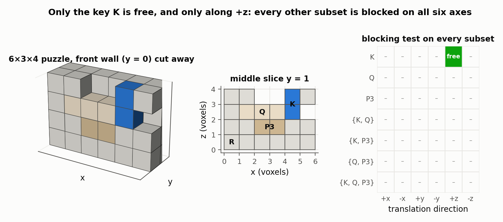
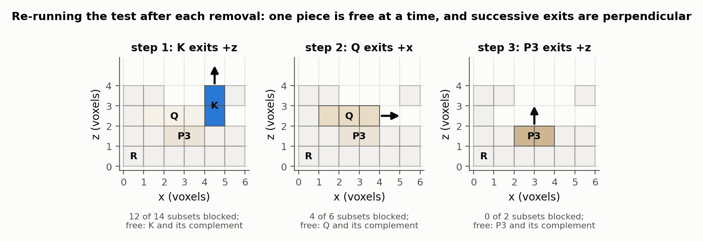
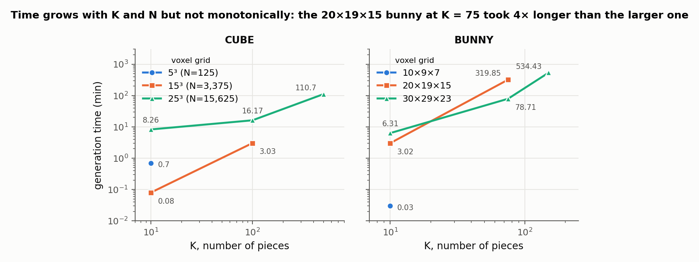

# Recursive Interlocking Puzzles

Peng Song, Chi-Wing Fu, Daniel Cohen-Or — *ACM Transactions on Graphics 31(6), Article 128 (SIGGRAPH Asia), 2012*

[Paper](https://doi.org/10.1145/2366145.2366147) · [Project page](https://sutd-cgl.github.io/supp/Publication/projects/2012-SIGAsia-Interlock/index.htm)

**Stability question:** Kinematic — guarantees that only one piece of a voxel dissection can move (under axis-aligned translations) by enforcing blocking locally among consecutive pieces, never testing all subsets.

**Source read:** full text, including the appendix proof (https://sutd-cgl.github.io/supp/Publication/papers/2012-SIGAsia-InterlockPuzzle.pdf); Table 1 timings read from the rendered page image.

## TL;DR
An assembly is *interlocking* if exactly one piece (the key) can move while every other piece, and every subset of pieces, is stuck. Checking that directly means testing every subset. This paper instead carves pieces one at a time out of a voxelized shape so that each three consecutive pieces lock each other. It then proves by induction that this local rule gives global interlocking, with a unique disassembly order.

## The problem
Given a voxelized solid and a target piece count K, cut it into K connected polycube pieces that:
- are **interlocking**: at least three pieces, exactly one movable, all other pieces and subsets immobilized relative to one another;
- are **assemblable**: too much blocking gives a deadlock that can be neither assembled nor disassembled;
- are **recursive**: the assembly stays interlocking after each removal, so there is only one order to take it apart.

Motion model: pieces only translate along ±x, ±y, ±z. Once a piece can leave, it is removed completely. There are no partial slides and no rotations.

## Why it matters
Immobilizing each piece does not immobilize every group: two individually stuck pieces can still slide out together. A naive generator would have to test all subsets and also test for deadlock. Before this paper, new interlocking puzzles came from hand design or exhaustive search; the authors cite Cutler's program, which took almost three years for six-piece configurations. A guarantee by construction is what makes hundreds of pieces possible.

## Contributions
1. A formal definition of (recursive) interlocking and three lemmas about blocking: group immobilization, relativity, and successive moving directions.
2. Local requirements on each newly extracted piece, plus an induction proof that they give global recursive interlocking for any number of pieces.
3. A constructive voxel algorithm (seed, shortest-path blocking, anchor voxels, accessibility-guided growth) that meets the requirements without global tests.
4. Results with up to 1,250 pieces, and hand-built LEGO puzzles.

## Key intuitions
1. **Relativity (Lemma 2).** If set S1 can slide in direction D while S2 is fixed, then S2 can slide in −D while S1 is fixed. A subset and its complement have the same mobility question, which halves what must be checked.
2. **One stuck member pins its group (Lemma 1).** If any piece in a group is blocked by pieces outside the group, the group cannot move as a whole. The proof never needs to test big subsets. It only has to point at one blocked member.
3. **Consecutive keys must leave in different directions (Lemma 3).** If pieces i and i+1 both came out along the same axis, they could come out together, and piece i would not be the only mobile one. The paper picks perpendicular directions.
4. **Treat the uncarved remainder as one solid.** When R_i is split into P_{i+1} and R_{i+1}, those two together behave like the old R_i. Everything already proven for [P_1, …, P_i, R_i] still holds, so only the new triple [P_i, P_{i+1}, R_{i+1}] has to be checked.
5. **Anchor voxels preserve blocking for free.** Once a direction is blocked by some remainder voxel, keeping that voxel (and those below it) out of the growing piece keeps the direction blocked however the piece grows. No mobility re-test is needed.

## Technical crux, explained simply
**Analogy.** Take a cabinet (R), a drawer (Q), and a pin (K) dropped through a hole in the cabinet top into the drawer's path. The drawer could slide out forward (+x), but the pin's stem is in the way. The pin can only lift straight up (+z). Can the pin and drawer move together? Forward, no: the cabinet lip holds the pin's head. Up, no: the cabinet top holds the drawer. So only the pin is free. Pull the pin, slide out the drawer, and the cabinet is left. That is a recursive interlocking puzzle, and the two exits are perpendicular, as Lemma 3 requires.

*Figure 1. A four-piece 6×3×4 voxel version of that cabinet, built by the paper's rules, with the six-axis blocking test actually run on every subset of pieces. Only the key K is free, and only along +z; K paired with anything else, and every other subset, is blocked on all six axes. Subsets containing R are left out because Lemma 2 (relativity) makes them mirror their complements. (our own toy computation, not a figure from the paper)*

*Figure 2. The same test re-run after each removal, which is what "recursive" means: at every stage exactly one piece is free and it has exactly one exit direction, and the exits go +z, +x, +z, so consecutive keys leave along perpendicular axes as Lemma 3 requires. (our own toy computation)*

**The requirements.** Pieces are grown in order, S → [P_1, R_1] → [P_1, P_2, R_2] → … and each split must satisfy:
- *Key P_1:* removable from [P_1, R_1] in one straight move; removable in **only one** direction (otherwise "it may fall off easily" and leaves fewer choices for the next piece); P_1 and R_1 each connected.
- *Piece P_i, i > 1:* (a) P_i is immobile in [P_{i−1}, P_i, R_i]; (b) P_{i−1} and P_i cannot move together relative to R_i; (c) once P_{i−1} is gone, P_i can be separated from R_i; (d) P_i and R_i each connected.

The appendix assumes C_n = [P_1…P_n, R_n] is assemblable, interlocking, and recursive, and shows that splitting R_n by these rules keeps all three properties. For interlocking it sorts all subsets into six cases by which of P_n, P_{n+1}, R_{n+1} they contain, and closes each case with Lemmas 1–2.

**The algorithm for the key.** Let N be the voxel count and m = ⌈N/K⌉ the target piece size.
1. *Seed:* choose an exterior voxel with exactly two exposed faces, one of them on top, and nothing above it, so it can lift straight out. Upward is the default key direction "so that the assembled puzzle is more stable when sitting on a table."
2. *Accessibility:* score how buried each voxel is. $a_0(x)$ is its number of neighbours, and $a_j(x) = a_{j-1}(x) + \alpha^j \sum_i a_{j-1}(y_i)$ sums over neighbours $y_i$, with α = 0.1 and j up to 3. Low scores mark voxels that are nearly cut off, and these are taken into pieces first so no fragments are left behind.
3. *Block the sideways exit:* let $\hat v_n$ be the normal of the seed's non-top exposed face. Find the 50 voxel pairs (blocking, blockee) along $\hat v_n$ nearest the seed, and keep the 10 whose blockee has the lowest accessibility. Join the seed to a blockee by a shortest path that avoids the blocking voxel and everything below it. Add every voxel above the path so the lift stays clear. Keep an "anchor" voxel in the remainder for each direction the seed was already blocked in. Among the candidate paths, take the one with the smallest accessibility sum.
4. *Grow* to about m voxels by randomly adding neighbouring voxels (plus all voxels above them), with probability proportional to (accessibility sum)^−β, β ∈ [1, 6]. Anchors are never touched.
5. *Confirm* with a flood fill that the remainder is still connected.

Later pieces follow the same pattern with more checks:
- Seeds must touch P_i across a face perpendicular to P_i's direction, so P_i is what blocks the new piece.
- The new piece takes every remainder voxel in its own exit path.
- A mobility test runs in the other five directions. In P_i's direction the test is done *without* P_i present, which rules out co-motion. Any direction that turns out free gets extra blocking paths.

For speed, all of this runs inside a box with a 10-voxel margin that expands as needed.

## What the results do well
- It handles varied topology: the 14 shapes of Fig. 12 include EIGHT (two holes), MUG (large concavity), CACTUS (branches), and PIGGY (a coin bank with a cavity and slot).
- It scales. A 1,250-piece recursive 35³ CUBE took about 10 hours, which the authors believe is the largest interlocking puzzle ever defined. A 6³ cube came out with 20 pieces (22 if recursion is relaxed), against 19 for the largest 6³ puzzle the authors found online. A 4³ cube reached 8 pieces, matching the best known count.
- Table 1 timings: 25³ cube with K = 10/100/500 took 8.26/16.17/110.70 min, and the 30×29×23 bunny with K = 10/75/150 took 6.31/78.71/534.43 min.
- Physical LEGO builds: a 4³ cube and a 40-piece BUNNY with 966 voxels.

*Figure 3. Every generation time the paper reports in Table 1, on log–log axes. Time climbs with both the piece count K and the voxel count N, but not monotonically: the 20×19×15 bunny at K = 75 took 319.85 min against 78.71 min for the larger 30×29×23 bunny at the same K.*

## Limitations
Stated by the authors:
- The method may not reach the largest possible K for a shape, because the number of dissections grows exponentially with voxel count.
- No rotations, although some wooden puzzles need a rotation step.
- It cannot handle voxels joined only along an edge, or one-voxel-thin models (e.g. 1×3×10).
- Run time ranges from seconds to hours. It grows when pieces are small (small m), with N at fixed K, and for shapes with branches and holes.

Our observations:
- The analysis is purely geometric: no gravity, friction, or material. "Interlocked" means no rigid axis-aligned translation exists and says nothing about load. The upward key direction is the only nod to gravity.
- Six axis tests are complete only when contacts are axis-aligned voxel faces. With slanted contact faces a piece can be blocked along all six axes and still be free along a diagonal.
- The paper says "simply connected," but the check is a flood-fill connectivity test and the results include models with holes, so what is enforced is plain connectivity.
- Timings are not monotone in size. The 20×19×15 bunny with K = 75 took 319.85 min, while the larger 30×29×23 one took 78.71 min. Growth is randomized, results are single runs, and no hardware is reported.

## Relevance to joint stability in this repo
- **A 2-part joint can never be "interlocking" in this sense.** The definition needs at least three pieces, and by Lemma 2 any 2-part joint that can be assembled has a free relative direction. For our 2-part joints the realistic kinematic target is the paper's key requirement: *exactly one* free translation direction, pointed away from service loads. For 3-part keyed joints such as `CJ_AKT`, the full definition applies and makes a concrete test: the key should be the only mobile part, and the other two must not be able to move together.
- **The blocking test is cheap on voxels.** Voxelize both parts. Part A is blocked along d if some voxel of B sits face-adjacent to A in direction d, which is exactly the paper's mobility check. Running it for the six axes gives each joint's free-direction set. It is exact for axis-aligned faces but can miss diagonal freedom at dovetail-style slanted faces, so a check on the actual contact normals is safer for those (our observation).
- **Lemmas 1–2 cut the subset work** for any multi-part check (complements, one-blocked-member arguments). [wang2018-desia.md](wang2018-desia.md) generalizes interlocking tests with a graph-based representation.
- **What does not transfer:** the piece-growing algorithm designs a new dissection of a solid, while our geometry is fixed by LHF cuts. The analysis also ignores whether contacts can carry load; see [whiting2009-structurally-sound-masonry.md](whiting2009-structurally-sound-masonry.md) and [yao2017-decorative-joinery.md](yao2017-decorative-joinery.md).
