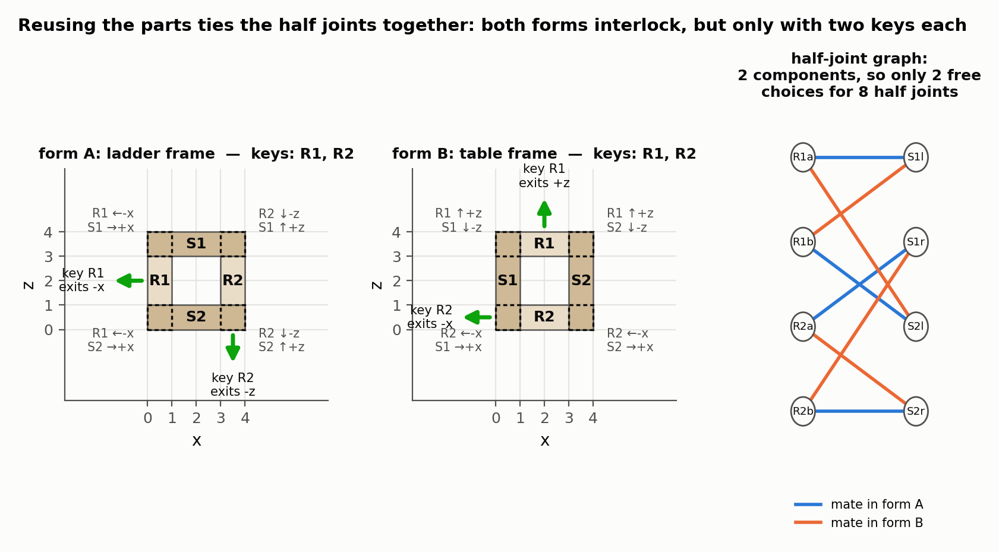
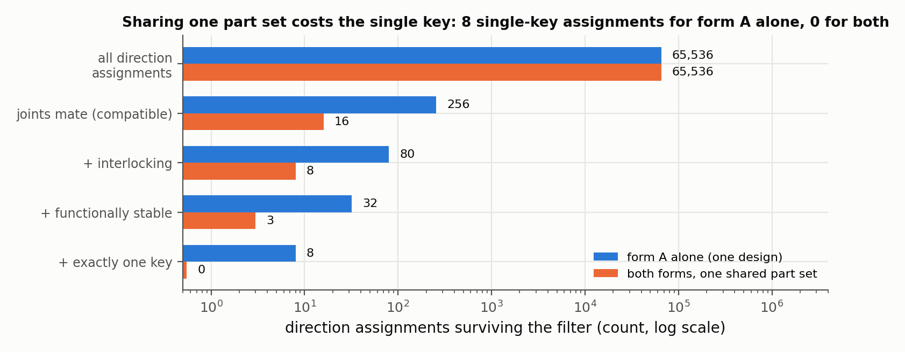
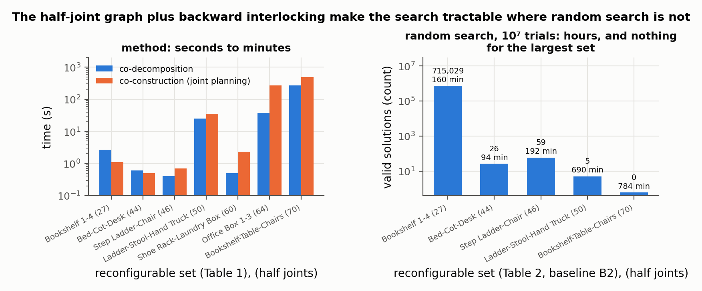

# Reconfigurable Interlocking Furniture

Peng Song, Chi-Wing Fu, Yueming Jin, Hongfei Xu, Ligang Liu, Pheng-Ann Heng, Daniel Cohen-Or — *ACM Transactions on Graphics 36(6), Article 174 (SIGGRAPH Asia), 2017*

[Paper](https://doi.org/10.1145/3130800.3130803) · [Project page](https://sutd-cgl.github.io/supp/Publication/projects/2017-SIGAsia-ReconfigFurniture/index.htm)

**Stability question:** Kinematic (main) — interlocks several furniture forms built from one shared set of parts; Static only as a heuristic — keys may not exit along gravity or along expected use loads.

**Source read:** full text (https://sutd-cgl.github.io/supp/Publication/papers/2017-SIGAsia-ReconfigFurniture_lowres.pdf, low-resolution figures); Tables 1–2 checked against the rendered pages. Song and Fu are marked as equal contributors.

## TL;DR
The goal is one set of parts that can build, say, a ladder, a stool, and a hand truck, each interlocked. The method has three steps:
1. Split the input designs into matching boxes so parts can be reused.
2. Model each joint location on a part as a "half joint" that can mate with different partners in different forms.
3. Plan joint directions with two relaxations of [fu2015-interlocking-furniture-assembly.md](fu2015-interlocking-furniture-assembly.md): *backward* interlocking, which builds groups toward the key instead of from it, and *multi-key* interlocking, which allows a few free keys per form.

## The problem
**Input:** N ≥ 2 furniture meshes with no parts or joints, similar in volume and substructure. The authors prepared them by hand in about 15–30 minutes each.

**Output:** one common set of parts with fixed joint geometry, such that every design can be assembled from it and each assembly interlocks without glue or nails.

The difficulty is that a half joint's geometry fixes its free direction in the part's own frame, and that one direction must work in every form the part appears in.

## Why it matters
Reusing parts saves cost. But requiring joints to be compatible across forms *and* interlocked in each form makes the joint search much harder than for one assembly, and the authors say it exceeds prior methods. A random baseline that draws directions without enforcing compatibility got no compatible assignment in 10⁷ trials for any input. Even with compatibility built in, random search found nothing for the largest input.

## Contributions
1. Co-decomposition posed as a weakly constrained dissection problem. It is solved iteratively on dynamic bipartite graphs of box "cages", which are resized or split to create exact matches while keeping contact, symmetry, and alignment.
2. The half-joint (joint connection) graph, which encodes joint compatibility across forms and shrinks the search space.
3. Backward and multi-key interlocking models, plus a co-construction tree that plans joints on substructures shared by several designs first.
4. Extensible, hierarchical assemblies from tileable parts, and fabrication by laser cutting, 3D printing, and woodworking.

## Key intuitions
1. **Directions live on the part, not in the room.** A half joint's free direction d is fixed in the part's frame. Rotating the part by T for a given form turns it into T·d in the world. Two mating half joints must point opposite ways, $T_{k,a}\,d_{a,x} = -\,T_{k,b}\,d_{b,y}$, so choosing one direction fixes every half joint connected to it. The free choices are therefore one per connected component of the half-joint graph, not one per joint.
2. **Reverse the dependency order.** In Fu 2015's *forward* model, the first group holds the global key and must end up locking everything, so every form would need the same first group and the same key. That rarely exists. In the *backward* model, each new group locks the keys of earlier groups, so construction ends at the global key and can start from whatever substructure the forms share.
3. **Allow a few keys.** One key per form over-constrains shared parts. A multi-key assembly has a few mobile keys, and all other parts and subsets stay stuck until some keys are removed.
4. **Spend the keys' freedom where it's harmless.** A "functional stability" constraint forbids a part from moving in a given direction. For example, ladder rungs may not exit downward or inward, and the stool's top key may not exit in the direction of sitting.

## Technical crux, explained simply
**Analogy.** Imagine a kit where every block already has its pegs and holes drilled. You may flip a block when building a different model, but you can't move its holes. A hole that takes a peg from the left in the ladder still has to face some peg once the block is rotated into the stool.

**Tiny example.** Part P has a half joint J whose geometry lets P slide off along its local +x.
- In the ladder, P is unrotated (T = identity) and mates with leg L, so L's half joint must release L along world −x.
- In the stool, P is rotated 180° about z (T maps +x to −x). J now releases P along world −x, so its stool partner must release along +x.
- If that stool partner also has a half joint in the same connected component, its direction is already forced. One choice ripples through the whole component.

*Figure 1. A toy version: four parts (two rails, two rungs) with eight half joints, assembled into a ladder frame and a table frame in which every part is turned 90°. Each label gives the world direction in which that part may leave its partner, after the pose is applied. Because each rail meets the other rung when the frame is rebuilt, the eight half joints fall into just two connected components, so there are only two free direction choices; the assignment shown is one of the eight that interlock both forms, and both need two keys. (our own toy computation, not a figure from the paper)*

**The pipeline.**
1. *Cages.* Approximate each design with a few large axis-aligned boxes that touch without gaps. Record contacts, symmetric groups, and co-planar alignments.
2. *Co-decomposition.* Score two cages by their best-orientation overlap, $S(B_1,B_2)=\max_i \mathrm{vol}(B_1\cap R_i(B_2))\,/\,\mathrm{vol}(B_1\cup R_i(B_2))$, where the $R_i$ are axis-to-axis orientations and S = 1 means identical boxes. Form matches greedily with randomness, either by resizing (at most 20% volume change) or by splitting a large cage into pieces that match smaller ones. The objective rewards matches, penalizes the number of distinct parts, and penalizes resizing, with weights 1, 0.5, and 0.3. Repeat with randomness and keep the best 10. Then merge joint locations that fall at the same spot on a part, and suggest where the user should add a part to complete 3- or 4-part cycles.
3. *Half-joint graph.* Nodes are half joints $J_{i,j}$ (the j-th on part i), and edges mean "these mate in some form". The unknowns are each half joint's direction $d_{i,j}$ and the pose $T_{k,i}$ of part i in design k (generally four choices). The constraints are:
   - compatibility (the equation above);
   - joint geometry (feasible directions from Fu 2015's joint analysis);
   - interlocking;
   - functional stability;
   - a soft preference for keeping a part's pose the same across designs, which avoids extra half joints.

   The rough search size is $m^g l^n$: m ≈ 4 directions per component, g components, l pose choices, n common parts.

*Figure 2. All 4⁸ = 65,536 direction assignments of the toy above, filtered step by step. The filters are nested: solving the ladder frame alone leaves 80 interlocking assignments, 32 of those functionally stable, and 8 of those with a single key. Requiring the same half joints to serve the table frame as well leaves 8 interlocking, 3 functionally stable, and no single-key assignment at all — which is why the paper needs the multi-key relaxation. (our own toy computation)*
4. *Co-construction.* Find 3- or 4-part cycles common to all or several designs whose half-joint connections are consistent. Arrange them in a tree with widely shared cycles near the root and per-design cycles at the leaves. Visit the tree breadth-first:
   - make each node's cycle a local interlocking group;
   - propagate the chosen directions through the half-joint graph;
   - prefer backward dependencies (parent locked by child);
   - backtrack on failure, relaxing the pose preference if needed.

## What the results do well
- Seven multi-form sets, with 1–3 keys per form, on a 3.4 GHz CPU with 8 GB RAM.
  - LADDER–STOOL–HAND TRUCK: 11 common parts, 50 half joints, 24.8 s decomposition plus 35.6 s joint planning.
  - BOOKSHELF–TABLE–CHAIRS: 16 parts, 70 half joints, 275.0 s plus 493.8 s, the slowest set.
- Baselines of 10⁷ random trials each:
  - B1 (random feasible directions) found 0 valid solutions for every input.
  - B2 (random but compatibility-consistent) found 715,029 for BOOKSHELVES, 59 for STEP LADDER–CHAIR, 26 for BED–COT–DESK, 5 for LADDER–STOOL–HAND TRUCK, and 0 for BOOKSHELF–TABLE–CHAIRS. Each run took 93.5–783.5 min.
- Tileable parts: three unique laser-cut parts form a single-key box. An ARMOIRE has 65 parts but only 7 unique parts and 3 global keys.
- Physical builds:
  - laser cut from 1.5 mm sheets stacked four layers deep;
  - FDM printed, with prints of 78.2 h and 69.0 h;
  - built by a carpenter at full size: a 1.6 m LADDER–STOOL–TRUCK in two days and 1 m BOOKSHELVES in one day.

*Figure 3. Left: the co-decomposition and joint-planning times of Table 1 for all seven sets, sorted by half-joint count — under a second for four of them, and 275.0 s plus 493.8 s for the 70-half-joint BOOKSHELF–TABLE–CHAIRS. Right: what baseline B2 found in 10⁷ compatibility-consistent random trials (Table 2), which falls from 715,029 solutions on the smallest set to 5 on LADDER–STOOL–HAND TRUCK and none on the largest, after 784 min.*

## Limitations
Stated by the authors:
- Co-decomposition fails when designs differ a lot in local dimensions or substructure.
- Interlocking depends on cyclic substructures, so users must add parts when cycles are missing. Only orthogonal joints are supported.
- Several steps are manual: adding parts, spotting undesirable results (e.g. unused tenons that stick out and hit the floor, unstable assemblies, visible unused joints), and transferring decorative features.
- Decomposition and joint planning run in sequence with no feedback between them. There is no formal stability analysis, and the number of keys isn't minimized.
- In the full-size wooden LADDER and TRUCK, weight and size forced the authors to add pins through the three-way joints "to strengthen the connections." With the pins in, the construction was "strong enough to support larger external forces," such as a student climbing the ladder.

Our observations:
- The pins are the clearest evidence in this group of papers that kinematic interlocking doesn't guarantee load capacity at real scale.
- Functional stability only restricts free directions. Nothing checks separation under load from friction loss, clearance, or deflection, and unstable results are rejected by eye.

## Relevance to joint stability in this repo
- **The cheapest static check we can add.** Give each 2-part joint an expected load direction (gravity or service use) and flag it when that load would push the parts apart along the joint's free direction. This is the paper's functional-stability constraint applied to one joint.
- **Frame bookkeeping for free directions.** Our LHF cuts carry a local (u, v, n) frame. A free direction found in one part's cut frame must be mapped by that part's pose, and negated for the mating part, before directions are compared across parts or joints. $T_{k,a}d_{a,x}=-T_{k,b}d_{b,y}$ is that consistency check.
- **Evidence for the three-level framing.** The pins in the wooden prototypes are a documented case of kinematically valid joints that fell short on static and structural grounds. A repair-strategy model shouldn't treat "can't come apart" as "holds" (our observation).
- **What does not transfer:** co-decomposition and reconfigurability solve a design-reuse problem. For a fixed 2-part joint, half-joint compatibility collapses to a single mating pair.
