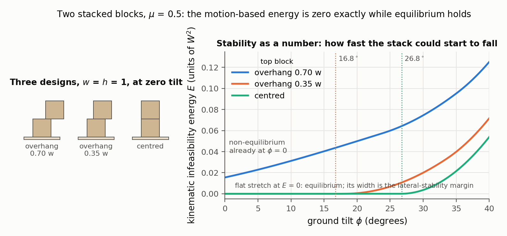
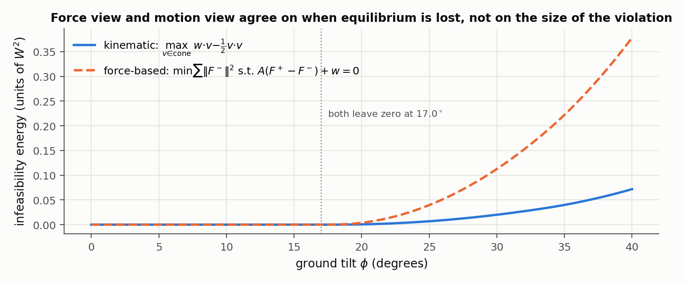

# Computational Assemblies: Analysis, Design, and Fabrication

Peng Song, Ziqi Wang, Marco Livesu — *Eurographics 2022 Tutorials*

[Paper](https://diglib.eg.org/handle/10.2312/egt20221056) · [Project page](https://sutd-cgl.github.io/supp/Publication/projects/2022-EG-AssemblyTutorial/index.html)

**Stability question:** Kinematic + Static — teaches joint motion spaces, rigid-block equilibrium, tilt analysis and interlocking tests, and adds the motion-space ("kinematic") equilibrium measure used for gradient-based stability optimization.

**Source read:** everything the project page provides: the 5-page tutorial proposal (https://sutd-cgl.github.io/supp/Publication/papers/2022-EG-AssemblyTutorial.pdf) and three slide decks (part 1, Song, 118 PDF pages; part 2, Wang, 127; part 3, Livesu, 61), read as extracted text. The project page lists no video or notes, and equations that exist only as images in the slides could not be recovered.

## TL;DR
A roughly three-hour tutorial (per its timetable) built on the [2021 STAR](wang2021-star-assemblies-rigid-parts.md) by two of its authors plus Marco Livesu. The written proposal is only an abstract and outline. The slides add some material the STAR lacks: a worked motion-space computation for joints, a "stability spectrum" framing, and a full recipe for *optimizing* stability by gradients. That recipe offers both a force-based and a motion-based infeasibility energy. Read the STAR first; read this file for those additions.

## The problem
Designers must reason jointly about fabricability, joining, assembly planning and structural stability. The tutorial is aimed at new graduate students (and designers or makers), and wants to leave them able to start research in "computational assemblies". Like the STAR, it covers structures with rigid parts and treats design as geometric modeling plus optimization.

## Why it matters
For this repo, the second deck (Wang) is the value. It explains how to turn a yes/no stability test into a *differentiable score*. That is what you need to rank or optimize LHF joint parameters, not just classify them.

## Contributions
1. **Part 1, analysis (Song):**
   - Fabricability tests: laser cutting (planar parts), 3-axis CNC (height fields, with three ways to test for one), and 3D-printing overhangs.
   - Joint mobility analysis.
   - Assembly-plan taxonomy: the STAR's features plus *coherence*.
   - Stability: static analysis, tilt analysis, and three interlocking tests.
2. **Part 2, design (Wang):** a 4-step gradient-based stability optimization framework, applied to:
   - Equilibrium, computed either with forces or with motions, plus friction.
   - Lateral (tilt) stability.
   - Scaffold-free assembly sequences.
   - Interlocking design with DBGs, shown as a step-by-step build of a 5-part assembly.
3. **Part 3, fabrication (Livesu):** shape decomposition to meet hardware limits.
   - Finding a *minimal* constrained decomposition is NP-hard, so methods rely on heuristics: BSP trees, beam search, graph-cut labeling, mesh Booleans.
   - Assemblability conditions for rigid and for soft (mold) pieces.

## Key intuitions
1. **Joint strength (kinematic) = how much relative motion the joint forbids.** Fix one part and compute the other's motion space. For *curved* contacts, sampled constraints give only an *upper bound* on the true motion space.
2. **Stability is a spectrum:** non-equilibrium → equilibrium under gravity → lateral stability → globally interlocking → deadlock. The slides mark a "practical region" on this spectrum, and note that moving right requires more restrictive joints.
3. **The force view and the motion view are interchangeable.** Static–kinematic duality means equilibrium can be tested with forces or with motions. The motion view can also test global interlocking, which the force view cannot, and handles non-planar contacts more efficiently.
4. **Optimization needs a score, not a yes/no.** Measure how *infeasible* a design is, differentiate that measure with respect to shape parameters, and hand it to a gradient or quasi-Newton solver.
5. **Rigid-body assemblability has a local and a global condition.** Locally, each interface must be a height field with respect to the extraction direction. Globally, a clear extraction path must exist.

## Technical crux, explained simply
**Joint motion space (part 1).** Fix part A. Give part B a tiny motion: a translation $v$ plus a rotation $\omega$. A contact point at offset $r$ then moves with velocity $v_c = v + \omega\times r$. Non-penetration requires $v_c\cdot n \ge 0$, where $n$ is the contact normal pointing into B. One such row per contact point gives a linear system whose solutions form the joint's motion space. For a whole part, intersect the motion spaces of its joints.

In the slides' 2D example, one part's three joints allow only $-y$, $-x$ and $-x$ respectively, so its motion space is $\{-y\}\cap\{-x\}\cap\{-x\} = \varnothing$ and it is stuck. Another part's two joints both allow $+y$, so it can be removed along $+y$.

**Two ways to score "how unstable" (part 2).**
- **Force-based** ([Whiting 2009/2012](whiting2012-structural-optimization-masonry.md)). Split each contact force into $F = F^+ - F^-$ with both parts $\ge 0$. Then minimize $\sum\|F^-\|^2$ subject to force and torque balance $A_{eq}F + w = 0$. The leftover "tension" $F^-$ is the infeasibility.
  - The QP has a closed-form solution when only equality constraints remain.
  - Small geometry changes only change the forces slightly, so a trust-region approach replaces the inequalities by equalities (fixing which $F^+_i$ or $F^-_j$ are zero), which makes the energy differentiable.
- **Kinematic-based** ([MOCCA](wang2021-mocca.md)). Consider motions $\hat v$ in the contacts' motion cone ($B_{in}\hat v \ge 0$) that *lower* gravitational potential ($\hat v\cdot w > 0$). The assembly is in equilibrium iff no such motion exists. The infeasibility is $\max_{\hat v}\; w\cdot\hat v - \tfrac12\hat v\cdot\hat v$ subject to $B_{in}\hat v \ge 0$, which is zero exactly when equilibrium holds.

In plain words: "how fast could the structure start to fall, if it could?" For a stack of parts, each relative motion must lie in the cone of the joint between the two parts.

*Figure 1. The stability spectrum read off one computed number (our computation): the kinematic infeasibility energy $E = \max_{\hat v}\, w\cdot\hat v - \tfrac12\hat v\cdot\hat v$ over the motion cone, for two stacked unit blocks on a ground tilted by $\phi$, with $\mu = 0.5$. The stack whose top block overhangs by 0.70 w has $E > 0$ already at $\phi = 0$ (non-equilibrium); the other two stay at $E = 0$ up to 16.8° and 26.8°, and that width is their lateral stability. Friction enters by using the two edge rays of each 2D Coulomb cone as the constraint "normals" (the polar of the friction cone), our extension of the slides' frictionless version; the centred column's limit matches the closed form $\tan\phi = \mu = w/(2h)$, i.e. 26.6°, to the sweep resolution.*

**Friction.** A Coulomb cone ($F_t \le \mu F_n$) alone can predict unrealistic sliding resistance. The slides add two rules ([Yao 2017](yao2017-decorative-joinery.md)):
- A complementarity condition: normal displacement times normal force equals zero (a contact either separates or pushes, not both).
- Maximum dissipation: friction opposes tangential displacement.

LEGO is a special case with constant normal forces and a precomputed friction range.

**Other stability types.**
- **Lateral stability:** evaluate the infeasibility energy at several gravity directions forming a pyramid and minimize their sum (BFGS), with contact area kept above a user value. Because the feasible cone of gravity directions is convex, making the pyramid's corner directions feasible makes the whole pyramid feasible.
- **Scaffold-free assembly:** sum the infeasibility energy over every intermediate stage of the sequence.
- **Interlocking:** make every base DBG strongly connected, apart from the key.

## What the results do well
- Links analysis to design in one place: the stability tests from part 1 reappear as energies to minimize in part 2.
- It compares the force-based measure side by side with the kinematic one (which postdates the STAR). The force-based one is "hard to test for some stability types (i.e., globally interlocking)" and "less efficient when handling parts with non-planar contacts".

  
  *Figure 2. Force-based versus kinematic infeasibility on the 0.35 w stack of Figure 1 (our computation). The force-based energy (Whiting-style: minimise $\sum\|F^-\|^2$ subject to exact force and torque balance, each contact force split into $F^+ - F^- \ge 0$ along the friction-cone rays) and the kinematic energy leave zero at the same tilt, 17.0°, which is the static–kinematic duality the slides rely on. Away from equilibrium the two numbers differ, so as optimisation energies they would rank unstable designs differently.*
- The slides name newer stability-analysis directions: friction ([Kao 2022](kao2022-coupled-rigid-block-analysis.md)), tolerance (PuzzleFlex, Lensgraf et al. 2020), and deformable parts (Tozoni et al. 2021).

## Limitations
**Stated by the presenters:**
- (Dis)assembly planning is NP-complete; common simplifications assume sequential, monotone, linear, coherent plans with translations only.
- A minimal constrained decomposition is NP-hard, so only good local minima are found.
- Future analysis should cover aesthetics, reconfigurability and functionality.

**Our observations:**
- Written material is thin: a 5-page proposal plus slides. Several equations are only in figures, so this summary can't check every sign or constraint.
- There are no new results; the tutorial repackages published papers.
- The rigid-part assumption still excludes material failure. The cited tolerance and deformable-part work is only named, not taught.

## Relevance to joint stability in this repo
- **The kinematic infeasibility energy is a strong candidate for a differentiable stability score for 2-part LHF joints.** Contact normals come straight from the cut faces (the floor normal $n$ and the swept walls), and the load $w$ can be any direction, not just gravity. *(our observation)*
- **Part 3's rigid-assemblability rule matches the LHF construction.** Interfaces must be height fields with respect to the extraction direction, and a clear path must exist. A single LHF cut is a prism along its normal $n$, with faces either parallel or perpendicular to $n$, so extraction along $n$ toward the cut's open side is the natural first candidate. Joints that combine cuts with different normals are where assemblability can fail. *(our observation)*
- **The spectrum tells you where 2-part joints sit.** A 2-part joint can't reach "globally interlocking" as defined here and in the STAR (a key plus at least two other parts that stay immobilized). The useful targets are equilibrium under specified loads and a lateral-stability-style margin. *(our observation)*
