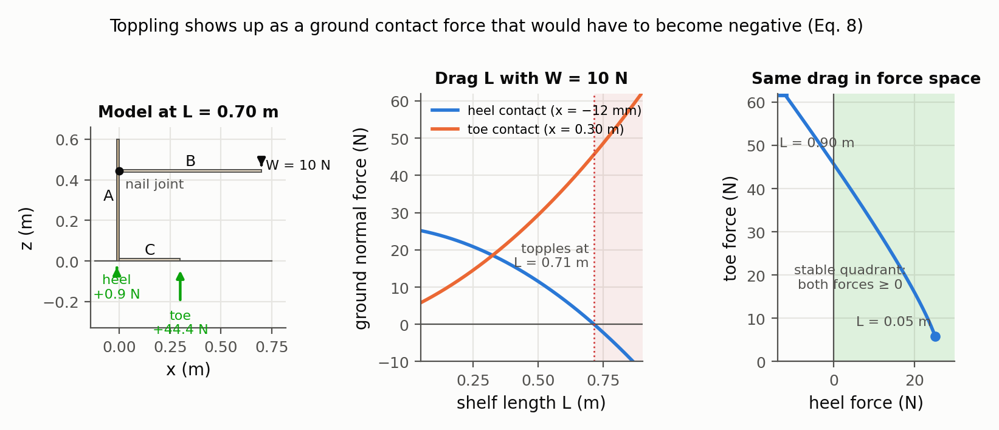
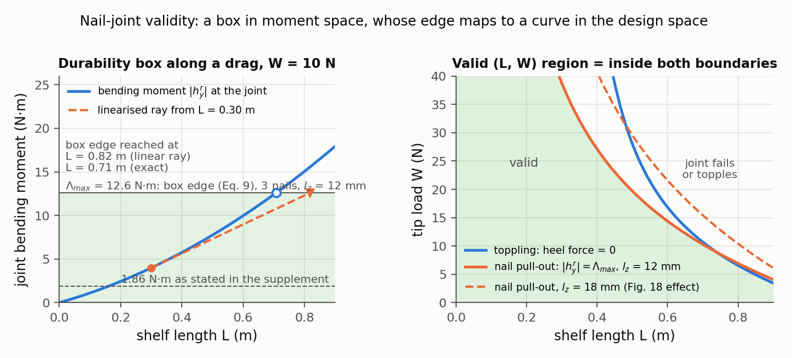
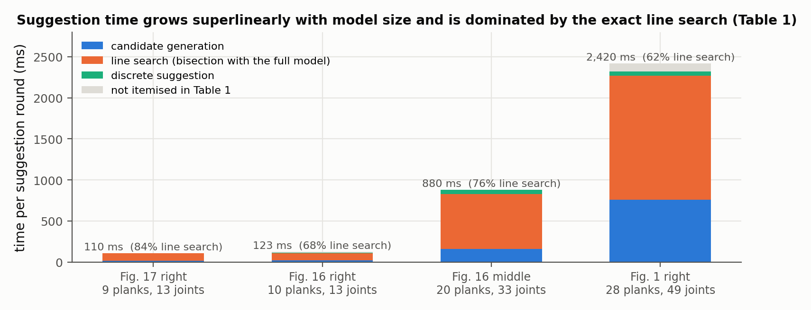

# Guided Exploration of Physically Valid Shapes for Furniture Design

Nobuyuki Umetani, Takeo Igarashi, Niloy J. Mitra — *ACM Transactions on Graphics 31(4), Proc. SIGGRAPH 2012*

[Paper](http://www.nobuyuki-umetani.com/publication/2012_sigg_GuidedExploration/2012_siggraph_GuidedExploration.pdf) · [Project page](http://www.nobuyuki-umetani.com/publication/2012_sigg_GuidedExploration/2012_siggraph_GuidedExploration.html) · [Code](http://www.nobuyuki-umetani.com/publication/2012_sigg_GuidedExploration/guided_exp_src.zip)

**Stability question:** Static + Structural — toppling is modeled as a ground contact force going negative (friction included), and joint durability as nail pull-out and shear forces exceeding tabulated fastener limits. Both feed a sensitivity analysis that tells the user which edits restore validity.

**Source read:** full text, 12 pages (http://www.nobuyuki-umetani.com/publication/2012_sigg_GuidedExploration/2012_siggraph_GuidedExploration.pdf), plus the project page's one-page supplement "Validation for nail joint model"

## TL;DR
An interactive modeler for nail-jointed plank furniture. While you drag a plank, it shows the range of that parameter over which the design stays physically valid: it doesn't topple and no nail joint fails under the target loads. When a design becomes invalid, it proposes up to 8 fixes. Each fix moves up to 3 parameters together, or adds a support plank. The key trick is to express both validity tests as simple shapes in *force space* (an orthant and a box), then use linearized derivatives of forces with respect to shape parameters to pick good edit directions.

## The problem
In the usual workflow, a designer models a shape, a simulator checks it, and the design goes back for another try. That loop is trial and error, gives no hint about *how* to fix a violation, and pushes people toward standard shapes. The paper instead wants validity feedback *during* editing for furniture with unusual plank angles. Three things are checked:
- **Connectivity:** joints stay attached geometrically.
- **Durability:** joints don't break under the target loads.
- **Stability:** the object doesn't topple or lose ground contact.

## Why it matters
An early example of turning a physical validity check into *design guidance*. Earlier work either only checked validity or, like [Whiting 2009](whiting2009-structurally-sound-masonry.md), optimized to a single answer. Its joint model is crude but explicit (joint forces become fastener demands compared with capacities), and its friction handling makes contact forces unique and differentiable. Both are templates for asking "which LHF parameter changes keep a joint valid?"

## Contributions
1. An interactive framework for designing shapes under geometric and physical constraints: valid ranges during a drag, fix suggestions after mouse release.
2. A design environment for nail-jointed plank furniture with frictional contact and an implicit static rigid-body solve.
3. A force-space sensitivity analysis producing continuous (coordinated multi-parameter) and discrete (add a support plank) suggestions.
4. A 9-person user study and a fabricated prototype tested under its target load.

## Key intuitions
1. **Planks are rigid; joints are where things break.** Following Parker & Ambrose, nailed wood structures mostly fail at joints, so planks can be unbreakable rigid bodies and only joint forces are checked.
2. **Soft springs replace hard joint constraints.** Loops of planks are over-constrained; penalty springs with tiny compliance ($10^{-5}$) always give a solution, and the spring *force* doesn't depend on the compliance even though the stretch does.
3. **Friction anchors make friction forces unique.** A table at rest can be held by many combinations of friction forces, and friction direction depends on velocity, which a static sensitivity analysis doesn't have. A tangential spring anchored at each ground contact's initial position picks one answer.
4. **Validity is simple in force space, messy in shape space.** Stable means every contact normal force is $\ge 0$ (an orthant). Durable means every joint bending moment lies within $\pm\Lambda_{max}$ (a box). Hard boundaries in shape space become easy ray-vs-box and least-squares problems once you map shape changes to force changes with a Jacobian.
5. **Linearize only to pick a direction, then check exactly.** Derivatives rank candidate edit directions. Each candidate is then verified by bisection with the full nonlinear constraints and dropped if no valid shape is found, so linearization errors cost missed suggestions rather than invalid ones.

## Technical crux, explained simply

**Analogy.** Hang a bag on the tip of a shelf nailed to a post: the shelf tries to rotate about the joint's bottom edge, prying the nails out. Lean on the front of a chair: the back legs get lighter, and if a leg would need the floor to *pull it down*, the chair tips.

**Tiny example (ours, to illustrate the paper's formulas).** Plank B is a horizontal shelf nailed to the side of vertical plank A (Figure 1, left, where a base plank C lets the piece stand on the ground). A weight $W$ hangs at distance $L$ from the joint. The joint's lower edge acts as the pivot, and the nails sit half a plank thickness ($l_z/2$) from it.

The joint must resist a bending moment $M = WL$. The paper treats it as a lever with arm $0.5\,l_z$ ($l_z$ = plank thickness, 12 mm), so the nails carry a total pull of $2M/l_z$, less any normal force pressing the planks together, divided among the nails. With $W = 100$ N at $L = 0.2$ m, $M = 20$ N·m and $2M/l_z \approx 3{,}300$ N: levers make joint demands large.

**Step 1: solve for forces (Sec. 5.1).** Plank $i$ has rotation $R_i$ and translation $u_i$. A nail joint between $P_i$ and $P_j$ is one point $p_{ij}$, with two mismatch vectors:
- Translational: $d^t_{ij} = [R_i(p_{ij}-c_i)+c_i+u_i] - [R_j(p_{ij}-c_j)+c_j+u_j]$.
- Rotational: $d^r_{ij} = \mathrm{vect}(R_i^T R_j)$.

Each joint stores spring energy $\tfrac12\|d^t\|^2/\varepsilon_t + \tfrac12\|d^r\|^2/\varepsilon_r$, giving joint forces $h^t = d^t/\varepsilon_t$ and $h^r = d^r/\varepsilon_r$ ($h^r$ is the "bending force", i.e., bending moment). The static equilibrium minimizes $E_{total} = -\sum_i M_i c_i^T g + \sum E_{joint} + \sum E_{contact}$ (gravity with plank mass $M_i$ and center $c_i$, joint springs, contacts) by Newton–Raphson, solving for $h$ as extra unknowns because the penalty Hessian is ill-conditioned, with $10^{-5}$ diagonal damping.

**Step 2: durability test.** Write each joint force in local axes:
- $h_n$: normal to the joint face of $P_j$.
- $h_x$: along the normal of $P_i$.
- $h_y$: the remaining direction.

Since the plank is thinner than the joint is wide, the bending component $h^r_y$ is what collapses the joint. Then:

$$f_{pull} = \frac{2|h^r_y|/l_z - h^t_n}{N_{nail}},\qquad f_{shear} = \frac{\sqrt{(h^t_x)^2 + (h^t_y)^2}}{N_{nail}}$$

A joint is durable if both are within allowable limits, $|f_{pull}| \le f_{pull}^{max}$ and $|f_{shear}| \le f_{shear}^{max}$. For 12 mm MDF with 32 mm nails at 20 mm spacing, the paper uses $f_{shear}^{max} = 190$ N and $f_{pull}^{max} = 35$ kN/m. The supplement reads 35 kN/m as pull capacity per metre of nail embedded in the second plank (32 − 12 = 20 mm).

**Step 3: toppling test.** Contacts sit at plank corners touching the ground. The design is stable iff every contact normal force is non-negative, $f^l_{cont} \ge 0$; a negative value means the ground would have to hold that corner down, i.e., the piece tips. Friction uses anchored springs (static coefficient 0.5), assuming contacts stay exactly on the ground and contact states don't change; anchors are relocated when sliding so no spring exceeds the Coulomb limit.

*Figure 1. The toppling test (Eq. 8) on our plank model: base C (0.30 m) on the ground, post A (0.60 m), shelf B nailed to A at 0.45 m and cantilevering over the base by $L$, tip load $W$; 12 mm MDF planks 0.25 m deep with an assumed density of 750 kg/m³. Left: the model at $L$ = 0.70 m with the two ground contact forces from 2D statics. Middle: dragging $L$ at $W$ = 10 N shifts weight toward the toe until the heel force would have to go negative at $L$ = 0.71 m, the toppling point. Right: the same drag traced in the force space of the two contacts; the stable region is the non-negative quadrant, as in the paper's Fig. 11. (our computation)*

**Step 4: sensitivity (Sec. 5.2).** Near equilibrium, the statics is a linear system $A(\gamma)x(\gamma) = b(\gamma)$, where $x$ stacks plank poses and joint forces and $\gamma$ is the shape. The paper uses $dx/d\gamma = A^{-1}\,db/d\gamma$ for two things: as a warm start for the next Newton solve during dragging, and to build the Jacobians below.

**Step 5: the design space.** Each plank has 8 design DOFs (3 translation, 3 rotation, 2 edge lengths; thickness fixed). Neighbouring plank lengths adjust to keep joints and ground contacts intact, and impossible DOFs (e.g., translating a plank nailed on both sides) are removed, giving $N_\gamma = 8C - \#DOF_{invalid}$ for $C$ planks.

**Step 6: valid ranges and suggestions (Sec. 6).**
- **Durability box.** Two approximations make the durable region a box: the translational force $h^t$ and the shear force stay fixed under small edits, and only $h^r$ changes. Then $|h^r_y| \le 0.5\,l_z\,(f_{pull}^{max}N_{nail} + h^t_n) = \Lambda_{max}$ for every joint. (The text calls this region $\Gamma_{stable}$ at one point, but the context and Fig. 11 show it means the durable region.)
- **Valid range while dragging.** If the design is valid, step the parameter in both directions until it becomes invalid. If invalid, choose the direction from the sensitivity, then bisect.
- **Durability suggestions.** For each combination of $m \le M = 3$ DOFs, with joint-moment sensitivities $K_0 = \partial h^r_y/\partial\gamma$, solve $y^* = \arg\min_y \|K_0 y + h^r_{y0}\|$ (the edit pushing moments closest to zero), normalize to a direction $s$, and find the step $t$ at which moments reach the box. This is a ray shot at the box; directions with $\|K_0 s\| \le 1$ or pointing away are culled. A combination is kept if $t < 1$ and none of its subsets was kept; its durable range is found by bisection with the full model, and suggestions are sorted by range size.
- **Stability suggestions.** $L_0 = \partial f_{cont}/\partial\gamma$ holds the contact-force sensitivities. Clamp the negative contact forces to zero to get a target $f^*_{cont0}$, then solve $\min_y \|L_0 y + f_{cont0} - f^*_{cont0}\|$. If both conditions fail, stability is restored first.
- **Discrete suggestions.** If joint $N_{ik}$ and/or $N_{jk}$ fails, where $P_k$ sits between two nearly parallel planks $P_i, P_j$, add a support plank between $P_i$ and $P_j$ at a rule-based, collision-free position; keep it only if re-simulation shows it is effective.

*Figure 2. Nail-joint durability on the model of Figure 1 (our computation with the paper's Eqs. 4 and 9). Left: the joint's bending moment grows with $L$ (quadratically, since the shelf's own weight grows too) until it reaches the box edge $\Lambda_{max} = 0.5\,l_z\,(f_{pull}^{max} N_{nail} + h^t_n)$ = 12.6 N·m for 3 nails at 700 N each (35 kN/m × 20 mm embedded, the paper's constants, $h^t_n = 0$). The dashed ray from $L$ = 0.30 m is the paper's linearised sensitivity: it predicts the edge at 0.82 m where the exact value is 0.71 m, which is why each suggestion is finished by bisection with the full model. The supplement instead states 1.86 N·m for this joint (see Limitations), which would shrink the durable range to about 0.15 m. Right: the valid $(L, W)$ region is the intersection of the toppling and pull-out constraints; an 18 mm plank (dashed) enlarges it, as in the paper's Fig. 18. Shear (190 N per nail) never binds at these loads.*

## What the results do well
- **Speed (Table 1, Intel Core i7 2.8 GHz, 4 GB RAM):**

| Planks | Joints | Total time |
|---:|---:|---:|
| 9 | 13 | 110 ms |
| 10 | 13 | 123 ms |
| 20 | 33 | 880 ms |
| 28 | 49 | 2,420 ms |

  Line search is the largest cost in every case, e.g., 1,512 ms of the 2,420 ms. The authors report regularly handling 10–15 planks at interactive speed.

  
  *Figure 3. The paper's Table 1 timings (Intel Core i7 2.8 GHz) as stacked components per suggestion round for its four example models. Line search, the exact bisection with the full nonlinear model, takes 62–84 % of each round; the printed totals exceed the sum of the itemised rows by 0–98 ms (grey).*
- **A physical build.** A design with 50 kg on the horizontal plank and 15 kg on the back plank took about 4 hours to build and "behave[d] satisfactorily under the target load".
- **Nail-model validation (supplement).** A two-plank cantilever with 3 nails was predicted to hold about 1 kg. Measured tip displacement left its linear trend near that load, and permanent set after unloading appeared, meaning the nails were slipping.
- **User study.** Nine novices (CS graduates, 1 female) tried no feedback, feedback plus ranges, and the full system. With the full system all nine made valid furniture close to their paper concept (roughly 30 minutes per successful design); those who used it *first* mostly failed to recreate their designs with the weaker variants. The authors call for a more rigorous quantitative study.
- **Suggestions encode non-obvious coupled moves**, e.g., sliding a table top left while straightening the left leg to offset the extra moment on the left joint.

## Limitations
**Stated by the authors:**
- Planks are perfectly rigid and unbreakable. Real planks bend under heavy load, which changes nail behaviour, and can break, especially long unsupported spans.
- No curved planks or shifting loads; only statics (a rocking chair is future work).
- Linearization can fail in highly nonlinear regions, and $M = 3$ limits the possible suggestions.
- Valid regions can be disjoint islands or joined by narrow passages, so the method may miss durable designs that exist.
- Aesthetics are not modeled, and self-intersections are not checked at runtime.
- Support-plank placement is a greedy rule-based search; "smarter strategies should be investigated".

**Our observations:**
- The nail capacity numbers in the supplement don't multiply out as printed: $0.02\cdot35000\cdot0.006\cdot3 = 12.6$ N·m, not the stated 1.86 N·m. Recheck the constants before reusing them.
- The paper's own reports differ: "10–20 rigid bodies on a 2.7 GHz laptop" in the introduction, 10–15 planks at interactive speed in the results, and a 2.8 GHz CPU in Table 1.
- Joints are *bilateral* springs carrying tension and moment; the only unilateral condition is at the ground.
- Eq. 6 as written, $dx/d\gamma = A^{-1}db/d\gamma$, omits the $(dA/d\gamma)\,x$ term, so it is approximate (fine for choosing directions).
- Loads are simplified (the exact weight position on a plank "is not important"), and there is no quantitative comparison with FEM or a baseline optimizer.

## Relevance to joint stability in this repo
- **Use sensitivities to show valid parameter ranges.** The workflow transfers directly to LHF parameters (sketch dimensions, sweep `amount`): differentiate a per-joint validity quantity, pick a direction, bisect with the exact check. This could label "how far can this cut change before the joint becomes invalid" across the 30 MiGumi joints.
- **Put the validity test in force space.** For a 2-part integral joint, the analogous regions would be non-negative contact normal forces (no separation) and a friction cone at each contact. That is RBE with friction, as in the [STAR](wang2021-star-assemblies-rigid-parts.md) and [Kao 2022](kao2022-coupled-rigid-block-analysis.md). These convex force regions make the ray and least-squares tricks usable.
- **Keep the lever model for joint capacity, but not the nail numbers.** *(our observation)* In an integral wood joint, the demand side still works: a bending moment divided by a lever arm gives a contact or shear force. The capacity side must come from wood properties (shear along grain at a tenon or dovetail neck, compression perpendicular to grain), not fastener tables.
- **Bonded springs won't transfer.** *(our observation)* Nails resist pulling apart; LHF joints resist only through unilateral contact and friction, and parts can separate along their assembly direction. A bilateral spring would hide exactly those kinematic failure modes, so use unilateral contacts on the LHF faces, keeping the friction-anchor idea only to make friction forces unique.
