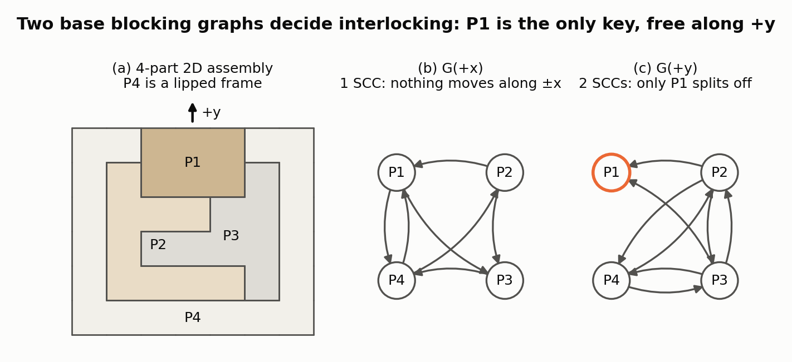
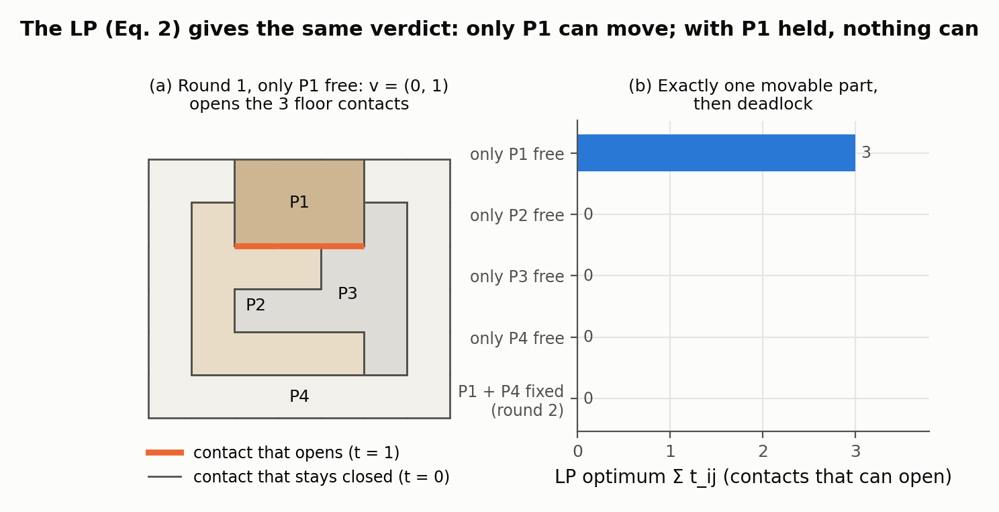
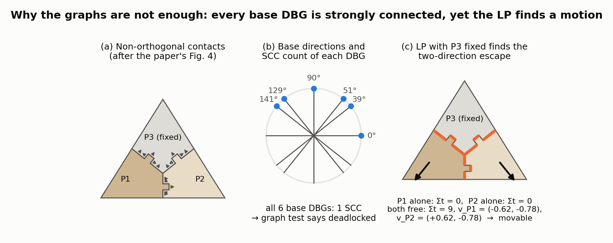
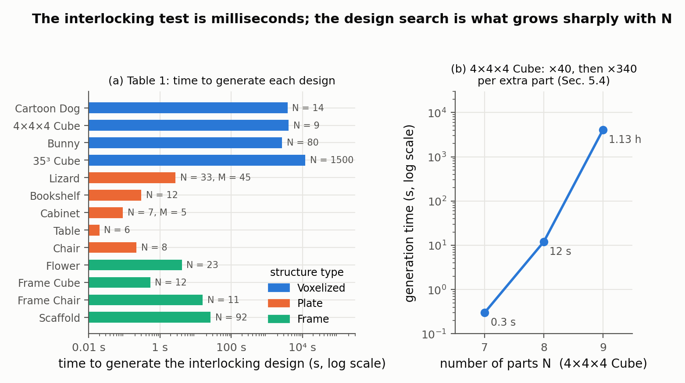

# DESIA: A General Framework for Designing Interlocking Assemblies

Ziqi Wang, Peng Song, Mark Pauly — *ACM Transactions on Graphics 37(6), Article 191 (SIGGRAPH Asia), 2018*

[Paper](https://sutd-cgl.github.io/supp/Publication/papers/2018-SIGAsia-DESIA.pdf) · [Code](https://github.com/KIKI007/DESIA)

**Stability question:** Kinematic — decides whether any part *or any group of parts* can slide out of an assembly, using directed blocking graphs and a linear program over contact normals.

**Source read:** full text (https://sutd-cgl.github.io/supp/Publication/papers/2018-SIGAsia-DESIA.pdf), all 14 pages including Table 1. The supplementary material (proofs, per-result blocking graphs) was not read.

## TL;DR
DESIA turns "is this assembly interlocking?" into a question about a few directed graphs. For each candidate sliding direction, it draws an arrow from part *i* to part *j* when *j* blocks *i*. If every graph is strongly connected, or splits off only the key, then no subset of parts can escape. This takes polynomial time instead of checking all $2^N$ subsets. On top of this test, DESIA builds voxel puzzles, plate furniture, and beam frames one part at a time. It plans the blocking graph first, builds geometry second, and backtracks when stuck.

## The problem
In an *interlocking* assembly, exactly one part (the **key**) can move. Every other part, and every subset of parts, is held in place by geometry alone. Checking this directly takes exponential time. Earlier design methods ([song2012-recursive-interlocking-puzzles.md](song2012-recursive-interlocking-puzzles.md), [fu2015-interlocking-furniture-assembly.md](fu2015-interlocking-furniture-assembly.md)) skipped the global test by chaining small "local interlocking groups". That guarantees interlocking but only explores a small slice of the possible configurations.

## Why it matters
- A cheap, exact kinematic test is what makes design search possible at all. DESIA's test takes 0.5 ms on an 80-part assembly.
- The same representation covers puzzles, furniture joints, and beam frames. It is the kinematic foundation that [wang2019-topological-interlocking.md](wang2019-topological-interlocking.md) and [wang2021-mocca.md](wang2021-mocca.md) extend.

## Contributions
1. A representation of blocking relations as a set of **base Directional Blocking Graphs (DBGs)**, plus an interlocking test that runs in polynomial time ($O(N^4)$ in the worst case).
2. An inequality/LP-based test that also catches groups escaping in *different* directions at once.
3. An iterative design framework that uses blocking relations with *all* previously built parts. It searches a tree of candidates and backtracks when it gets stuck.
4. Three application classes: voxelized puzzles, plate structures with woodworking joints, and new single-key interlocking **frame structures** held together by 3×3×3 voxel joints (one was built physically).

## Key intuitions
1. **Group immobility is a graph property.** A group S can slide along direction d only if no arrow leaves S in the graph for d. In a strongly connected graph, every proper subset has both an outgoing and an incoming arrow. So strong connectivity rules out escape along ±d for all $2^N$ subsets at once.
2. **Only finitely many directions matter.** Contact planes split the circle of 2D directions into arcs. Inside an arc the graph is the union of the graphs at its two endpoints, so it only has *more* arrows. Also, G(−d) is G(d) with every arrow reversed. So only the endpoint directions on half the circle need checking: $O(N^2)$ graphs. For 3D the paper points to Wilson and Latombe 1994.
3. **A contact is a linear inequality on velocities.** The graphs only consider a group moving together in one direction. Writing non-penetration as $(\mathbf v_j-\mathbf v_i)\cdot\mathbf n_{ij}\ge 0$ also catches parts moving in different directions at once.
4. **Design the graph before the geometry.** When a new part $P_i$ is split off, first decide which blocking arrows it and the remainder need to stay on a cycle. Then look for geometry that produces those arrows. Any earlier part can help lock the new one, not just the previous part as in Song 2012.

## Technical crux, explained simply
**Analogy.** A drawer comes out in exactly one direction. A puzzle box won't open in any direction until you find the key piece. DESIA keeps track of "who blocks whom, in which direction."

**Tiny example: a peg B in a U-shaped base A (2D).** B sits in a rectangular slot of A, open at the top. There are three contacts: B's left side against A's left arm, B's right side against A's right arm, and B's bottom on the slot floor.

- **Graph for +x.** If B moves right, it hits A's right arm, so draw B→A. If A moves right, its left arm pushes into B, so draw A→B. The two arrows form a cycle, so the graph is strongly connected and nothing moves along x.
- **Graph for +y.** B moving up hits nothing. A moving up pushes the floor into B, so draw A→B. B has no outgoing arrow, so B is free to move along +y. Equivalently, A is free along −y.

So the graphs say "B lifts straight out and can't move otherwise." The paper's rule: a group S can move along +d (−d) exactly when its out-degree (in-degree) in G(d) is zero. With two parts nothing can be interlocking; the graphs become interesting from three parts on, as in the 4-part example below.

*Figure 1. (our computation) A 4-part 2D assembly with only axis-aligned contacts, so there are just two base directions, +x and +y. Contacts were read off the pixel geometry and each DBG built with the rule "arrow i→j if Pj sits in the way of Pi moving along d". G(+x) is one strongly connected component, so no part or group moves along ±x. G(+y) splits into {P1} and {P2, P3, P4}: P1 has no outgoing arrow, so it is the key and lifts out along +y, while P2 and P3 hook under each other and the lips of the frame P4 hold the pair down. This is exactly the two-SCC case of the interlocking test in Section 3.2 of the paper.*

**Interlocking test (at least 3 parts).** For every base direction d, the graph G(d) must be one of:
1. strongly connected, so nothing moves along ±d; or
2. split into exactly two strongly connected components (SCCs), one of which is a single part, and that part is the same in every such graph. That part is the key, and d (or −d) is one of its free directions.

Tarjan's algorithm finds the SCCs in linear time per graph. That gives $O(N^2)$ per graph, times $O(N^2)$ graphs, for $O(N^4)$ total. If each part touches at most $L$ others, it drops to $O(L^2N^2)$. The 80-part Bunny is tested in 0.5 ms including graph construction. Song et al.'s method takes 24.6 s on a 20-part Bunny.

**Why the graphs are not enough.** In the paper's Fig. 4, two parts can only escape by moving in *two different directions at the same time*, so every single-direction graph shows them as blocked. The paper states that the graph test is sufficient when parts meet at right angles (proof in the supplement). For non-orthogonal connections it is only a necessary condition. Figure 3 below reproduces this failure on our own version of that assembly.

**The LP test.** Give each part a velocity $\mathbf v_i$. At a planar contact between parts *i* and *j*, let $\mathbf n_{ij}$ be the face normal pointing toward $P_j$. The constraint
$$(\mathbf v_j-\mathbf v_i)\cdot\mathbf n_{ij}\ \ge\ 0$$
says "the gap along the normal may open or stay the same, but never close." Stacking one of these per contact gives $A V \ge 0$. Fix one reference part ($\mathbf v_r=0$) so the whole assembly can't just move as one rigid body. The assembly is **deadlocking** if the only solution is $V=0$. For the peg, fixing A gives: floor $v_{B,y}\ge 0$, left wall $v_{B,x}\ge 0$, right wall $-v_{B,x}\ge 0$. So $v_{B,x}=0$ and $v_{B,y}\ge 0$: straight up only, the same answer as the graphs.

To check for a nonzero solution, the paper adds one slack variable $t_{ij}$ per contact:
$$\max \sum t_{ij}\quad\text{s.t.}\quad (\mathbf v_j-\mathbf v_i)\cdot\mathbf n_{ij}\ge t_{ij},\quad 0\le t_{ij}\le 1,\quad \mathbf v_r=0 .$$
If every $t_{ij}$ is 0 at the optimum, the assembly is deadlocked. Otherwise some contact can open. For the peg, $\mathbf v_B=(0,1)$ opens the floor gap, so the optimum is 1 and B is movable. The full interlocking test runs this LP in two rounds:
1. Once per part, with only that part allowed to move. Exactly one part must turn out to be movable; that is the key.
2. Once with the key and the reference part both fixed. The rest must then be deadlocked.

On the 1500-part Cube, the graph test takes 0.0076 s and the LP test 0.1281 s. The paper therefore suggests filtering with the graphs first and confirming with the LP.

*Figure 2. (our computation) Eq. 2 of the paper solved with `scipy.optimize.linprog` on the assembly of Figure 1. Round 1 frees one part at a time: only P1 gets a positive optimum (Σt = 3, the three unit contacts under P1 that open when it moves with v = (0, 1), highlighted left); P2, P3 and P4 each give 0. Round 2 fixes the key P1 and the reference P4, and the optimum is 0 again, so the rest is deadlocked. The LP therefore returns the same verdict as the graphs of Figure 1.*

*Figure 3. (our computation, modelled on the paper's Fig. 4) Three parts with slanted interfaces and small teeth; P3 is the fixed reference. The contact lines give six base directions (b), and the DBG at every one of them is strongly connected, so the graph test reports "deadlocked". Each part alone is indeed stuck (LP optimum 0). But with P1 and P2 both free, the LP finds Σt = 9 with P1 moving down-left and P2 down-right (c): the teeth on the vertical interface separate while both parts drop off the slanted faces. This is the two-directions-at-once escape that single-direction graphs cannot express.*

**Design loop.** DESIA starts from the whole shape $R_0$ and repeatedly splits off parts: $[R_0]\to[P_1,R_1]\to[P_1,P_2,R_2]\to\dots$. Each split must keep both pieces connected, keep the assembly interlocking with $P_1$ as the key, and let $P_i$ be removed from $[P_i,R_i]$. The arrows the old remainder had to earlier parts are handed to $P_i$, to $R_i$, or to both. Then 2, 1, or 0 new arrows between $P_i$ and $R_i$ close a cycle, going through earlier parts when there are fewer than 2. Fewer new arrows means fewer geometric constraints. Voxels are then assigned to produce the chosen arrows and joined with shortest paths. The search keeps $m=30$ ranked candidates per level (ranked by default by how compact $R_{i+1}$ is) and backtracks on failure. For plates, each joint comes from a library (mortise-and-tenon, halved, dovetail), and each allows one direction. Picking $P_i$'s removal direction $d_i$ fixes all its joints, so only G($d_i$) needs checking.

## What the results do well
- **More parts than prior work on the same input** (Fig. 12). Bunny (966 voxels): 80 parts, versus at most 40 with Song 2012. 35×35×35 Cube: 1500 versus 1250. For the same N, DESIA is also faster (Fig. 14).
- **Room for extra goals.** The Cartoon Dog keeps its eyes, ears, nose, and tail each within one part: 1.06 h, versus 23.3 s without that constraint.
- **Plate furniture is fast** (Table 1). Cabinet (7 parts): 0.09 s including the LP check. Lizard: 33 parts, 45 base directions, 2.73 s. The Bookshelf has 6-part cycles, which Fu et al. 2015's approach does not support (it needs 3- or 4-part cycles).
- **A structural insight.** If the parts graph has a cut point (a part whose removal disconnects the graph), the assembly can never be interlocking, whatever joints are used (proof in the supplement).
- **New frame structures.** The authors describe these as the first single-key interlocking frame structures. Frame Cube: 12 parts, 0.53 s. Scaffold: 92 parts, 26.41 s. The 11-part Frame Chair (1.0 m × 0.5 m × 0.5 m) was built from wooden posts and glued wooden cubes. Symmetric corners get *different* joints, because assembly order, not part shape, determines joint geometry.

*Figure 4. Left: the time to generate each result, from Table 1 of the paper (N = parts, M = base directions where it differs from 3). Voxel puzzles take 0.74–3.33 h; plate and frame structures take 0.02–26 s. Right: the 4×4×4 Cube with 7, 8 and 9 parts takes 0.3 s, 12 s and 1.13 h (Section 5.4). The interlocking test itself is milliseconds; the hours are the backtracking search for geometry that produces the planned arrows.*

## Limitations
Stated by the authors:
- The graphs model only *infinitesimal translations*. Collisions along a finite removal path are checked separately by sampling positions.
- Only planar contacts and translational assembly. No rotations.
- No structural analysis (stress concentrations) and no tolerance handling.
- Runtime grows sharply with part count. The 4×4×4 Cube takes 0.3 s with 7 parts, 12 s with 8, and 1.13 h with 9.

Our observations:
- "Interlocking" here is purely geometric. There is no gravity, friction, or load magnitude, and a blocking arrow from a tiny contact counts the same as one from a large face.
- The LP objective rewards only contacts that *open*. If every contact just *slides*, all $t_{ij}=0$ and the motion is reported as deadlocked. An example is the peg above with no slot floor, so it can slide all the way through. Check this before reusing the LP on through-joints.
- The graph test can wrongly accept assemblies with non-orthogonal contacts, so only the LP is a real guarantee there. Both tests miss rotational escapes; [wang2019-topological-interlocking.md](wang2019-topological-interlocking.md) fixes that.

## Relevance to joint stability in this repo
- **2-part joints.** Single-key interlocking needs at least 3 parts. For a 2-part joint, the useful output is the set of directions in which the stock-cut part can leave the LHF-cut part, i.e. the peg example scaled up. Build $A$ from the contact faces of the Boolean result and run the LP. (our observation) Every LHF wall is parallel to the cut's sweep normal and every floor is perpendicular to it. So each wall's contact normal lies in the sketch plane (one per sketch edge) and each floor's normal lies along the sweep axis. For polygonal sketches that keeps the set of candidate directions small.
- **3-part keyed joints (e.g. `CJ_AKT`).** DESIA's key is exactly what such joints are meant to have. The cut-point result is a quick check: if the two main members touch *only* through the key, the joint cannot be interlocking. Along the key's free direction the other two would have to lock each other, and they can't if they never touch.
- **Graph first, geometry second** maps onto choosing which LHF cuts add which blocking arrows before fixing sketch dimensions. DESIA's voxel/joint-library geometry step would have to be replaced by LHF sketch edits.
- **What does not transfer.** No friction, loads, material strength, or milling clearance. A halved joint and a dovetail both show up as "one free direction", yet they behave very differently in wood. For rotations and statics see [wang2019-topological-interlocking.md](wang2019-topological-interlocking.md); for how wide each joint's escape set is, see [wang2021-mocca.md](wang2021-mocca.md).
