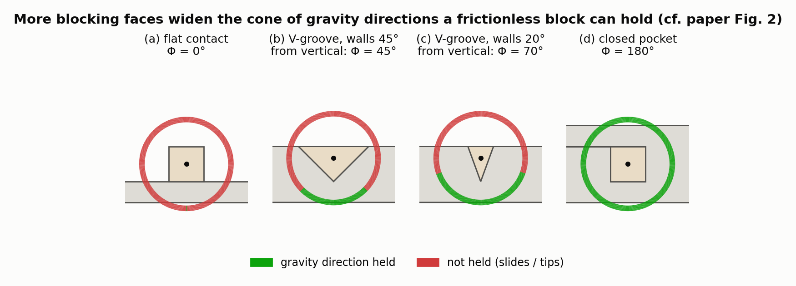
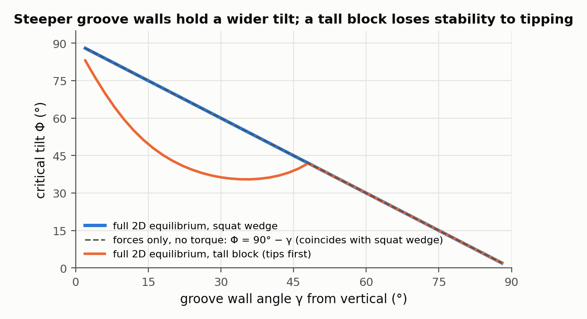
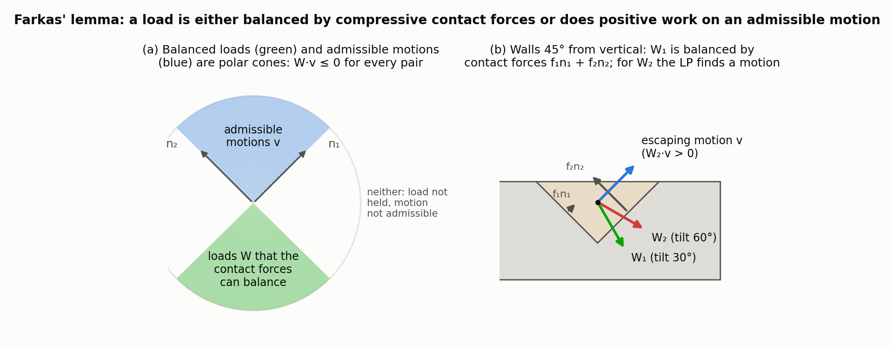
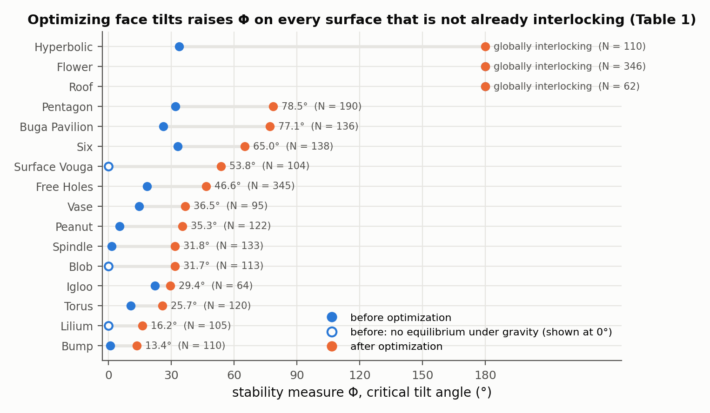

# Design and Structural Optimization of Topological Interlocking Assemblies

Ziqi Wang, Peng Song, Florin Isvoranu, Mark Pauly — *ACM Transactions on Graphics 38(6), Article 193 (SIGGRAPH Asia), 2019*

[Paper](https://sutd-cgl.github.io/supp/Publication/papers/2019-SIGAsia-TopoInterlock.pdf) · [Code](https://github.com/EPFL-LGG/TopoLite)

**Stability question:** Kinematic + Static — extends the interlocking test to translations *and rotations*, proves that interlocking is the same as frictionless equilibrium under *every* possible load, and optimizes a "tilt cone" stability measure that sits between the two.

**Source read:** full text (https://sutd-cgl.github.io/supp/Publication/papers/2019-SIGAsia-TopoInterlock.pdf), all 13 pages including Table 1. The supplementary material (LP details, gradient derivations, tessellation optimization) was not read.

## TL;DR
The paper studies *topological interlocking* (TI) assemblies. These are convex blocks that approximate a freeform surface, touch their neighbours through single planar faces, and are held by a fixed boundary frame. The key result is that an assembly is globally interlocking if and only if it is in frictionless static equilibrium under arbitrary external forces and torques. The proof is one application of Farkas' lemma, because the kinematic constraint matrix is the transpose of the equilibrium matrix. Between "stable under gravity only" and "stable under everything," the paper defines a measure Φ: the smallest tilt angle, over all tilt axes, at which self-weight equilibrium fails. It then optimizes the tilt of the block faces to make Φ larger.

## The problem
- **Convex blocks are weak connectors.** They are easy to cut from stone, wood, or foam, but two blocks sharing one planar face only block each other in one direction.
- **Existing interlocking tests miss escapes.** Take a globally interlocking flat Abeille-style assembly and lift it onto a sphere (Fig. 4). Every block is still immobilized by its neighbours, yet a *group* of blocks can escape by moving along different paths at once; the paper says existing methods do not capture this. Parts may also be removable by rotation but not by translation, which translation-only tests ([wang2018-desia.md](wang2018-desia.md), Song et al. 2012) cannot see.
- **Gravity-only equilibrium is fragile, and global interlocking is often too strict.** A frictionless stack of two cubes is in equilibrium, but the slightest tilt makes the top one slide off. Designers need an intermediate target that can be optimized.

## Why it matters
The paper makes the **Kinematic**–**Static** link explicit for assemblies: the same contact data answers "can it move?" and "can contact forces hold it?" It also replaces a yes/no verdict with an optimizable scalar, the critical tilt angle.

## Contributions
1. A global interlocking test that includes rotations (6 DoF per part). It applies to any rigid assembly whose contacts can be written as point-plane constraints, orthogonal or not.
2. A proof that interlocking ⇔ equilibrium under arbitrary external forces and torques.
3. A stability measure Φ, generalizing structural engineers' critical tilt angle, plus a gradient-based optimization of block geometry to increase it.
4. An interactive design tool: a surface tessellation plus per-edge "augmented vectors" that define each block.

## Key intuitions
1. **One matrix, two readings.** Each contact point contributes one row. Kinematics reads it as "don't close this gap," and statics reads it as "this contact may only push along this normal." The constraint matrix for motions is the transpose of the equilibrium matrix for forces: $B_{in}=A_{eq}^T$.
2. **Farkas' lemma: either forces hold it, or a motion escapes.** Either some non-negative contact forces balance the load, or some non-penetrating motion lets the load do positive work. Exactly one of the two holds. If *every* load must be balanced, no nonzero motion can exist, because you could pick the load pointing along that motion. That is global interlocking.
3. **Balanced loads form a convex cone.** If loads $W_1$ and $W_2$ can each be held, so can any non-negative mix of them. So the set G(P) of holdable loads is a convex cone. Convexity lets binary search find its boundary.
4. **Tilt tables measure lateral stability.** Tilting the ground plane adds a sideways component to gravity. Φ is the critical tilt angle for the *worst* tilt axis.
5. **Past 90°, the only next stop is 180°.** A convex cone of directions that contains a closed hemisphere plus anything more is the whole sphere. So once all downward directions are held (Φ = 90°), making all six axis directions work gives Φ = 180°.

## Technical crux, explained simply
**Analogy.** Slowly tilt a tray holding a block. With no friction, how far can you tilt in each direction before the block slides? The safe gravity directions form a cone, and Φ is its half-width on the narrowest side.

**Tiny example (ours, 2D, frictionless).** A square block rests in a 90° V-groove. The groove's faces point up-right and up-left, i.e. at 45° on either side of vertical. Contact forces can only push along those two normals. When the tray is level, gravity points straight down and equal forces on both faces hold the block. Tilt by $\phi$, and the forces must still combine into the tilted "up" direction. That is only possible while that direction lies between the two normals, i.e. $\phi\le 45^\circ$, so $\Phi=45^\circ$. The paper's Fig. 2 makes the same point in 3D. One supporting face tolerates exactly one gravity direction. Two faces give an arc of directions, three give a patch, and blocking all six faces holds the cube for every direction.

*Figure 1. (our computation, 2D analogue of the paper's Fig. 2) For each block the ring shows which gravity directions the frictionless equilibrium system A_eq F = −W, F ≥ 0 (Eq. 8) can hold, tested with a linear program at 1° steps; forces sit at the endpoints of each contact segment and torques are included. One flat contact holds only straight-down gravity (Φ = 0°). Groove walls 45° from vertical hold tilts up to 45°, walls 20° from vertical up to 70°, and a closed pocket holds every direction (Φ = 180°).*

*Figure 2. (our computation) The critical tilt Φ of a block in a V-groove, found by binary search on the same equilibrium LP, as the wall angle γ from vertical varies. For a squat wedge the full force-and-torque result equals the forces-only bound Φ = 90° − γ. For a tall block (body three times the groove depth) Φ drops below that line for γ < 48°, because the weight's line of action leaves the contact region and the block tips before it slides. Torque balance, which translation-only tests ignore, is what catches this.*

**Step 1 — contacts as point-plane constraints.** A face-face contact gives one constraint per vertex of the contact polygon. An edge-edge contact gives one constraint at the contact point, using the plane containing both edges.

**Step 2 — kinematics with rotation.** Part $i$ moves with linear velocity $\mathbf t_i$ and angular velocity $\boldsymbol\omega_i$. A contact point $c$ at offset $\mathbf r_{ci}$ from the part's centroid moves with $\mathbf v_{ci}=\mathbf t_i+\boldsymbol\omega_i\times\mathbf r_{ci}$. Non-penetration at that point is
$$(\mathbf v_{cj}-\mathbf v_{ci})\cdot\mathbf n_l\ \ge 0 ,$$
where $\mathbf n_l$ is the contact normal pointing toward the higher-indexed part. Stacking these gives $B_{in}Y\ge 0$, where $Y$ holds all parts' 6D velocities. The boundary frame is held fixed. The assembly is globally interlocking if $Y=0$ is the only solution, which is checked with an LP as in [wang2018-desia.md](wang2018-desia.md). This took 0.98 s on the 62-part Roof.

**Step 3 — statics without friction.** Each contact vertex carries a compressive force of size $f\ge 0$ along the normal. The paper ignores friction on purpose: it is unreliable because of fabrication error and wear, and leaving it out makes the analysis depend only on geometry. Force and torque balance on every block gives
$$A_{eq}F=-W,\qquad F\ge 0 ,$$
where $W$ collects the external forces and torques. This follows [whiting2009-structurally-sound-masonry.md](whiting2009-structurally-sound-masonry.md) and took 0.22 s on the Roof under gravity.

**Step 4 — the link.** Farkas' lemma applied with $A=A_{eq}$, $b=-W$, $A^T=B_{in}$ says: if $A_{eq}F=-W$ has a solution with $F\ge 0$ for *every* $W$, then $B_{in}Y\ge 0$ has no nonzero solution. So interlocking means "in equilibrium under arbitrary loads."

*Figure 3. (our computation) The wedge of Figure 1(b), translations only so that both cones are planar sectors. (a) Loads that the two contact normals can balance (green, from the equilibrium LP) and admissible motions (blue, {v : v·n₁ ≥ 0, v·n₂ ≥ 0}) are polar cones: W·v ≤ 0 for every pair, and no direction lies in both. (b) For a 30° tilt the LP returns balancing forces f₁ = 0.26 W, f₂ = 0.97 W along the normals; for a 60° tilt the force LP is infeasible and the dual LP (max W·v subject to B_in v ≥ 0) returns the escaping motion v = (1, 1) with W·v > 0. This is Lemma 3.1 of the paper on one contact pair.*

**Step 5 — the measure.** The paper restricts loads to tilted self-weight. Every block gets its own weight, applied at its centroid, all pointing in one common direction $\mathbf d(\theta,\phi)$. Here $\theta$ is the azimuth and $\phi$ the polar angle measured from straight down, which leaves 2 degrees of freedom. For uniformly sampled $\theta$, binary search finds the critical $\phi$. Then
$$\Phi(P)=\min\{\phi \mid \mathbf d(\theta,\phi)\in\partial G(P)\}.$$
The resulting spectrum: not in equilibrium under gravity → $0<\Phi<90^\circ$ → $\Phi=90^\circ$ → $\Phi=180^\circ$ (held under every gravity direction) → global interlocking. The last step is still a real gap. $\Phi=180^\circ$ does not imply interlocking, because arbitrary loads also include torques and a different direction for each part.

**Step 6 — the design space.** A surface tessellation (mainly lifted from 2D with conformal maps) gives each half-edge $e_{ij}$ a unit vector $\mathbf n_{ij}$ perpendicular to it; together they define a plane. Each block is the intersection of its edges' planes, optionally trimmed. Each $\mathbf n_{ij}$ starts from $e_{ij}\times(N_i+N_j)$ and is rotated about the edge by $\pm\alpha_{ij}$, with signs alternating between adjacent edges where possible so that neighbours trap each other.

**Step 7 — optimization** (only the angles $\alpha_{ij}$ change; the tessellation stays fixed).
- If the design is not in equilibrium under gravity, first optimize for straight-down gravity alone.
- If $\Phi=90^\circ$, optimize for the six axis directions.
- Otherwise, set a target $\Phi_{tagt}=\omega\Phi$. Build a hexagon ($K=6$) of target directions that encloses the target circle (radius $\tan\Phi_{tagt}$ on the plane $z=-1$) while staying close to the current feasible section. Then solve
$$\min_{\{\alpha_{ij}\}}\sum_{k}E(P,\mathbf d_k)\quad\text{s.t. each contact area}\ge A_{thres},\ \alpha_{ij}\ \text{within bounds}.$$
$E$ is the "glue" energy of [whiting2012-structural-optimization-masonry.md](whiting2012-structural-optimization-masonry.md). Each force is split into compression minus tension, $f=f^+-f^-$. $E$ is the minimum of a weighted quadratic that heavily penalizes tension while still balancing the load. $E=0$ means equilibrium is possible without glue. On success, $\omega$ resets to 1.2. On failure, $\omega$ is multiplied by 0.95, and the loop stops once $\omega\le 1.01$.

## What the results do well
- **Big, measurable gains** (Table 1, 16 surfaces with 62–346 parts and up to 1371 contacts). Examples: Bump 0.8°→13.4°, Spindle 1.4°→31.8°, Pentagon 31.9°→78.5°, Buga Pavilion 26.2°→77.1°. Surface Vouga went from no equilibrium to 53.8°. Hyperbolic went from 33.8° to globally interlocking.

*Figure 4. Φ before and after the structural optimization for every surface in Table 1 of the paper, sorted by the final value. Hollow markers are surfaces that had no equilibrium under gravity before optimization (Lilium, Blob, Surface Vouga); Roof, Flower and Hyperbolic end up globally interlocking, shown at 180°. Roof and Flower were already interlocking without optimization.*
- **Minimal surfaces interlock almost for free.** Roof (62 parts) and Flower (346 parts) are globally interlocking without any optimization.
- **Non-self-supporting shapes** (flat tops, inverted bumps) can still be made stable (Fig. 16).
- **Interactive modeling.** Rebuilding geometry takes 2.3–17.4 ms.
- **Physical validation.** Roof and Igloo were SLS-printed in PA 2200 polyamide, with a two-piece frame closed by magnets. Roof holds in arbitrary orientations, as predicted, and Igloo passes tilt tests.

## Limitations
Stated by the authors:
- No equilibrium under gravity is found for closed surfaces or surfaces with a large concave cavity (Fig. 20).
- The boundary frame is analyzed as one rigid part but built as two pieces, which may affect accuracy.
- Blocks are assumed rigid and perfectly accurate. Fabrication tolerances could accumulate and cause failure.
- Φ only covers weight-like loads in one shared direction. The method does not directly optimize for global interlocking.
- Only the angles $\alpha_{ij}$ are optimized, with the tessellation fixed and blocks convex with planar faces. Optimization takes 24.1–1141.1 min per model.
- Open question: which surfaces admit globally interlocking convex assemblies? The authors conjecture minimal surfaces do, but have no proof.

Our observations:
- **No friction anywhere.** That is conservative for stone TI vaults, but wooden joints often *rely* on friction. A frictionless Φ of 0 does not mean a physical wood joint falls apart.
- **Direction only, never magnitude.** Scaling a holdable load keeps it holdable, so the analysis says nothing about crushing, splitting, or deflection. The **Structural** question is not addressed.
- **First-order, exact-fit contacts.** The analysis is infinitesimal and assumes zero clearance. A milled joint with slack may have fewer active contacts than the model assumes.

## Relevance to joint stability in this repo
- **Same contacts, two tests.** For a 2-part LHF joint with the LHF-cut part fixed, build $B_{in}$ from the vertices of the shared contact polygons, with 6 DoF for the other part. A nonzero solution means the joint can move instantaneously; none means it is locked. By $B_{in}=A_{eq}^T$, the same matrix answers the frictionless load question with no extra modeling.
- **Φ as a joint stability label.** Fix one part and apply self-weight to the other along $\mathbf d(\theta,\phi)$. Binary search per $\theta$ gives a single number for how far the joint can be tilted before it slides apart. That makes it easy to compare cut configurations.
- **A useful bound (our observation).** Suppose an assemblable joint lets the moving part translate along $\mathbf u$. Then any weight direction with $\mathbf d\cdot\mathbf u>0$ does positive work along that motion, so it cannot be held (intuition 2). Hence $\Phi\le 90^\circ-\beta$, where $\beta$ is the angle between $\mathbf u$ and vertical. Joints assembled sideways ($\beta=90^\circ$) have $\Phi=0$ without friction. For such joints, friction-aware analysis (see [yao2017-decorative-joinery.md](yao2017-decorative-joinery.md), [nadeau2024-robustness-frictional-contact.md](nadeau2024-robustness-frictional-contact.md)) or the joint's orientation in the final structure is what matters. [wang2021-mocca.md](wang2021-mocca.md) turns this trade-off into a design variable.
- **What does not transfer.** The tessellation and augmented-vector model is specific to convex TI blocks, and the α-angle gradients don't map onto LHF sketch parameters. The idea of minimizing tension "glue" to measure infeasibility does carry over to any contact-based joint model.
