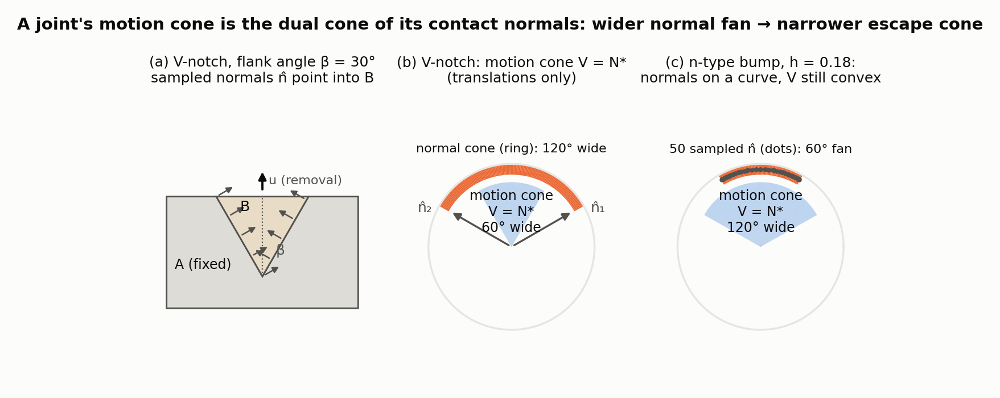
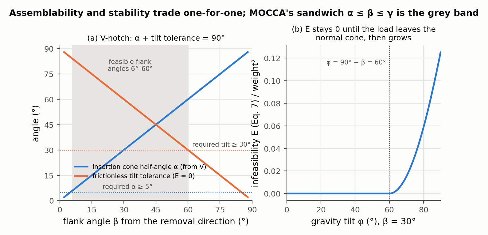
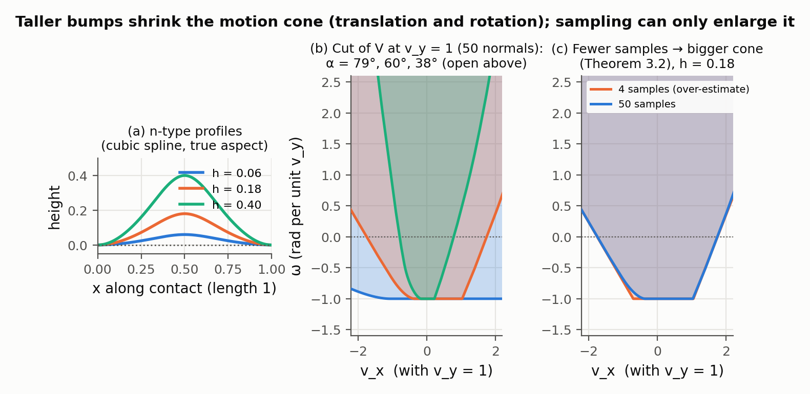
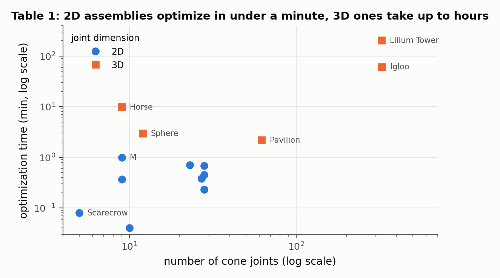

# MOCCA: Modeling and Optimizing Cone-joints for Complex Assemblies

Ziqi Wang, Peng Song, Mark Pauly — *ACM Transactions on Graphics 40(4), Article 181 (SIGGRAPH), 2021*

[Paper](https://sutd-cgl.github.io/supp/Publication/papers/2021-SIGGRAPH-ConeJoint.pdf)

**Stability question:** Kinematic + Static — describes each joint by the cone of rigid motions it allows, checks frictionless equilibrium directly in that motion space, and trades stability (narrow cones) against ease of assembly (a cone wide enough to insert each part).

**Source read:** full text (https://sutd-cgl.github.io/supp/Publication/papers/2021-SIGGRAPH-ConeJoint.pdf), all 14 pages including Table 1. The supplementary material (proofs, cut-plane choice, optimization details) was not read.

## TL;DR
A *cone joint* is an integral joint with a curved or piecewise-planar contact, so one part can be removed along any direction inside a cone. It sits between a mortise-and-tenon, which allows one direction, and a flat contact, which allows a whole half-space. A joint's motion cone is the *dual cone* of its generalized contact normals. That makes it always convex and cheap to approximate. MOCCA first chooses a simple required motion cone for every joint. The choice makes the assembly stand in equilibrium while leaving every part a circular insertion cone of half-angle α. Then it shapes each joint's spline contact separately to fit between those two bounds.

## The problem
- **Single-direction joints** restrict motion strongly. But complex arrangements of them can deadlock, and inserting a part exactly along one direction is hard, especially for robots.
- **Planar contacts** are simple, easy to assemble, and avoid stress concentration. But they restrict motion the least, so partial assemblies often need supports.
- How cone-joint geometry affects assemblability and stability was largely unstudied. Optimizing it directly with force-based equilibrium over densely sampled curved contacts is slow and depends on the starting geometry.

## Why it matters
"Holds well" versus "goes together easily" is the core tension in joint design. MOCCA writes it as nested cones and splits one global problem into independent per-joint shape problems. It builds on the motion-space view of [wang2018-desia.md](wang2018-desia.md) and the motion/force duality of [wang2019-topological-interlocking.md](wang2019-topological-interlocking.md).

## Contributions
1. A link between joint geometry and motion space via convexity theory: the motion space is always convex, and it can be approximated from samples.
2. A motion-based static analysis, dual to the usual force-based method, that measures equilibrium infeasibility in motion space.
3. A two-stage design method, kinematic design then geometric realization, for a given assembly sequence.
4. Simple parametric cone joints: 2D cubic-spline "n-type" and "z-type" profiles and a 3D bicubic n-type patch. Results include equilibrium puzzles, support-free puzzles, laterally stable shells, frames, and a single-key interlocking sphere.

## Key intuitions
1. **A joint is a set of allowed motions.** A contact point at $\hat{\mathbf r}$ with normal $\hat{\mathbf n}$ allows only rigid velocities $\mathbf v$ (translation plus rotation) with $\mathbf n\cdot\mathbf v\ge 0$, where $\mathbf n=(\hat{\mathbf n},\ \hat{\mathbf r}\times\hat{\mathbf n})$ is the *generalized normal*. The allowed set is an intersection of half-spaces, so it is **convex whatever the contact shape**.
2. **Sampling fewer normals gives a bigger cone.** Dropping constraints can only enlarge the cone, so a sampled cone contains the true cone (Theorem 3.2). The paper uses 50 samples per 2D joint and 200 per 3D joint.
3. **Duality flips containment.** "Motion cone ⊆ $V_0$" is equivalent to "normal cone ⊇ $V_0^*$" (Lemma 3.3). A circular cone of half-angle α has as its dual a circular cone of half-angle $\pi/2-\alpha$. So conditions on motions become conditions on contact normals, which the joint shape controls directly.
4. **Equilibrium without forces.** The assembly is in equilibrium exactly when no admissible motion lets the loads do positive work ($\mathbf w^T\mathbf v>0$). So each joint can be summarized by a coarse motion cone (4 faces in 2D, 10 in 3D) instead of one with thousands of faces from sampled normals.
5. **Split global from local.** The kinematic stage turns global goals into a per-joint requirement $\hat K\subseteq V_{ij}\subseteq\bar V_{ij}$. Each joint can then be shaped on its own, with many random restarts.

## Technical crux, explained simply
**Analogy.** A drawer slides out one way. A mug on a table lifts off in any upward direction. An ice-cream cone in a conical holder comes out anywhere within a cone around "up". MOCCA designs joints of the third kind and tunes how wide each cone is.

**Tiny example (ours, 2D, translations only).** Part A is fixed and has a V-notch whose walls make angle β with vertical. Wedge B sits in it; the wall normals pointing into B are $\mathbf n_1=(\cos\beta,\sin\beta)$ and $\mathbf n_2=(-\cos\beta,\sin\beta)$ (Figure 1a).

*Figure 1. (our computation) (a) The V-notch with β = 30° and the sampled contact normals. (b) On the unit circle, the cone spanned by the normals (orange ring, 120° wide) and the set of translations v with v·n̂ ≥ 0 for every sample (blue sector, 60° wide): the motion cone is the dual cone N* of Theorem 3.1, and its half-angle 30° is 90° minus the normal cone's half-angle 60°, the α ↔ π/2 − α relation of Lemma 3.3. (c) The same construction for an n-type spline bump (profile in Figure 2a): the 50 normals lie on a curve, yet the dual is a clean convex sector 120° wide.*

- **Assembly freedom.** B may translate along $\mathbf v$ only if $\mathbf v\cdot\mathbf n_1\ge0$ and $\mathbf v\cdot\mathbf n_2\ge0$, i.e. $|v_x|\le v_y\tan\beta$. So B can leave along any direction within **β** of vertical. At β = 0 you get a mortise-and-tenon slot; at β = 90° a flat contact.
- **Stability (frictionless).** Tilt gravity by φ. The two wall forces can only push along $\mathbf n_1,\mathbf n_2$, which lie at 90° − β from vertical. So B stays put only while **φ ≤ 90° − β**.

Widening the insertion cone narrows the tilt tolerance, one for one. That is exactly the α ↔ π/2 − α duality in intuition 3. Suppose we demand insertion freedom of at least α and a required stability cone of at most γ. Then the wall angle must satisfy **α ≤ β ≤ γ**. That sandwich is what MOCCA solves for every joint, with rotations included and in 3D.

*Figure 2. (our computation) (a) For the V-notch of Figure 1, the insertion cone half-angle α read off the computed motion cone (generalized normals with rotation included, Eq. 1) and the largest frictionless gravity tilt for which the motion-based test of Eqs. 5–6 finds no admissible motion with positive power. They sum to 90° at every β, so the two goals trade one for one. With the paper's typical requirement α ≥ 5° and a required tilt tolerance of 30° (our choice), the feasible flank angles are the grey band 5°–60°: MOCCA's sandwich α ≤ β ≤ γ. (b) The infeasibility measure E of Eq. 7, computed through its dual Eq. 8, for β = 30°: it is exactly 0 up to the 60° tilt and grows smoothly beyond, which is what makes it usable as an optimization objective.*

**Step 1 — motion space of a joint.**
$$V=\{\mathbf v\mid \mathbf n\cdot\mathbf v\ge 0\ \ \forall\,\mathbf n\in N\}=N^*,$$
where $N$ is the set of generalized normals over the contact. In 2D, $\mathbf v$ has 3 components (2 translations, 1 rotation).

**Step 2 — equilibrium measured in motion space.** Stack the non-penetration constraints of all joints, $B_{in}\mathbf v\ge 0$, and fix the parts touching the ground. The infeasibility is
$$E=\max_{\mathbf v}\ \mathbf w^T\mathbf v-\tfrac12\mathbf v^T\mathbf v\quad\text{s.t.}\quad \mathbf v_j-\mathbf v_i\in V_{ij}\ \text{for every joint.}$$
In words: how much power the external loads $\mathbf w$ can extract from allowed motions, with a quadratic term to keep it finite. $E=0$ means equilibrium. Its dual is $\min\tfrac12\|\mathbf s\|^2$ subject to $A_{eq}\mathbf f+\mathbf s=-\mathbf w$, $\mathbf f\ge0$, where $\mathbf s$ is the extra force/torque the parts would need. The paper presents this as an alternative to the tension-penalty measure of [whiting2009-structurally-sound-masonry.md](whiting2009-structurally-sound-masonry.md). For pure *analysis* both cost about the same; the payoff comes in design, where $V_{ij}$ can be replaced by a coarse cone.

**Step 3 — joint geometry.** A 2D contact starts as a straight segment $p_1p_2$ and becomes a cubic spline. The spline is a height field along a *principal direction* $\mathbf u$, so the part can always slide out along $\mathbf u$. **n-type** joints (3 control points) are bump-and-socket, like a tenon. **z-type** joints (4 control points) are two opposing bumps: more restrictive, but more complex and more prone to stress concentration. In 3D, an n-type bicubic patch raises the middle 4 of 16 points by $h$. All contacts between the same two parts share one $\mathbf u$.

*Figure 3. (our computation) (a) n-type profiles: a cubic spline bump of height h on a contact of length 1. (b) The motion cone of the upper part, with 3 components (v_x, v_y, ω), cut by the plane v_y = 1 as in the paper's Fig. 3h and built by intersecting the 50 half-spaces n·v ≥ 0. Its width at ω = 0 is the translational insertion cone: α = 79°, 60° and 38° for h = 0.06, 0.18 and 0.40, so taller bumps restrict motion more. The sections are open towards +ω because a single bump does not stop the part hinging about the contact ends; only other contacts can. (c) With 4 sampled normals instead of 50 the section is slightly larger (α = 60.2° instead of 60.2° at 50, visibly wider at the corners), as Theorem 3.2 states: a sampled cone always contains the true one.*

**Step 4 — kinematic design (whole assembly, geometry-free).** The assembly order is given, so the parts graph is directed. Each joint gets a *required* motion cone $\bar V_{ij}$: a polyhedral cone whose cross-section is a rectangle in 2D (4 faces) or a 5D box in 3D (10 faces), with parameters Ψ. A part's insertion freedom is the intersection of the translational parts of its joints with already-placed parts, $\bar V_j=\bigcap_{i<j}T(\bar V_{ij})$. Then solve
$$\min_{\Psi,\ \mathbf d_j}\ E\big(\mathbf w,\{\bar V_{ij}\}\big)\quad\text{s.t.}\quad K(-\mathbf d_j,\alpha)\subseteq\bar V_j\ \ \text{for every part } j .$$
The objective pushes cones *narrow* (more stable), and the constraint keeps a circular removal cone of half-angle α *inside* them (assemblable). Bounds on Ψ stop cones from getting too small to build. The output is a per-joint sandwich
$$\hat K(-\mathbf d_j,\alpha)\ \subseteq\ V_{ij}\ \subseteq\ \bar V_{ij}.$$

**Step 5 — geometric realization (one joint at a time).** Using duality, the sandwich becomes a condition on sampled contact normals $\{\mathbf n_l\}$:
$$\bar V_{ij}^{*}=\text{cone}(\{\mathbf f_k\})\ \subseteq\ \text{cone}(N_{ij})\ \subseteq\ K(-\mathbf d_j,\tfrac{\pi}{2}-\alpha)\times\mathbb R^{2m-3},$$
where $\mathbf f_k$ are the face normals of the required cone and $m$ is 2 or 3 (dimension).
- **Right inclusion (hard constraint):** every contact normal's translational part lies within $\pi/2-\alpha$ of the removal direction, which keeps insertion possible.
- **Left inclusion (energy):** $\sum_k \mathrm{dist}(\text{cone}\{\mathbf n_l\},\mathbf f_k)$, where each distance is a small non-negative least-squares problem $\min_{\lambda\ge0}\|\mathbf f_k-\sum_l\lambda_l\mathbf n_l\|^2$. Zero means the contact normals "cover" every face of the required cone, so the true motion cone fits inside it.
- A signed-distance constraint keeps each joint away from part boundaries.

Each joint has few variables, so many uniformly sampled starting values are tried to avoid local minima. Both stages use an off-the-shelf interior-point method (Knitro in the implementation). The stages alternate several times, because part centroids and weights change once joints are carved.

## What the results do well
- **The trade-off is visible in physical puzzles.** In the laser-cut 4-part Scarecrow, planar contacts fail under gravity and single-direction joints need careful alignment, while the cone-joint version avoids both problems. Of four 6-part Spheres, the planar one is unstable and standard mortise-and-tenon is deadlocked. Cone joints (α = 3°) make it single-key interlocking, tested by applying a separating force at every contact and checking equilibrium. Swapping each joint for a *tilted* mortise-and-tenon along its $\mathbf u$ keeps it interlocking, since that motion cone is smaller.
- **Broad scope** (Table 1): equilibrium puzzles (M, Horse, Tree), frames (Pavilion, 48 parts), and shells. Lilium Tower (139 parts, 325 joints) has an inverted bump but becomes self-supporting with only some contacts modified. Igloo (139 parts) is not in equilibrium under gravity with planar contacts; with cone joints it tolerates tilts up to 35°.
- **Harder inputs yield sharper joints.** Leaning Towers tilted 10°, 20°, and 30° all reach equilibrium, with joints getting sharper as the tilt grows. Support-free variants (Leaning Tower at 15°, Deer) are stable at every step of assembly, obtained by summing $E$ over all intermediate stages.
- **Speed.** α is typically 5°. 2D results take under a minute (e.g. Scarecrow 0.08 min, Tree 0.37 min); 3D takes longer (Lilium Tower 203.78 min, Igloo 61.11 min). Compared with directly optimizing joint parameters (a Whiting-2012-style gradient baseline), timings match for small assemblies. Above 16 parts the baseline's time rises sharply; read off Fig. 17d, it approaches 100 s near 40 parts while MOCCA stays near 10 s.

*Figure 4. Optimization time against the number of cone joints for the 14 results in Table 1 of the paper. All 2D assemblies (5–28 joints) finish in 0.04–1.00 min; the 3D ones range from 2.19 min (Pavilion, 62 joints) to 203.78 min (Lilium Tower, 325 joints).*

## Limitations
Stated by the authors:
- Limited joint family (spline n/z-type profiles, bicubic n-type patches), and no friction yet.
- Geometric realization ignores appearance and structural soundness. Sharp joints may fail from stress concentration.
- Required cones are coarse pyramids (4 faces in 2D, 10 in 3D).
- The kinematic stage assumes fixed centroids. As a result, the baseline sometimes wins with few parts, e.g. a 2-part case where MOCCA finds no equilibrium but the baseline does.
- 3D runs can take hours. The assembly sequence must be provided.

Our observations:
- **Sampling is only safe on the stability side.** Theorem 3.2 means the sampled cone *over*-estimates mobility, which is conservative for stability. The insertion requirement, though, is only checked at sampled normals. An unsampled normal between samples could narrow the true insertion cone.
- **Idealized contact.** Rigid parts, zero clearance, first-order motion. An α = 5° insertion cone says nothing about fit tolerance, and frictionless equilibrium concerns load *direction*, not strength, so the **Structural** question is untouched.

## Relevance to joint stability in this repo
- **The joint motion cone is the right primitive for 2-part joints.** Sample points and normals on the shared contact surface of the two Boolean-cut parts and form generalized normals. The dual cone lists every instantaneous rigid escape: {0} means locked, a single translational ray means a single-direction joint, and anything wider is a cone joint. Equilibrium under gravity or a tilt then follows from the motion-based test, with no force variables.
- **LHF cuts can make cone joints, but only in the sketch plane (our observation).** An LHF wall is parallel to the sweep normal, so its normal lies in the sketch plane. A floor's normal lies along the sweep axis. A V-shaped or spline sketch boundary therefore gives an in-plane motion cone, like the example above, combined with free (through-cut) or one-sided (floor) motion along the sweep axis, unless other cuts block it. A MOCCA 2D n-/z-type profile used as a sketch boundary and extruded is an LHF cut. A draft along the sweep axis is not representable, and stair-stepping a taper with stacked LHFs brings back sideways blocking at first order.
- **A spec for repair (our suggestion).** Damage that removes contact faces removes normals, which widens the motion cone. The kinematic stage's required cone $\bar V$ says which face normals $\mathbf f_k$ a repair must cover again, while the insertion constraint keeps the repair piece installable.
- **What does not transfer.** The frictionless assumption (wooden joints often rely on friction), and the staged iteration, which is overkill for 2 parts with a trivial assembly order.
