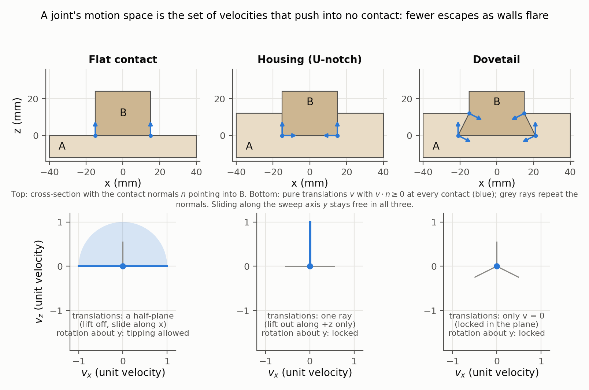
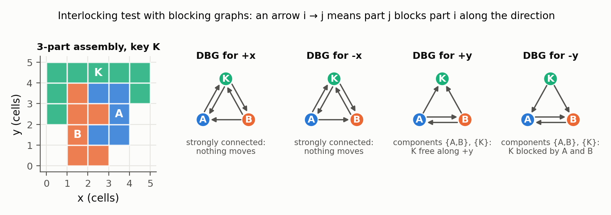
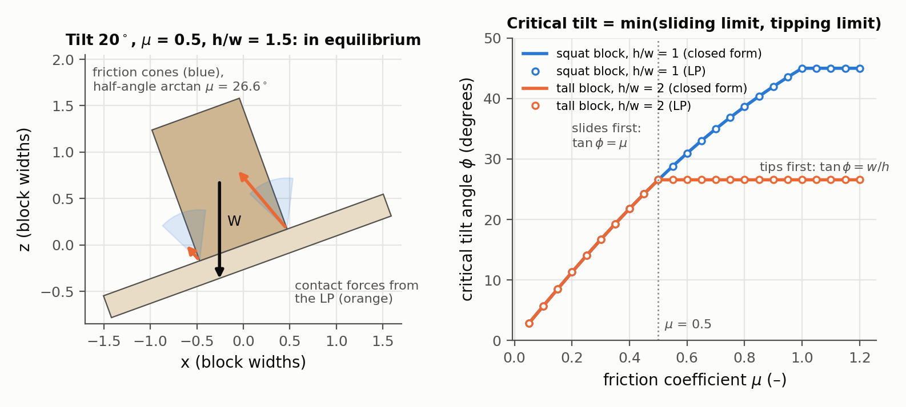
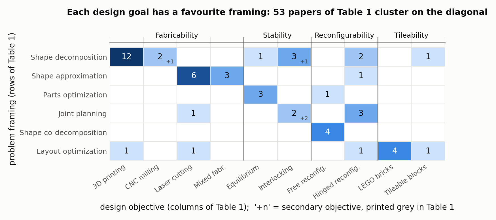

# State of the Art on Computational Design of Assemblies with Rigid Parts

Ziqi Wang, Peng Song, Mark Pauly — *Computer Graphics Forum 40(2), Eurographics 2021 (STAR), pp. 633–657*

[Paper](https://diglib.eg.org/handle/10.1111/cgf142660)

**Stability question:** Kinematic + Static (Structural only named as an open problem) — surveys how motion spaces and blocking graphs test interlocking, how rigid-block equilibrium with friction tests static stability, and how tilt analysis turns stability into a number.

**Source read:** full text, all 25 pages including Table 1 and the Section 8 outlook (https://sutd-cgl.github.io/supp/Publication/papers/2021-EG-AssemblySurvey.pdf)

## TL;DR
The first survey of graphics methods for designing load-carrying *structures* made of rigid parts, split into *analysis* (joining, assembly planning, structural stability, packing) and *design* grouped by goal (fabricability, stability, reconfigurability, tileability), with a table sorting over 50 papers by goal and problem framing. For stability, the lesson is a ladder of conditions: equilibrium under known loads, a tilt-angle margin, and global interlocking (equilibrium under *any* load). Because statics and kinematics are dual, the strongest condition can be tested with geometry alone.

## The problem
A small change to one part's geometry or joint can change how a whole assembly performs, and the parts must also be assemblable. By 2021 many graphics papers had solved pieces of this (puzzles, furniture, masonry, decomposition for 3D printing or CNC) without a shared map. The survey limits itself to structures with rigid parts, where design becomes "a geometric modeling and optimization problem, with minimal consideration of material behavior (e.g., friction)".

## Why it matters
Most stability papers in this reading list assume the survey's vocabulary: motion space, directional blocking graph (DBG), key, rigid block equilibrium (RBE), tilt angle. The survey defines them in one place, with each test's assumptions and failure cases. It also names the gaps that matter most for wood joints: non-rigid material, tolerance, and stress concentrations at thin joints.

## Contributions
1. **A three-level classification.** Papers are sorted by high-level design objective, then by the specific design problem, then by the design method.
2. **The analysis toolbox (Sec. 2):** joint types (permanent vs. non-permanent, external vs. integral); assembly planning (hands, monotonicity, linearity; parts-graph vs. blocking-graph planners); structural stability (static analysis, interlocking tests, a stability measure); packing.
3. **Design methods by objective (Sec. 3–6):** assembly-based fabrication (3D printing, CNC milling as height-field decomposition, laser cutting, mixed); stable assemblies (equilibrium or interlocking); reconfigurable assemblies (free or hinged); tileable blocks (LEGO, custom and topological-interlocking blocks).
4. **Table 1 (Sec. 7):** six ways to frame a design problem (shape decomposition, shape approximation, parts optimization, joint planning, shape co-decomposition, layout optimization), crossed with the design objectives.
5. **Open problems (Sec. 8):** prediction accuracy, multi-objective design, new joint and assembly-plan types, and machine learning.

## Key intuitions
1. **A joint is a restriction on relative motion.** The survey measures what a joint does by the motion space it leaves one part relative to the other. This works because, for infinitesimal motions, "don't push into the contact" is a *linear* inequality in the velocities. So mobility questions become linear programs or graph problems.
2. **Plan assembly by planning disassembly.** A finished assembly has far more motion constraints than loose parts, so the search is much smaller; with rigid parts and only geometric constraints, assembly and disassembly sequences match one to one.
3. **Blocking changes only at a few directions.** Across all translation directions, which part blocks which stays constant over a finite number of regions. That gives a finite set of DBGs (the NDBG). "Can any group of parts move along *d*?" then becomes a question about strongly connected components, which takes polynomial time instead of checking an exponential number of subsets.
4. **Statics and kinematics are dual.** An interlocking assembly is one "in equilibrium under arbitrary external forces and torques" (with the key held). So instead of listing every possible load, you ask whether any part or group of parts can move.
5. **Stability is a spectrum, not a yes/no.** Equilibrium under gravity is fragile. Global interlocking is robust but restricts geometry heavily. Tilt analysis sits in between and gives a scalar margin. The survey notes that the set of gravity directions under which the assembly stays in equilibrium is a convex cone.
6. **Interlocking fights disassembly.** Joints must restrict motion strictly enough to lock the parts, yet at least one collision-free way to take them apart must remain (not *deadlocking*). The survey calls this the main challenge in designing interlocking assemblies.

## Technical crux, explained simply

**Analogy.** A drawer slides out one way and is blocked every other way. *Kinematics* asks which ways it can move; *statics* asks whether the cabinet walls, which can only push, can resist your shove. These are two views of the same fact.

**Tiny example: kinematics.** Fix block A, which has a U-shaped notch (the housing in Figure 1, middle). Block B sits in the notch. The contact normals, pointing into B, are: floor $n = (0, 0, +1)$, left wall $n = (+1, 0, 0)$, right wall $n = (-1, 0, 0)$.

*Figure 1. Motion space of a 2-part joint computed from the survey's non-penetration inequality (Eq. 4) for three cross-sections (our computation). Top: contact points and normals $n$ pointing into B. Bottom: the pure translations $v$ with $v\cdot n \ge 0$ at every contact, i.e. the dual cone of the normals: a half-plane for the flat contact, a single lift-out ray for the housing, and only $v = 0$ for the dovetail. A small LP over $(v, \omega)$ checks rotation as well: only the flat contact can tip. Sliding along the sweep axis $y$ (out of the page) stays free for all three prisms.*

Give B a small translation velocity $v$. At each contact, B may slide along the face or move away from it, but not into it: $v \cdot n \ge 0$.
- Floor: $v_z \ge 0$.
- Left wall: $v_x \ge 0$.
- Right wall: $-v_x \ge 0$.

Together these force $v_x = 0$. The motion space is "slide along the notch ($\pm y$) or lift out ($+z$)", which is two escape routes. A dovetail flare (Figure 1, right) or a closed end would remove some of them.

Rotation fits the same pattern. At a contact point with lever arm $r$ from B's reference point, the velocity is $v + \omega \times r$, where $\omega$ is the angular velocity. The constraint $(v + \omega \times r)\cdot n \ge 0$ is still linear in $(v,\omega)$. Stack one row per contact point, with each part's motion $Y_i = (t_i, \omega_i)$, and you get the survey's Eq. 4:

$$B_{in}\,Y \ge 0,\quad Y \ne 0$$

To rule out moving everything together, fix one part ($Y_r = 0$). Then solve a linear program:
- If no non-zero solution exists, the assembly is **deadlocking**.
- If the only possible motion frees a single part, that part is the **key** and the assembly is **interlocking**. By the survey's definition, this requires at least three parts.

**Blocking graphs, the cheaper test.** For a direction $d$, draw one node per part. Draw an arrow $i \to j$ when $j$ blocks $i$ from moving along $d$. A part or group of parts can translate along $d$ exactly when no arrows leave it (out-degree zero). If the graph is strongly connected, nothing can move along $d$. The DBG test declares an assembly interlocking if every *base* DBG is either strongly connected, or splits into exactly two strongly connected components where one is a single part that is the same in every base DBG (the key).

The catch: this test only considers sequential translations. It gives **false positives** when parts escape by rotating or by moving several groups at once. The inequality test above catches those cases.

*Figure 2. The DBG-based interlocking test on a 5×5-cell 2D assembly (our example, checked by computing every pairwise blocking relation and the strongly connected components). Each graph has one node per part and an arrow $i \to j$ when $j$ blocks $i$ along that direction. Along $\pm x$ the graphs are strongly connected; along $\pm y$ they split into exactly two components, $\{A, B\}$ and the key $K$, which is free only along $+y$. That is the survey's condition for interlocking. Once $K$ is lifted out, $A$ slides free along $+x$, so the remainder is not deadlocked.*

**Tiny example: statics.** Put block B (weight $W$) on a ramp of angle $\theta$ cut into A. RBE replaces each contact interface by forces at its vertices. Each force has a normal part $f_n$ and two tangential parts $f_{t1}, f_{t2}$. Equilibrium asks whether some forces exist that satisfy:

$$A_{eq} f = -w,\qquad f_n \ge 0,\qquad |f_{t1}|,|f_{t2}| \le \alpha f_n$$

Here $w$ collects the weights and external loads, $A_{eq}$ holds the force- and torque-balance coefficients, and $\alpha$ is the static friction coefficient. The first condition is balance. The second says contacts only push. The third is Coulomb friction. For the ramp, the contact must supply $W\cos\theta$ normally and $W\sin\theta$ tangentially, so a solution exists iff $\tan\theta \le \alpha$. In general you find out with a linear program. [Whiting et al. 2009](whiting2009-structurally-sound-masonry.md) turns violations of $f_n \ge 0$ into a penalty that measures how infeasible a design is.

The survey flags one failure. RBE can find friction forces that "hold" a part which in reality would slide off no matter the friction coefficient. [Yao et al. 2017](yao2017-decorative-joinery.md) fix this by adding variational principles that exclude forces that can't physically occur.

**Tilt analysis, the scalar margin.** Tilt the ground by an angle $\phi$ and increase it until equilibrium fails. The first failing angle is the critical tilt. In the ramp example, if B slides before it tips, tilting "downhill" fails at $\phi = \arctan\alpha - \theta$. [Wang et al. 2019](wang2019-topological-interlocking.md) try every tilt axis: they compute the cone of gravity directions under which the assembly stays in equilibrium, and take the *minimum* critical tilt over all azimuths as the stability measure.

*Figure 3. Rigid-block equilibrium used as tilt analysis (our computation with the survey's Eqs. 1–3). Left: a block on ground tilted by 20° with $\alpha = \mu = 0.5$; the Coulomb cones at the two contact vertices have half-angle $\arctan\mu = 26.6°$, and the LP finds contact forces (orange, drawn to scale) that balance the weight. Right: the critical tilt found by bisection on LP feasibility (circles) matches $\min(\arctan\mu,\ \arctan(w/h))$ (lines): friction sets the limit until tipping about the downhill corner takes over for the taller block.*

## What the results do well
- **Table 1 shows which problem framing each goal tends to use.** 3D printing (high fidelity) leads to shape decomposition, laser cutting (low fidelity) to shape approximation, reconfigurable assemblies to co-decomposition. Interlocking appears in two rows: shape decomposition when the input is a target shape ([Song 2012](song2012-recursive-interlocking-puzzles.md)), joint planning when it is a set of parts without joints ([Fu 2015](fu2015-interlocking-furniture-assembly.md)). Empty cells are flagged as opportunities, e.g., self-supporting puzzles framed as joint planning.

  
  *Figure 4. Counts of the 53 papers in the survey's Table 1 (p. 651) by design objective (columns) and problem framing (rows); "+n" marks the four entries printed in grey as secondary objectives. The diagonal is the correlation the survey points out: 3D printing → shape decomposition, laser cutting → shape approximation, equilibrium → parts optimization, free reconfiguration → co-decomposition, LEGO → layout optimization.*
- **It compares the interlocking tests honestly.** Building from local interlocking groups guarantees global interlocking but searches only a small part of the design space. [DESIA's DBGs](wang2018-desia.md) search the whole space in polynomial time but assume translation only, so designs with non-orthogonal connections must be re-checked with the inequality test.
- **It states each planner's assumptions.** Parts-graph planners assume plans that are sequential, monotone and linear, so finding such a plan is sufficient for assemblability but not necessary. Supporting non-linear plans raises complexity from linear to exponential.
- **It frames equilibrium vs. interlocking as robustness vs. geometric complexity**, with relaxations between: multiple keys ([Song 2017](song2017-reconfigurable-interlocking-furniture.md)) and friction-assisted immobilization (Tang et al. 2019).

## Limitations
**Stated by the authors:**
- The four objectives don't cover every paper. Some application-specific work is left out to keep the survey coherent, including [Umetani 2012](umetani2012-guided-exploration-furniture.md) on furniture.
- **Prediction accuracy.** Analyses assume rigid material and perfect manufacturing. In reality, small contacts or thin joints concentrate stress and can fail, and gaps from machining tolerance can make geometrically stable furniture unstable; imperfections propagate across parts. Tolerance analysis is suggested. Functionality analysis is also named as open.
- Most papers optimize one objective. Combining fabricability, stability of the final and intermediate stages, and assembly planning may need new formulations.
- Joints between two extremes need study: integral joints that allow a single removal direction, and planar contacts that restrict little. Examples are curved contacts or puzzle-like joints ([Tsugite](larsson2020-tsugite.md)). So do plans beyond sequential, monotone and linear.
- Machine learning is held back by hard and global constraints and by a lack of datasets. Reinforcement learning is suggested.

**Our observations:**
- *Structural* failure is almost absent: one sentence points to FEM for joint strength (Yao et al. 2017, shell pieces). Nothing covers wood crushing, grain, or press-fit.
- Friction is always one Coulomb coefficient, and the survey is qualitative: no shared benchmark says which stability test is more accurate on the same inputs.
- Later work is missing, e.g., [coupled rigid-block analysis](kao2022-coupled-rigid-block-analysis.md) and [MOCCA](wang2021-mocca.md). The [2022 tutorial](song2022-computational-assemblies-tutorial.md) slides partly fill this in.

## Relevance to joint stability in this repo
- **The motion-space linear program applies directly to LHF joints.** Every face of an LHF cut is either the floor, whose normal is the sweep normal $n$, or a swept wall, whose normal lies in the sketch plane and is perpendicular to $n$. Sample points on the faces that parts A and B share, write $(v+\omega\times r)\cdot n_k \ge 0$, and solve. The solution says exactly how B can move relative to A. *(our observation)* With only a few distinct normals this is cheap, and could become a per-joint feature or label.
- **A 2-part joint cannot be "interlocking" in the survey's sense.** *(our observation)* The definition needs at least three parts. If a 2-part joint can be put together by one translation, then reversing that motion takes it apart, so that direction is always free. Resistance along it must come from gravity, friction, or a third part such as the key in `CJ_AKT`. For 2-part joints, the right tools are RBE with friction plus a tilt-style margin over *load* directions, not the interlocking tests.
- **The feasible-cone and minimum-critical-tilt idea gives a scalar stability score.** Replace "gravity direction" with "direction of applied load on part B" to rank joint configurations or LHF parameter changes.
- **Some things won't transfer.** RBE assumes rigid parts, no tension, and exact geometry. In tightly coupled milled MiGumi joints, tolerance and wood compliance decide whether friction engages (an open problem per the survey), and failure through the material (e.g., shear at a dovetail neck) needs FEM or engineering formulas.
