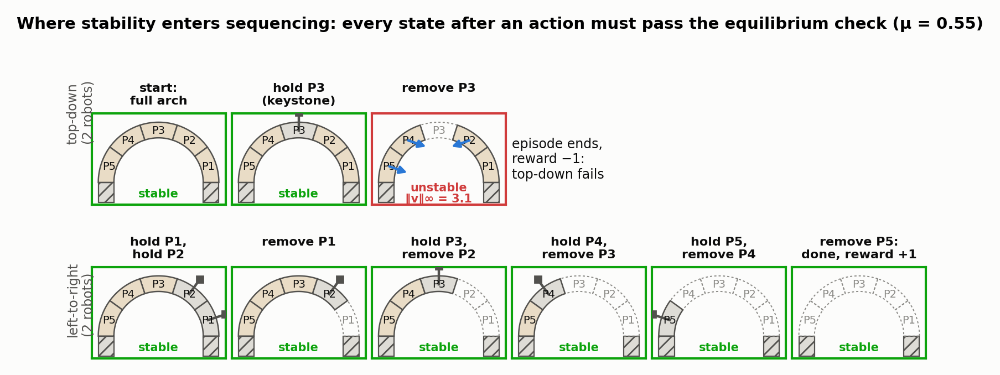
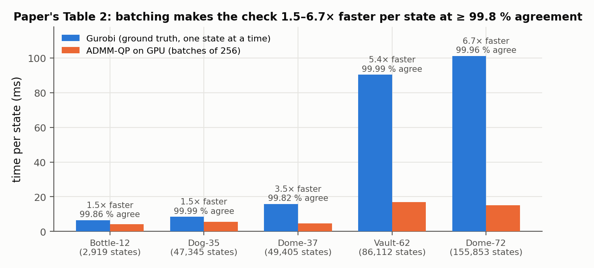
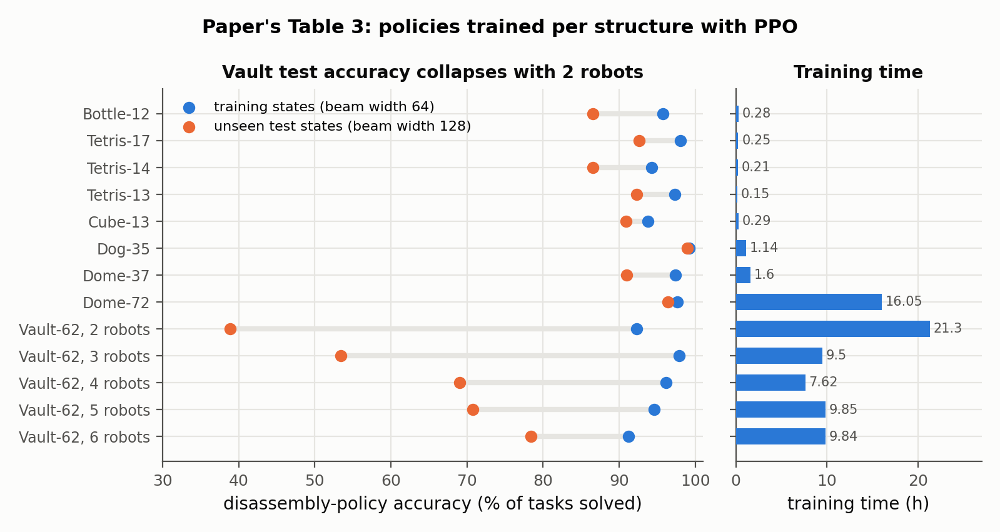

# Learning to Assemble with Alternative Plans

Ziqi Wang, Wenjun Liu, Jingwen Wang, Gabriel Vallat, Fan Shi, Stefana Parascho, Maryam Kamgarpour — *ACM Transactions on Graphics 44(4), August 2025 (SIGGRAPH 2025)*

[Paper](https://doi.org/10.1145/3730824) · [Code](https://github.com/KIKI007/LearningToAssemble)

**Stability question:** Static and Kinematic — every intermediate state must be in frictional rigid-body equilibrium under gravity, with robot-held parts as supports (static). Parts must also come out along collision-free straight lines, and robot motions must be collision-free (kinematic).

**Source read:** full text (author PDF: https://kiki007.github.io/assets/pdf/Wang2025Learn2Assemble.pdf, 16 pages; supplementary material not read).

## TL;DR
The paper trains a reinforcement-learning (RL) policy, separately for each structure, that proposes the next *disassembly* action: a robot either holds a part or removes a held part. Every intermediate state must stay stable, and the reversed sequence is an assembly plan for building without scaffolding. When reality departs from the plan (parts arrive late, the robot layout changes), the policy is simply resampled from the new state. For a 62-part vault this takes 8 s, versus 53 min to rerun a search-based planner. Three ingredients make training feasible:
- a GPU stability checker that evaluates batches of states in parallel;
- a curriculum built from search-generated states;
- a graph neural network shaped like the equilibrium equations.

## The problem
$n$ robots assemble a structure of $m$ rigid parts ($n<m$), such as a masonry vault, with no scaffolding. Robots temporarily hold parts to keep partial structures standing. Search methods compute one plan offline, which is expensive. Real execution gets disrupted by setup changes, part-delivery delays, or later repair and replacement, and rerunning search then causes long delays. Enumerating all plans up front is combinatorially infeasible. The paper first solves an abstract version (no collision bodies, interchangeable robots), then adds physical constraints.

## Why it matters
- Scaffolding-free construction needs every intermediate state to stand, and the space of valid orders is tiny. A "remove from the top down" rule already fails for a simple arch with two robots (Fig. 2).
- A depth-first search found a plan for the 12-part Bottle in 82 steps (0.54 s), but found none for the 37-part Dome within 100,000 steps.
- A *policy*, unlike a single plan, gives a next move from **any** state, and that is what makes alternative plans cheap.

## Contributions
1. A GPU rigid-body-equilibrium stability simulator that solves batches of stability QPs in parallel with a modified ADMM solver.
2. A curriculum-based training scheme that uses search-generated state graphs to overcome sparse rewards.
3. A force-torque graph attention network (FT-Graph + GAT) as the policy.
4. A hybrid planner that couples the learned policy with a GPU robot motion planner (CuRobo), demonstrated in simulation and on real robots.
5. Code and dataset release.

## Key intuitions
1. **Plan by disassembly, and learn a policy rather than a plan.** Removing parts shrinks the problem, and a feasible disassembly reversed is a feasible assembly. A policy $\pi(a\mid s)$ suggests actions from whatever state the site is actually in, so "alternative plans" are samples from it.
2. **Only the bounds change between states, so batch on GPU.** Stability is a quadratic program (QP) whose cost and constraint matrices can be made independent of which parts are present or held. The state only changes the bounds. ADMM's expensive linear solve then uses one precomputed inverse, and every iteration is plain matrix multiplication. Hundreds of states can run in one batch.
3. **Start RL where success is reachable.** From a full 62-part vault, random exploration never finds a feasible plan: plain PPO stalls after 55 actions when at least 94 are needed (Fig. 6). But every node of a search's state graph is a partial state *known* to be solvable. Training starts from small ones, adds parts as the policy improves, and, for the target-state variant, failed episodes are relabelled as successes toward an earlier target (hindsight experience replay).
4. **Make the network look like the physics.** Stability depends on contact normals and on the lever arms from part centroids to contact points. Giving each its own node type means information is not duplicated. The graph is also unchanged when parts are renumbered or the structure is translated, which allowed some transfer between structures.

## Technical crux, explained simply
**Analogy.** Picture building a stone arch with two helpers and no wooden frame. Sometimes a helper must hold a stone so the half-built arch doesn't collapse while the next stone goes in. It is easier to think backwards: how would you take the arch apart safely, one stone at a time, with at most two hands holding stones?

**Tiny example (our illustration, in the spirit of Fig. 2).** Voussoirs P1…P5 span two fixed abutments, with two robots available.
- *Top-down fails.* Holding and removing the keystone P3 leaves two half-arches leaning on nothing, and the stability check fails, giving reward −1.
- *Left-to-right works.* Hold P1, hold P2, remove P1 (P2 is held, so P3–P5 still lean on something). Then hold P3, remove P2; hold P4, remove P3; hold P5, remove P4; remove P5. Reversed, this is a build order in which each new stone is placed while its neighbor is held.

*Figure 1. The held-part stability check applied to every state of the two orders above, for a 5-voussoir semicircular arch on fixed abutments with μ = 0.55 as in the paper (our computation, in the spirit of the paper's Fig. 2). Grey parts are held by a robot (their equilibrium row is dropped, since the support force f absorbs any load); dashed parts are removed. The verdict is whether the QP's constraints admit a zero residual, tested as an LP feasibility problem, which is what the paper's threshold ‖v‖∞ ≤ 10⁻³ decides; for the failing state the minimum weighted residual is solved with SLSQP and the leftover motion v = M⁻¹r of each free part is drawn as a blue arrow. Removing the keystone leaves two half-arches whose 36° joints would need tan 36° = 0.73 > μ of friction, so the top-down order fails at its first removal and the episode gets reward −1, while the left-to-right order keeps a held part next to every free one and reaches the empty state.*

**State, actions, rules.** Each part carries two bits (still present? held?), and each action has two bits (remove? hold?).
- A part is held at most once.
- At most $n$ parts are held at a time.
- A part must be held before it is removed.
- There is one action per step, and a held part cannot be released without being removed.

An episode samples $a\sim\pi(\cdot\mid s)$ and applies it. If the new state is unstable the reward is −1. If all removable parts are gone the reward is +1.

**The stability check.** This is the rigid-body equilibrium method of [whiting2009-structurally-sound-masonry.md](whiting2009-structurally-sound-masonry.md), reshaped for batching. The unknowns are normal contact impulses $\lambda_n$, friction impulses $\lambda_t$ along 8 tangent directions, and a "support force" $f$ that robots may apply:

$$\min_{\lambda_n,\lambda_t,f}\ \tfrac12\,\big\|J_n^T\lambda_n+J_t^T\lambda_t+g+f\big\|^2_{M^{-1}}$$
$$\text{s.t.}\quad 0\le\lambda_n\le C\lambda^u,\quad 0\le\lambda_{t_k}\le C\lambda^u,\quad -[1-P]f^u\le f\le[1-P]f^u,\quad 0\le\mu\lambda_n-\textstyle\sum_k\lambda_{t_k}.$$

In words: pick contact forces that push but do not pull and obey friction ($\mu=0.55$), and let robots push on held or removed parts only. Then minimize whatever unbalanced load remains, weighted by the inverse mass matrix $M$. $J_n,J_t$ map contact impulses to forces and torques on parts, and $g$ is gravity. The part mask $P$ and contact mask $C$ encode the state, but they appear only in the bounds; each component of $\lambda^u$ and $f^u$ is $10^5$. The leftover motion $v=M^{-1}(J_n^T\lambda_n+J_t^T\lambda_t+g+f)$ decides the verdict: the state is stable if $\|v\|_\infty\le10^{-3}$.

The ADMM solver precomputes $L^{-1}$ with $L=Q+\sigma I+\rho A^TA$ ($\rho=0.1$, $\sigma=10^{-6}$, $\alpha=1.6$) and runs in FP64 on an H100. It checks residuals every 200 iterations, retires states that have converged, and labels any still undecided at the iteration limit (e.g., 3000) as unstable. Because it verifies the forces it outputs, it never calls an unstable state stable, but it may call a slow-to-converge stable state unstable.

**Curriculum data.** A beam search of width $W$ adds parts from the empty state and keeps only stable states. The resulting state graph's nodes are guaranteed-solvable starting points. For a variant policy $\pi(\cdot\mid s,s_\text{target})$ that stops at a non-empty target (e.g., restoring a partially collapsed structure), a disassembly-direction search provides the training tasks.

**Policy network.** The heterogeneous FT-Graph has three node types:
- *part nodes*, carrying the held flag and mass (plus the target state in the variant);
- *force nodes*, one per distinct contact normal between two parts, with two edge types for normal direction;
- *torque nodes*, holding contact points relative to each part's centroid.

Skip connections link all parts. Eight GAT layers with 16 features feed a linear head that outputs action probabilities. The network is trained with PPO (batch 128, learning rate $2\times10^{-3}$, discount 0.95).

**Physical constraints.** For kinematics, each part gets $d$ sampled straight removal directions (e.g., 1000). A $d\times m\times m$ table records collisions, and removals with no free direction are masked. For robots, the planner is a tree search with backtracking: sample from $\pi$, check stability, find robot "keyframes", and plan motions with CuRobo (one robot moves at a time). Failed actions get probability zero.

## What the results do well
- **Simulator** (Table 2, Gurobi as ground truth, batches of 256): accuracy 99.82–99.99% on states from five models of 12–72 parts. It is at least 1.5× faster per state, and about 6× faster on the 72-part dome (15.13 vs 101.16 ms). In one Vault test the text reports up to 100× over Gurobi.
- **Policy** (Table 3, trained on beam width 64, tested on unseen states from width 128): test accuracy 86.53–98.98% on every two-robot model except the Vault. The Vault-62 is the hard case: 38.90% with 2 robots, rising to 78.39% with 6. Training takes 0.15–21.3 h.
- **Target-state variant** (Table 4): 66.03–90.89% accuracy, versus 0.04–6.46% for simply masking the base policy.
- **GNN vs MLP** (Table 5): test accuracy 95.86% vs 88.97% on Bottle and 69.04% vs 17.85% on Vault with 4 robots. A policy trained on Bottle scores 66% on Dog's training set without retraining.
- **Robots:** Dome-37 with two ABB IRB 2600 arms, average planning 5 min. Vault with three arms under different layouts, average 96 min, 33.9 h training. The Bird House disassembles; the Bookshelf hits a deadlock that needs two parts removed at once.
- **Physical:** two ABB GoFa arms built the Bottle from store-bought wooden toy pieces. When the bottom three parts were "delayed," the policy produced an alternative order. Real-vs-simulated position deviation averaged 1.67 mm (max 5 mm).

*Figure 2. The paper's Table 2: time per state for the batched ADMM-QP (batches of 256, FP64 on an H100) against Gurobi, with the agreement between the two verdicts on beam-search states of five models. The speed-up grows with the number of parts, from 1.5× on the 12-part Bottle to 6.7× on the 72-part Dome.*

*Figure 3. The paper's Table 3: accuracy of the per-structure disassembly policy on its training states (beam width 64) and on unseen states (beam width 128), with the training time. Every model except the Vault generalises to 86.5–99 %; the 62-part Vault drops to 38.9 % with 2 robots and climbs to 78.4 % with 6, the gap the hybrid planner's backtracking has to make up.*

## Limitations
Stated by the authors:
- One robot acts at a time, one part per action, straight-line removal only. There is no simultaneous removal (deadlocks like the Bookshelf), no rotations such as unscrewing, and no parallel execution.
- The rigid-body equilibrium check misses sliding failures. Staggered projections (Kaufman 2008; Yao 2017) are compatible with the solver but too slow for RL training.
- No re-grasping.
- Test cases reach 72 parts, although the simulator handles 150. Each model must be retrained because transfer is limited.
- The FT-Graph is inefficient for curved contacts.
- Robot motion planning is the bottleneck, and the hybrid planner scales to only three arms.
- Deformable parts are out of scope.

Our observations:
- "Online" is relative. The 8 s vs 53 min comparison excludes hours of per-structure training, and low test accuracy on hard cases (38.90%) shifts work onto backtracking.
- Stability is a yes/no feasibility test with generous force bounds ($10^5$). There is no margin, and states held up by large internal squeezing count as stable, as in [mosemann1997-stability-assemblies-friction.md](mosemann1997-stability-assemblies-friction.md).
- Robot support is idealized as a bounded generalized force on the held part.

## Relevance to joint stability in this repo
- **Sequencing is trivial for 2-part joints, so the RL machinery is not needed** (our observation). What transfers is the *held-part stability check* for multi-part joints such as `CJ_AKT`. Checking whether a partial assembly stands on its own, or needs a clamp or hand, is exactly this QP with a support force on "held" parts.
- **Straight-line removal table as a cheap kinematic test** (our suggestion). For LHF parts, obvious candidates are the ± sweep normal of each cut plus a sphere sample. Heed the Bookshelf deadlock: a single-part straight-line test can wrongly call a genuinely interlocking multi-part design unassemblable. See [chen2022-high-level-interlocking-puzzles.md](chen2022-high-level-interlocking-puzzles.md).
- **Batching over states, not shapes** (our observation). The GPU trick only works when geometry is fixed and just the bounds change. For repair questions this fits well. Deleting contact faces lost to damage (setting their $C\lambda^u$ bounds to zero) or toggling clamps are pure bound changes, so many damage scenarios of one joint could be checked in one batch. Changing cut parameters changes $J$ and $M$, so the trick does not apply there.
- **Sliding blind spot.** Friction-reliant joints are exactly where this check is weakest. Use a staggered-projection analysis ([yao2017-decorative-joinery.md](yao2017-decorative-joinery.md), [kao2022-coupled-rigid-block-analysis.md](kao2022-coupled-rigid-block-analysis.md)) or a margin such as [nadeau2024-robustness-frictional-contact.md](nadeau2024-robustness-frictional-contact.md).
