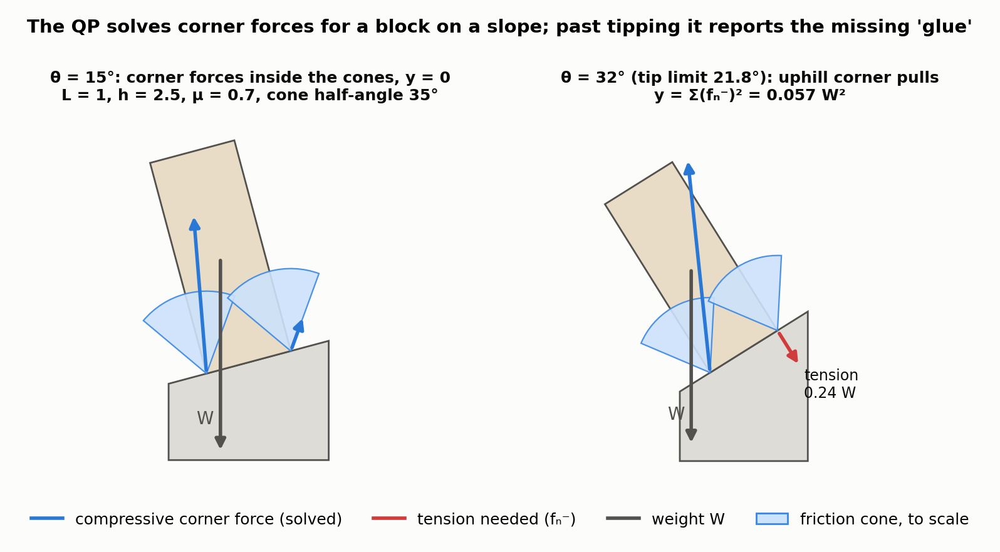
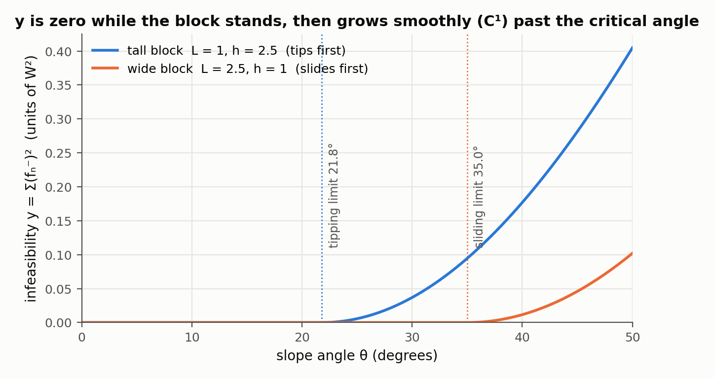
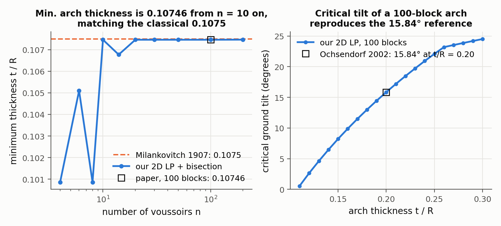
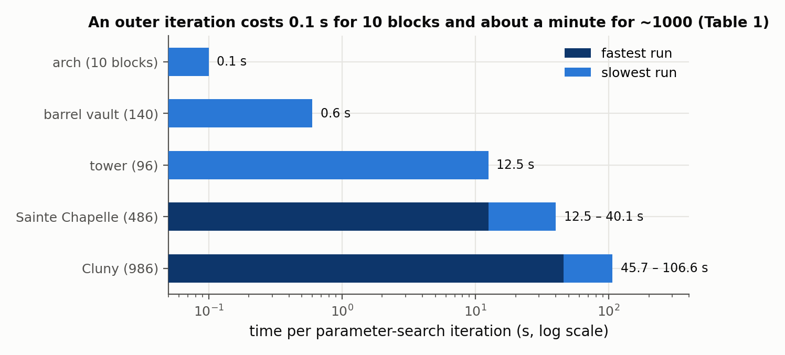

# Procedural Modeling of Structurally-Sound Masonry Buildings

Emily Whiting, John Ochsendorf, Frédo Durand — *ACM Transactions on Graphics 28(5), Article 112 (Proc. SIGGRAPH Asia), 2009*

[Paper](https://cs-people.bu.edu/whiting/resources/pubs/WhitingOchsendorfDurand-09.pdf) · [Project page](https://cs-people.bu.edu/whiting/projects/siggasia09.html)

**Stability question:** Static — checks whether contact forces that only push, and stay within friction limits, can hold every rigid block in equilibrium, and measures how much "glue" (tension) is missing when they cannot.

**Source read:** full text (https://cs-people.bu.edu/whiting/resources/pubs/WhitingOchsendorfDurand-09.pdf), plus the erratum listed on the project page.

## TL;DR
The paper treats a masonry building as a pile of rigid blocks. It asks whether there are contact forces that only push, respect friction, and cancel every block's weight. When there are none, it lets the interfaces pull and finds the smallest squared pulling force that works. That minimum is a smooth "distance to stability", and a gradient-based optimizer drives it to zero by adjusting free parameters of a procedural building grammar (wall thickness, window width, buttress size, ...).

## The problem
Procedural modeling (grammars in the style of Müller et al. 2006) produces buildings that look right, but nothing guarantees they would stand up. Standard engineering tools (finite elements, elasticity) are built around stress and material failure, and stone's high stiffness makes them poorly conditioned. The authors also cite Block et al. 2006, who showed that linear elastic theory could not tell a feasible masonry arch from an infeasible one. The classic alternative, Livesley's (1978) linear program for rigid blocks, gives only a yes/no answer. When a design fails, it says nothing about how far the design is from standing, so it cannot guide a search.

## Why it matters
In masonry, stresses are low compared with the stone's strength, so whether a building stands depends on its **geometry**: is there a path of compressive forces to the ground? This paper turns that yes/no question into a continuous number that can be optimized. The formulation, later called the rigid-block equilibrium (RBE) method, was extended to vertex-level gradients in [whiting2012-structural-optimization-masonry.md](whiting2012-structural-optimization-masonry.md). It was then corrected for complex, non-planar interfaces in [kao2022-coupled-rigid-block-analysis.md](kao2022-coupled-rigid-block-analysis.md).

## Contributions
1. The idea of generating structurally feasible procedural building models by automatically choosing designated free rule parameters, within bounds set by the user.
2. A **measure of infeasibility**, computed by a quadratic program, that says how close a model is to structurally sound. It agrees closely with available experimental data.
3. Using that measure as an energy for gradient-based nonlinear optimization of the rule parameters.
4. Example buildings with internal structure (inspired by Cluny Abbey and Sainte Chapelle, plus a mosque, a tower and a barrel vault), and a demonstration that the stable results can be dropped into a rigid-body dynamics engine.

## Key intuitions
1. **For masonry, stability is about geometry, not strength.** Following Heyman (1995), the authors treat stone as rigid, with zero tensile strength (mortar is assumed to add none) and friction at the joints. The question becomes "does a set of pushing forces exist?" Every constraint is linear.
2. **One force per corner of a contact polygon models a linear pressure distribution.** Their combined push can act anywhere inside the contact polygon. It can move outside only if some corner pulls. So "compression only" is equivalent to "the resultant force lies inside the contact area" (their Fig. 7).
3. **Soften the hard constraint to get a distance.** Split each normal force into a push part and a pull part, allow pulling, and minimize the squared pull. A result of zero means feasible. A positive value says how much glue is needed, and the tension arrows show where.
4. **The penalty is squared, not linear, on purpose.** Squaring makes the energy smooth (C¹) as the building parameters change, which gradient-based optimizers need.
5. **The objective removes the ambiguity.** Most structures have more unknown forces than equilibrium equations, so many force sets balance the loads. Picking the one closest to compression-only gives a single, well-defined answer.

## Technical crux, explained simply
**Analogy.** Picture building with sugar cubes and no glue. A cube can push on its neighbors and rub against them, but it can never pull. The structure stands if you can assign a push and a rub at every contact so that the forces on every cube cancel out. If you can't, imagine putting dabs of glue at some contacts. The least total glue you need is a measure of how unstable the design is.

**Tiny example (2D, one block on a support).** The contact is an edge running from $x=0$ to $x=L$. The block weighs $W$, and its centre of mass is at horizontal position $c$. Put one upward normal force at each corner: $f_0$ at $x=0$ and $f_L$ at $x=L$. A negative force is "glue".

- Vertical balance: $f_0 + f_L = W$.
- Torque balance about $x=0$: $L\,f_L = c\,W$.
- So $f_L = cW/L$ and $f_0 = W(1 - c/L)$.

If $0 \le c \le L$, both forces are non-negative, the block is stable, and the infeasibility is $y = 0$. If the block overhangs so that $c = 1.2L$, then $f_0 = -0.2W$: that corner would have to pull. Then $y = (0.2W)^2 = 0.04W^2$. Sliding the block back toward $c = L$ shrinks $y$ smoothly to zero, and that smooth change is what an optimizer can follow. With four corners in 3D, or many blocks, the balance equations no longer fix the forces uniquely, and the quadratic program picks the force set with the least tension.

Tilting the support does the same thing as moving $c$, and adds friction to the picture. Figures 1 and 2 run the paper's quadratic program on that version of the example.

*Figure 1. The paper's quadratic program (Eq. 6) solved in 2D for a block (L = 1, h = 2.5, μ = 0.7) resting on a slope, with the friction cones (half-angle arctan μ = 35°) drawn to scale at both contact corners. At 15° both corner forces lie inside their cones and y = 0; at 32°, past the tipping angle arctan(L/h) = 21.8°, the uphill corner would have to pull with 0.24 W (red), so y = 0.057 W². Our computation, not a figure from the paper (our observation); friction is bounded by the compressive part $f_n^{+}$, as Kao et al. 2022 (Sec. 3.2) describe the RBE formulation doing.*

*Figure 2. The infeasibility measure y(θ) from the same program as the slope angle θ varies, for a tall block (tips first, at 21.8°) and a wide block (its sliding limit arctan μ = 35° comes first). y is exactly zero while the block stands and then grows as (θ − θ_c)², i.e. with a continuous first derivative, which is the C¹ property the parameter search relies on (Sec. 4). In the sliding case the program buys friction capacity with cancelling compression/tension pairs at the same vertex, a quirk that Kao et al. 2022 later remove with the constraint $f_n^{+} f_n^{-} = 0$ (our observation).*

**The actual method.**
- *Geometry.* Grammar rules generate blocks and their contact interfaces. Neighboring faces are assumed coplanar and non-interpenetrating, and adjacencies are found with bounding boxes.
- *Unknowns.* At each vertex $i$ of each interface there is a 3D force $f_i$ with one normal component $f_n^i$ and two in-plane friction components $f_{t1}^i, f_{t2}^i$.
- *Equilibrium.* $A_{eq} f + w = 0$. Here $w$ collects block weights and any external loads, and $A_{eq}$ has 6 rows per block (3 for net force, 3 for net torque). Each interface force touches only two blocks, so $A_{eq}$ is sparse.
- *Compression only.* $f_n^i \ge 0$.
- *Friction.* The friction cone is linearized to a pyramid, $|f_{t1}^i|, |f_{t2}^i| \le \alpha f_n^i$, with a typical friction coefficient $\alpha = 0.7$. The coefficient is scaled by $1/\sqrt{2}$ so the pyramid lies inside the true cone, which is conservative. Written compactly, $A_{fr} f \le 0$.
- *Infeasibility.* Write $f_n^i = f_n^{i+} - f_n^{i-}$, with both parts non-negative ($f_n^{i-}$ is tension). Then solve

$$y(\theta) = \min_f \sum_i \left(f_n^{i-}\right)^2 \quad \text{s.t. } A_{eq} f = -w,\; A_{fr} f \le 0,\; f_n^{i+}, f_n^{i-} \ge 0,$$

where $\theta$ is the vector of free grammar parameters that produced the geometry.
- *Search.* Minimize $y(\theta)$ subject to bounds $lb \le \theta \le ub$, stopping when $y = 0$ or at a local minimum. The QP is solved with the BPMPD interior-point solver. The outer loop uses Matlab's active-set SQP, with gradients from forward finite differences. $y$ is C¹, but its second derivative can jump when a penalty force switches off.
- *Safety margin.* The contact polygon can be shrunk to its "kern" (the middle third, for rectangles) so resultants stay away from edges. Live loads are simply added to $w$.

## What the results do well
- **Validation against known arch limits.** The known minimum thickness of a semicircular arch is 0.1075 of its centerline radius (Milankovitch 1907); the method gives 0.10746 with 100 blocks. For an arch with thickness/radius 0.20, the critical ground-tilt angle is 15.84° (Ochsendorf 2002), and the method matches it exactly with 100 blocks. Those reference values come from 2D analyses, while this method is fully 3D.

  
  *Figure 3. The validation of Sec. 3.3 reproduced with a 2D rigid-block LP (the feasibility conditions of Eq. 4, μ = 0.7, radial joints, two contact vertices per joint) and bisection. Left: minimum thickness of a semicircular arch versus the number of voussoirs; from 10 blocks on we get 0.10746, the paper's value, within 0.04% of Milankovitch's 0.1075. The dips at 4, 8 and 14 blocks occur because hinges can only form at joints, so a coarse arch can look more stable than the continuous one, which is the block-count caveat the authors raise. Right: critical ground tilt of a 100-block arch versus thickness, passing through Ochsendorf's 15.84° at t/R = 0.20 (we get 15.844°). Our computation (our observation).*
- **Scale.**

  | Model | Blocks | Free parameters | Iterations | Time per iteration |
  |---|---|---|---|---|
  | Cluny-inspired abbey | 986 | 4–9 | 4–10 | 45.7–106.6 s |
  | Sainte Chapelle–inspired | 486 | 3–10 | 4–9 | 12.5–40.1 s |
  | Tower | 96 | 32 | 6 | 12.5 s |
  | Barrel vault | 140 | 1 | 8 | 0.6 s |
  | Arch | 10 | 2 | 6 | 0.1 s |

  Cost grows with iterations × parameters × QP time, because the gradients come from finite differences.

  
  *Figure 4. Time per outer iteration from the paper's Table 1. Each iteration solves one QP per free parameter for the finite-difference gradient, which is why the Cluny model spans 45.7–106.6 s for 4–9 parameters; models with several reported runs are shown as a range.*
- **Design trade-offs.** In the Sainte Chapelle model, a 4-parameter search reaches stability by lowering the building. A 10-parameter search keeps the original height and uses smaller windows and thicker walls instead. In another grammar variant, adding flying buttresses moves load away from the walls and allows larger windows than the version without buttresses. In interactive editing, the buttress angle updates in under five seconds as the user widens a barrel vault.
- **Robust search in practice.** No problematic local minima showed up. The 32-parameter tower search, started from random points, always converged to a zero-tension solution.
- **Sensitivity checks.** Rotating the friction pyramid by 45° changed the optimized dimensions by 10.5% (corner columns), 4.3% (window arch thickness) and 1% (columns under the windows).

## Limitations
Stated by the authors:
- The grammar and free parameters may not contain any feasible structure. The method then returns the least-infeasible model, and the user has to add structural elements by hand, guided by the tension visualization.
- **An equilibrium existing does not prove stability.** The authors write that the structure "may still be unstable if alternative equilibrium states exist where friction constraints are violated". They also leave out the "sawtooth" friction case (Gilbert et al. 2006) and assume idealized interfaces where only tangential displacement occurs.
- Block count matters. Fewer, larger blocks can overestimate stability where hinging failures occur (arches, vaults, buttresses). A "just stable" Sainte Chapelle stayed stable when its blocks were subdivided from 486 to 876, then became unstable when the groin-vaulted ceiling was subdivided further.
- A poorly chosen interface orientation can make a structure unstable, and how orientation affects the solution space is left open.
- Active-set SQP does not guarantee a global minimum.
- The method is compression-only, though tension-only pairs can be handled by flipping the sign of the constraint.
- *Erratum (project page):* in the appendix, the vertex-to-centroid vector $\hat v_{i,j}$ should not be normalized, because its length is needed for the correct torque.

Our observations:
- (our observation) The penalty measures only how large the tension forces are, not their lever arm. The follow-up paper shows this produces gradients that enlarge interfaces instead of fixing the imbalance ([whiting2012](whiting2012-structural-optimization-masonry.md)).
- (our observation) The quantitative validation is on arches, which fail by hinging. Nothing validates cases where failure is dominated by sliding, which is exactly where the friction caveat above applies. [kao2022](kao2022-coupled-rigid-block-analysis.md) later shows this formulation declaring wedged blocks stable even upside down.
- (our observation) Blocks are rigid, so crushing, bending and fracture (the structural question) are out of scope. That is justified for low-stress stone, but less obviously so for timber.

## Relevance to joint stability in this repo
- **Transfers: the contact-force model.** In a 2-part joint, treat one part as the fixed support and the other as the free block. Cut faces from LHF cuts are planar: floors at the sweep depth, and side walls swept along the plane normal. Contact interfaces are therefore planar polygons. Place a force at each polygon corner, build $A_{eq}$, and add the load case (a gravity direction or an applied force) to $w$. Curved sketch segments, such as milling fillets, would first need to be split into planar facets.
- **Transfers: infeasibility as a continuous label.** "Minimum squared tension needed to hold part B against part A under load L" is a graded stability score, and the tension pattern shows which contact fails. It is useful for ranking joint configurations, or as a training target.
- **Does not transfer safely: joints held by wedging.** Dovetail flanks, keyed shoulders and other non-planar, opposing contacts are exactly the case the authors flag, where an equilibrium exists on paper but friction wouldn't actually supply it. For those, use the kinematics-coupled version in [kao2022](kao2022-coupled-rigid-block-analysis.md).
- **Does not transfer:** the grammar-parameter search with finite differences, and anything about wood strength, grain or deflection. The method answers only the static question, not the kinematic or structural ones.
