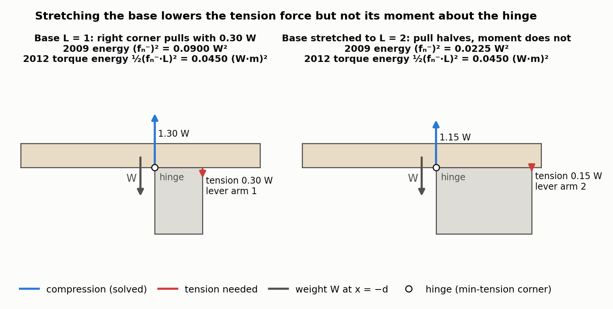
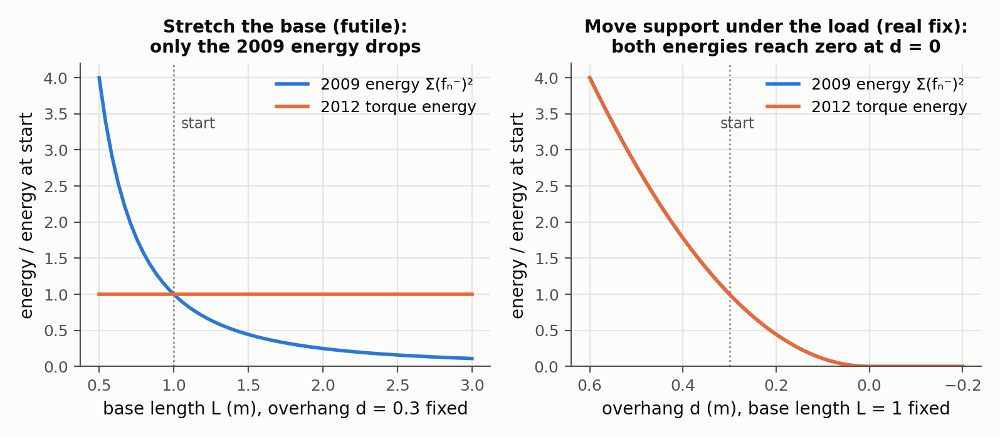
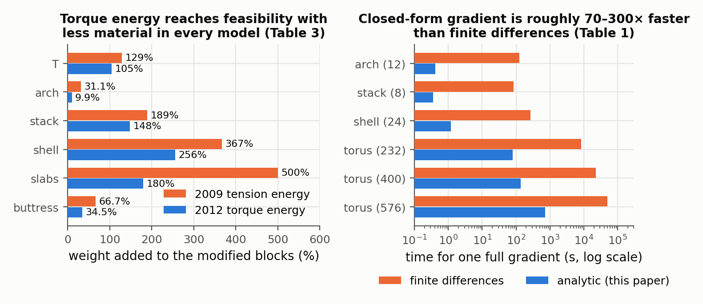

# Structural Optimization of 3D Masonry Buildings

Emily Whiting, Hijung Shin, Robert Wang, John Ochsendorf, Frédo Durand — *ACM Transactions on Graphics 31(6), Article 159 (Proc. SIGGRAPH Asia), 2012*

[Paper](https://cs-people.bu.edu/whiting/resources/pubs/WhitingShinWangOchsendorfDurand-12.pdf) · [Project page](https://cs-people.bu.edu/whiting/projects/siggasia12.html)

**Stability question:** Static — turns rigid-block infeasibility into a torque-aware energy with a closed-form gradient with respect to every vertex, so the geometry itself can be moved toward equilibrium.

**Source read:** full text (https://cs-people.bu.edu/whiting/resources/pubs/WhitingShinWangOchsendorfDurand-12.pdf), plus the 2-page supplemental derivation (https://cs-people.bu.edu/whiting/resources/pubs/WSWOD-12-supplemental.pdf).

## TL;DR
[Whiting et al. 2009](whiting2009-structurally-sound-masonry.md) measured instability as "how much tension glue is needed", but its gradients point to the wrong fixes: they make interfaces bigger. This paper measures the **unbalanced torque** about each interface's would-be hinge. It derives a closed-form gradient of that energy with respect to all block vertices by freezing the QP's active constraints. It then applies gradient steps under user constraints: planar faces, fixed thickness, orientation or volume, and material minimization. Cables are also supported, as tension-only elements.

## The problem
The 2009 method optimized a few grammar parameters using finite-difference gradients, which is too slow once each vertex of a generic block model is a variable. More fundamentally, the 2009 tension penalty proposes "futile changes". Stretching a support away from an overhanging load lowers the tension needed, but the load still tips. The goal here is a stability energy whose gradient points toward real improvements, is cheap to evaluate, and can be combined with design constraints.

## Why it matters
Structural analysis usually happens after the architectural form is fixed, and tools such as FEM analyze a design without saying how to change it. A **structural gradient** tells a designer, for every vertex, which way to move to improve soundness most. It turns stability into a differentiable objective that can be traded off against other goals. The authors argue that the underlying principle, minimizing non-axial forces, reaches beyond masonry.

## Contributions
1. A new stability metric that "accurately quantifies infeasibility" by including torque imbalance.
2. A closed-form derivation of the gradient of stability with respect to geometry changes.
3. A geometry parameterization that keeps block faces planar.
4. An extension to tension-only elements (cables).
5. Gradient modifications for user constraints and objectives, for guided improvement of stability.

## Key intuitions
1. **Measure what actually fixes tipping: torque, not force.** An overhanging block tips because its weight creates a moment about an edge. Lengthening the lever arm lowers the tension needed but leaves that moment unchanged. An energy built from tension × lever arm is blind to such useless changes, so its gradient favors real fixes, like moving support under the load.
2. **Freeze the active set and the QP becomes a formula.** Once you know which inequality constraints are tight (friction at its limit, normal forces at zero), the QP is a least-squares problem with only equality constraints. It has a closed-form solution, and a formula can be differentiated.
3. **Give every force a small weight, not just tension.** Penalizing compression and friction lightly (tension heavily) makes the weight matrix positive definite. That keeps the closed form well-defined and picks low-force solutions among the many that balance a statically indeterminate structure.
4. **Parameterize with moves that keep faces flat.** Gradients are taken with respect to sliding a vertex within its face, offsetting a face along its normal, and tilting a face. The step is then projected back to planar, coincident geometry.
5. **Constraints act as projections.** Take the raw gradient step, then solve for the nearest geometry that satisfies the designer's constraints.

## Technical crux, explained simply
**Analogy.** A plank sticks out past the edge of a table. You could hold it with glue at the far end of the table. Extending the table on the far side means less glue is needed, because the lever is longer, but the plank tips just as badly. What matters is the turning effect of the overhang, and the only real fix is to move support under the plank's centre of mass or reshape the plank.

**Tiny example (2D, the paper's T-shape in miniature).** A top block of weight $W$ rests on a base whose contact edge runs from $x=0$ to $x=L$. The top block's centre of mass is at $x=-d$, overhanging the left corner by $d>0$, so $x=0$ is the hinge and the corner at $x=L$ is the one that would need glue (Figure 1).

- Balance: $f_0 + f_L = W$, and torque about $x=0$ gives $L\,f_L = -dW$.
- So $f_L = -dW/L$ is tension at the right corner, and $f_0 = W(1 + d/L)$.
- **2009 energy:** $y = (dW/L)^2$. Increasing $L$ (stretching the base to the right) lowers $y$, so the gradient says "stretch the base". That is a futile change that only adds material.
- **Torque view:** the hinge is the corner with the least tension ($x=0$). The tension's moment about it is $(dW/L)\cdot L = dW$, which does not depend on $L$. Only reducing $d$ (moving the base's left edge under the load, or reshaping the top block) lowers it. The paper states this directly: in the T example "the change in torque energy is zero since the tension force decreases but the torque arm increases".

*Figure 1. The T example of the paper's Fig. 3(a,b) in 2D: a slab (W = 1) whose centre of mass overhangs the base's left corner by d = 0.3, solved with the paper's QP (Eq. 5, tension weighted 1000× more than compression and friction; the base is treated as a fixed support). Stretching the base from L = 1 to L = 2 halves the tension at the right corner (0.30 W → 0.15 W), so the 2009 energy drops from 0.090 to 0.0225 W², but the tension's moment about the hinge, d·W, is unchanged, so the torque energy of Eq. 8 stays at 0.045 (W·m)². Our computation (our observation).*

*Figure 2. The two energies along the two possible edits, each normalised to the starting design (d = 0.3, L = 1). Left: stretching the base lowers the 2009 energy as 1/L² but leaves the torque energy flat, so only the 2009 gradient favours this futile change. Right: moving the base's left edge under the load shrinks the overhang d, and both energies fall to zero at d = 0, quadratically, as (dW)². Our computation (our observation).*

**The actual method.**
1. *Force solution.* As in 2009, contact forces sit at interface vertices, with normal and two friction components and a friction pyramid (typical coefficient 0.7). Normal forces are split into compression and tension parts. The QP is

$$f^* = \arg\min_f \tfrac12 f^\top H f \quad \text{s.t. } A_{eq} f = -w,\; A_{fr} f \le 0,\; I_{lb} f \ge 0,$$

where $H$ is diagonal with a large weight on tension and small weights on compression and friction.
2. *Energy.* On each interface, the tension is split into a **uniform part** $f_{min}$ (the smallest tension on that interface, non-zero only if every vertex pulls) and a **torque part** (each vertex's tension above $f_{min}$). The hinge is the line through the vertices at minimum tension. Each vertex's torque contribution is its excess tension times its distance $d_i$ to the hinge. The total is $y = \alpha\, y_{uniform} + y_{torque}$, both quadratic, where $\alpha$ converts between units of $N^2$ and $(N\,m)^2$ and must be set for the model's scale.
3. *Closed form.* Lagrange multipliers from the solver identify the active constraints. Stacking them with equilibrium gives $C f = b$. Assuming they stay active for small changes,
$$f^* = H^{-1} C^\top \left(C H^{-1} C^\top\right)^{-1} b.$$
In words: the smallest-weighted force vector that satisfies all tight constraints. Linearly dependent rows are removed, and QR decomposition is used for numerical stability.
4. *Differentiate.* Per the supplement, the friction and lower-bound rows don't depend on block geometry. Only $A_{eq}$ (normals and lever arms from block centroids) and $b$ (block weights, via volumes) do. Their derivatives are derived analytically and pushed through the formula for $f^*$ by the chain rule, holding the minimum-tension vertex sets fixed.
5. *Parameterize and step.* Partial derivatives are taken for in-plane vertex translations $(u,v)$, face offset $n$, and face rotations $(\theta,\phi)$ about the face centroid, then summed per vertex. A step $\Delta p$ is projected by Gauss–Newton onto geometry where quad faces stay planar (angles sum to $2\pi$) and adjacent faces stay coincident, to a tolerance of $5\times10^{-3}$. Optional penalties fix block thickness, vertices, face orientation or block volume, and a volume term $\gamma\nabla v$ can minimize material. L-BFGS can replace plain gradient descent.
6. *Cables.* Cables carry only tension, along their axis, with no friction, and compression is penalized. Because a cable can't balance every torque, virtual torques at element centroids enter the penalty.

## What the results do well
- **Speed versus finite differences:**

  | Model | Blocks | Gradient entries | Analytic | Finite diff. |
  |---|---|---|---|---|
  | Arch | 12 | 792 | 0.41 s | 127 s |
  | Stack | 8 | 528 | 0.36 s | 84.5 s |
  | Shell | 24 | 1584 | 1.19 s | 269 s |
  | Torus | 232 / 400 / 576 | 15312 / 26400 / 38016 | 80.6 / 138.6 / 720.6 s | 8.37×10³ / 2.28×10⁴ / 4.95×10⁴ s |

  The planarity projection takes 0.08–0.60 s without user constraints and 0.09–0.75 s with them.
- **Few iterations.** With a stopping criterion of 1% of the initial infeasibility, the arch and shell took ≤ 4 iterations and the cable bridge 10. The 8-block stack took 40, which the authors call a hard case because few configurations are feasible. In the slab-and-column building, infeasibility dropped from $7.65\times10^5$ to $8.6\times10^{-7}$.
- **Less material than the 2009 energy.** Weight increase after reaching feasibility, new vs. 2009: T 105% vs 129%, arch 9.9% vs 31.1%, stack 148% vs 189%, shell 256% vs 367%, slabs 180% vs 500%, buttress 34.5% vs 66.7%. With volume minimization, a stacked-block design went from an infeasible 160 weight units to a feasible 127, versus 174 without it.

  
  *Figure 3. Left: weight added to the modified blocks to reach feasibility with the torque energy versus the 2009 energy (paper's Table 3). Right: time for one full gradient, analytic versus finite differences, on a log scale (paper's Table 1).*
- **Checked gradients.** Changes in the constraint matrices matched finite differences with error below 1%. The energy change for a small interface rotation matched a forward difference to within 2.3%.
- **Physical check.** Physical models of the 8-block stack show the unstable input falling and the optimized output standing, with the failure hinge at the interface of greatest tension.

## Limitations
Stated by the authors:
- Planarity and user constraints can fight the gradient, so a projected step may even decrease feasibility.
- The gradient depends on which active constraints the QP solver reports. If a vertex's normal force is zero (both bounds active), its derivatives are zero.
- Structures are hyperstatic, and the quadratic energy prefers spreading small tensions over concentrating large ones.
- Very large compression forces (for example at the base) can overpower small tension forces, keeping the gradient from eliminating tension. Better step sizes and L-BFGS helped more than re-weighting.
- There is no guarantee that a feasible solution exists within continuous geometry changes.
- Differentiability requires fixed topology: block adjacencies and the vertex count of each contact polygon must not change.
- Non-planar joint faces are deliberately excluded. They "would eliminate the smooth friction surfaces and result in interlocking block faces which are rare in masonry construction."

Our observations:
- (our observation) This is still a force-only equilibrium test, so it inherits the 2009 caveat that an equilibrium existing does not prove stability. Driving $y$ to zero could converge on false-stable designs wherever sliding and wedging matter; [kao2022](kao2022-coupled-rigid-block-analysis.md) shows these cases.
- (our observation) The gradient is only valid inside one active-set region. Joint edits often create or remove contact patches, which changes the active set and polygon topology, so expect a piecewise, non-smooth landscape.
- (our observation) The unit-balancing weight $\alpha$ and the penalty weights in $H$ are scale-dependent tuning knobs, and the paper gives no values for them.

## Relevance to joint stability in this repo
- **Transfers: differentiating stability with respect to cut parameters.** The LHF sweep amount acts like a face offset $n$, and moving sketch vertices moves side-wall faces. A chain rule from LHF parameters to vertex positions, followed by this sensitivity analysis (freeze the active set, differentiate $A_{eq}$ and $w$), would give gradients for joint editing. One nice property (our observation): the mating part is cut from stock using the same geometry, so the coincidence constraint this paper enforces with a penalty comes for free in the repo's representation.
- **Transfers: the torque-over-force lesson.** Any stability score used as a learning or optimization target should respond to changes that actually fix the imbalance. Otherwise the optimizer "cheats" by enlarging contact areas.
- **Does not transfer: interlocking faces.** The paper explicitly excludes them, and it rests on a force-only test that misjudges wedged interfaces. For dovetails and keyed joints, pair the differentiation idea with the kinematics-coupled model of [kao2022](kao2022-coupled-rigid-block-analysis.md).
- **Does not transfer: fixed-topology differentiability.** Edits that change which faces touch, which is typical when resizing a tenon or shifting a sketch, break the assumptions. Wood strength and deflection are also outside the model.
