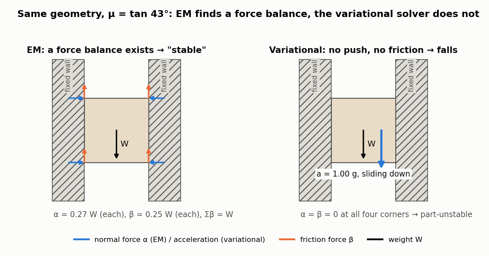
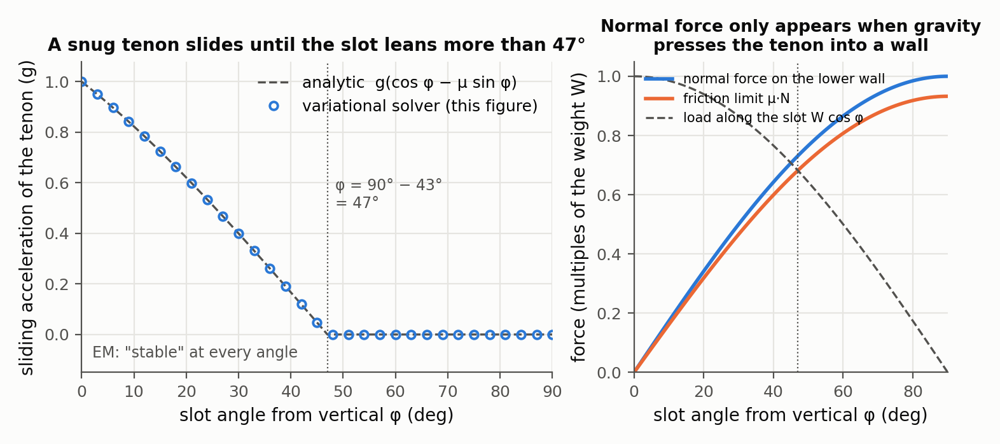
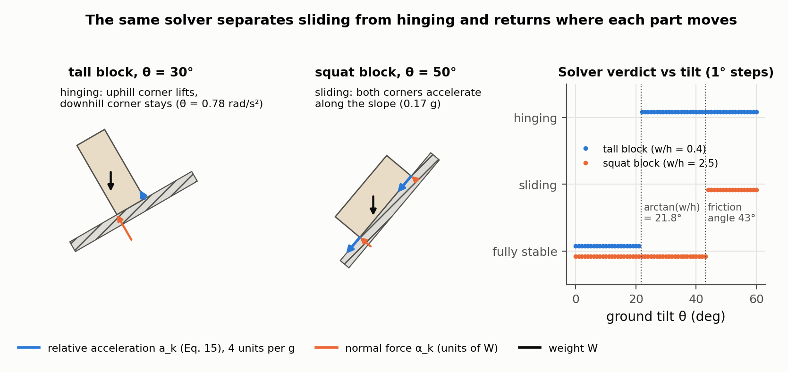
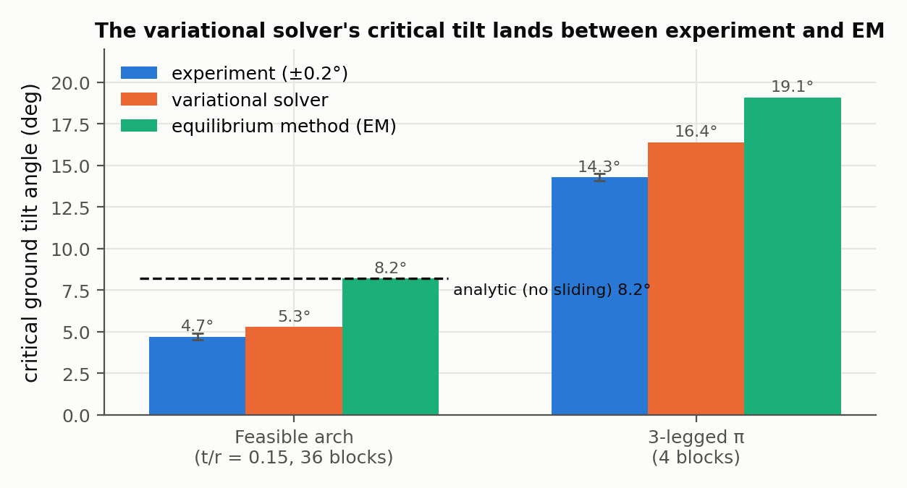

# Interactive Design and Stability Analysis of Decorative Joinery for Furniture

JiaXian Yao, Danny M. Kaufman, Yotam Gingold, Maneesh Agrawala — *ACM Transactions on Graphics 36(2), 2017 (presented at SIGGRAPH 2017)*

[Paper](https://jiaxianyao.github.io/joinery/joinery.pdf) · [Project page](https://jiaxianyao.github.io/joinery/)

**Stability question:** Kinematic, Static — kinematic through single-translation assemblability tested against 26 directions; static through a new rigid-body frictional-contact solver that reports which parts slide or hinge, and in which direction.

**Source read:** full text (https://jiaxianyao.github.io/joinery/joinery.pdf, 16 pages)

## TL;DR
The user paints a furniture model's surface into regions, one per part, and the tool computes interior part shapes that go together one at a time, each with a single straight push. A *variational static analysis* then checks whether the parts stay put under gravity. Unlike the masonry equilibrium method, it catches sliding and reports where and which way parts move, which tells the user where to add a joint.

## The problem
There are two sub-problems:
1. **Construction.** Input: a solid model plus a partition of its *surface* into "surface 2D parts". Output: solid 3D parts that (a) are each one connected solid whose visible surface matches its painted region, and (b) satisfy **sequential one-push assemblability (SOPA)**: in some order, each part joins the earlier ones by one collision-free translation.
2. **Stability.** Decide whether the assembly holds under gravity. If it doesn't, say which parts move relative to which, and whether they slide (translate) or hinge (rotate). The paper uses three classes:
   - **fully stable:** nothing accelerates;
   - **part-stable:** the whole assembly moves as one rigid body (e.g. a jointed table missing two legs tips over);
   - **part-unstable:** some contacting parts move relative to each other.

## Why it matters
The standard stability test in graphics and architecture was the **equilibrium method (EM)** (see [whiting2009-structurally-sound-masonry.md](whiting2009-structurally-sound-masonry.md), [whiting2012-structural-optimization-masonry.md](whiting2012-structural-optimization-masonry.md)). EM asks only whether *some* admissible set of contact forces balances the loads, and masonry work assumes friction is high enough that blocks don't slide. Furniture parts that lack enough joints often do slide. The authors show EM can call such an assembly stable, and when EM does report failure it can't say which parts fail or how.

## Contributions
1. A construction algorithm: a directional blocking graph over 26 directions, enumeration of SOPA-compatible disassembly orders, then two passes. Pass 1 builds "maximum 3D parts" by subtracting sweep volumes; pass 2 splits overlapping volume between pairs of parts.
2. Redesign feedback for infeasible inputs. The tool shows the disassembly sequence with the least total collision area, and the user can give each collision region to either part.
3. A variational static analysis for rigid assemblies with Coulomb friction (Gauss's least constraint + maximal dissipation, solved with Staggered Projections). It outputs relative accelerations at each contact, so it can say where and in which direction parts slide or hinge.
4. Suggested surface regions where the user can add joints.
5. Validation: more than 100 joints and 9 furniture assemblies, plus one full-size wooden chair.

## Key intuitions
1. **Assembly is disassembly run backwards.** Part *p* is blocked by part *q* in direction *d* if sweeping *p* along *d* until it leaves the bounding box hits *q*.
2. **Start with the biggest possible part, then carve.** Each part starts as the whole solid, minus anything swept by earlier-removed parts or by later parts moving opposite to this part's removal direction. If even this maximal part is disconnected, the order can't work.
3. **EM can invent contact forces that nothing produces.** Equal and opposite squeezing forces cancel, so EM may pick them arbitrarily large, and with them arbitrarily large friction. Real contacts push only as hard as something forces them to.
4. **Make normal forces minimal and friction maximally dissipative.** With these two principles the solver picks forces a real rigid system would produce. Any force left unbalanced becomes an acceleration, and that acceleration shows what fails and where to add a joint.

## Technical crux, explained simply

**Analogy.** Hold a book between your palms without squeezing, and it drops. "*Could* friction hold it?" gets a yes, because you *could* squeeze: that's EM's question. "Given how hard the palms *actually* press, does it hold?" gets a no: that's the variational method's question.

**Tiny example (the paper's own).** A square block touches two fixed vertical walls without being squeezed. Gravity points down. Take contact points at the block's 4 corners. Contact normals are horizontal (pointing into the block) and friction acts vertically.

*Figure 1. The paper's own didactic example (Sec. 5.2), solved both ways at μ = tan 43° with a small 2D re-implementation of Eqs. 13–15 (our computation). Left: EM's LP finds a self-cancelling squeeze — α = 0.27 W and β = 0.25 W at each of the four corners, Σβ = W — and calls the block stable. Right: the variational solver returns α = β = 0 everywhere, so friction is capped at zero and the block accelerates downward at exactly 1 g: part-unstable, sliding down.*

- **EM.** It needs normal magnitudes $\alpha_k \ge 0$ and friction $\beta_k$ with $|\beta_k| \le \mu\,\alpha_k$ such that forces and torques sum to zero. Set every $\alpha_k = a$: left and right pushes cancel. Set every $\beta_k = b$ upward: the torques cancel and the net upward force is $4b$. Make $a$ large enough that $\mu a \ge b$ and $4b$ equals the weight. EM declares the block stable, for any friction coefficient and any weight. That's wrong.
- **Variational.** First ask which normal forces are *needed*. A block falling straight down never pushes into the walls, so non-penetration already holds with $\alpha = 0$. The smallest admissible normal force is zero. Then Coulomb's law caps friction at $\mu \cdot 0 = 0$. The leftover force is all of gravity, so the block accelerates downward: "part-unstable, sliding down."

The "H" benchmark is the free-standing version: a horizontal block between two free vertical blocks, with no joints. The EM code still reports it stable. The variational solver reports that the middle block slides down.

*Figure 2. The same example with the slot axis leaned over by φ, which is the snug-tenon case for this repo (our toy extension, not in the paper). Left: the solver's sliding acceleration matches the closed form g(cos φ − μ sin φ) to within 10⁻⁴ g and first reaches zero at φ = 90° − 43° = 47°, while EM answers "stable" at every angle. Right: a normal force appears only once gravity leans the tenon into a wall, and only then is there any friction budget μ·N to spend.*

**The actual method.** Each part $b$ is rigid, with position $t_b$ (its centre of mass) and rotation $R_b$. Stack every part's linear and angular acceleration into one vector $\ddot q$, and let $M$ be the block-diagonal mass matrix. For each contact $k$ (part–part or part–ground), a linear map $\Gamma_k$ turns $\ddot q$ into the relative acceleration of the two touching points.
- Normal directions become generalized force directions $\Gamma_k^T n_k$. Stacking them as columns gives $N$, with magnitudes $\alpha$.
- Two tangent directions per contact give the friction basis $D$, with coefficients $\beta$.
- $g$ collects gravity and any other external forces.
- The total force is $r = N\alpha + D\beta + g$, and the accelerations are $\ddot q = M^{-1} r$.

EM looks for $\alpha \ge 0$ and $\lVert\beta_k\rVert \le \mu_k \alpha_k$ with $r = 0$. The variational analysis instead solves two coupled problems:

$$\min_{\alpha}\ \tfrac12\,\alpha^T N^T M^{-1} N \alpha \quad \text{s.t.}\quad N^T M^{-1}(N\alpha + D\beta + g) \ge 0$$

In words: find the smallest contact pushes (measured by how much they accelerate the bodies) such that no contact point accelerates into its neighbour. This is Gauss's least constraint.

$$\min_{\beta}\ \beta^T D^T M^{-1} D\beta + \beta^T D^T M^{-1}(N\alpha + g) \quad \text{s.t.}\quad \lVert\beta_k\rVert \le \mu_k\alpha_k$$

In words: friction does as much negative work as possible on the resulting motion, while staying inside each contact's Coulomb disk. This is maximal dissipation. The friction limit is kept as an exact disk rather than the polyhedral approximation often used with EM.

The solver alternates between the two problems (Staggered Projections, Kaufman et al. 2008) until the relative change drops below $10^{-4}$, giving $r^*$. If $\lVert r^*\rVert = 0$, the assembly is in equilibrium. Otherwise the relative acceleration at each contact is $a_k = \Gamma_k M^{-1} r^*$:
- every $a_k = 0$ and every part acceleration $= 0$ → **fully stable**;
- every $a_k = 0$ but some part accelerates → **part-stable**;
- some $a_k \neq 0$ → **part-unstable**. Relative linear and angular accelerations are drawn as arrows marking sliding and hinging.

*Figure 3. What the relative accelerations $a_k = \Gamma_k M^{-1} r^*$ (Eq. 15) buy you, on a block resting on a tilted plane (our toy example). A tall block (w/h = 0.4) starts hinging at the geometric limit arctan(w/h) = 21.8°, its uphill corner lifting while the downhill corner stays; a squat block (w/h = 2.5) stays fully stable until the friction angle 43° and then slides with both corners moving together. One solver run separates the two failure modes and says which corner moves.*

**Load cases.** The interface runs the solver five times: gravity alone, then gravity plus a perturbation force along +x, −x, +z and −z (y is up). This catches parts that are stable only under perfectly vertical gravity, such as an unattached tabletop.

**Where to add a joint.** Joints are assumed to lie inside the extrusion of a contact patch along its normal. The tool highlights the visible faces of that volume for each unstable pair.

**Construction, briefly.** The blocking graph uses 6 axis, 12 face-diagonal and 8 corner-diagonal directions. A part ordering is kept if every part has at least one direction not blocked by the parts removed after it.

## What the results do well
- **Benchmarks** (density 1.5 g/cm³, friction angle 43°, matching Shin et al. 2016):

| | Infeasible arch (t/r=0.08) | Feasible arch (t/r=0.15) | 3-legged π | H |
|---|---|---|---|---|
| blocks | 36 | 36 | 4 | 3 |
| stable at 0° (analytic / experiment / variational / EM) | U / – / U / U | S / S / S / S | S / S / S / S | U / U / U / **S** |
| critical tilt ° (analytic / experiment / variational / EM) | N/A | 8.2 / 4.7±0.2 / 5.3 / 8.2 | – / 14.3±0.2 / 16.4 / 19.1 | N/A |

  The variational solver matches the reference answer in all four stability cases. Its tilt angles fall between the experimental values and EM's.

  
  *Figure 4. The critical-tilt row of the table above, from the paper's Fig. 8 benchmarks. In both cases the variational solver lands between the measured angle and EM's, and EM is always the most optimistic because it ignores sliding — for the feasible arch it reproduces the analytic no-sliding answer of 8.2° exactly.*
- **Five under-jointed furniture models** that should all fail. For the Shelf (11 parts, μ=0.9) and the Picnic table (22 parts, μ=0.5), EM wrongly says stable. For the Arch nightstand, Curved chair and Bamboo table, both methods say unstable, but only the variational solver says how. On the chair, the arm rests hinge while their triangular supports slide.
- All fabricated furniture was predicted stable and stood once assembled.
- **Coverage:** 52 of 62 joints from two woodworking websites and 38 of 40 from Seike's Japanese joinery book. The other 12 need rotations or multi-step translations. The generated interiors often closely match hand-crafted joints.
- **Timing:** 3–15 min per joint. Most furniture took 30–60 min, but about 24 h for the 13-part Bookshelf and the 3-part Bench, whose curved parts need fine tessellation. Runtime is dominated by mesh CSG and grows quadratically with the number of parts.
- **Fabrication:** 3D prints in PLA/ABS with a 0.25 mm offset for fit; a woodworker built a full-size wooden Branca chair.

## Limitations
*Stated by the authors:*
- Only 26 disassembly directions are searched, so some assemblable inputs may be rejected.
- SOPA only: no rotations, multi-step translations or snap-fits.
- One known construction failure (two parts with identical maximum parts, where a cross-lap-like solution exists); it never came up in practice.
- Instabilities must be fixed by hand. Automatic hidden mortise-and-tenon joints fail when the disassembly direction is parallel to the mating surface.
- The user must supply a complete surface partition.
- The interface considers gravity only, although the solver accepts arbitrary loads.

*Our observations:*
- **No preload.** Parts are rigid and fit exactly, so a normal force appears only when a load pushes one part into another. Friction from press-fit, swelling or wedges can't be represented. A snug tenon loaded along its free axis is exactly the block-between-walls case and will be reported as sliding.
- **No material model.** "Stable" means rigid-body equilibrium only: no crushing, splitting or bending.
- **One yes/no per load case.** The test gives no margin, and doesn't say how far a part moves or whether it jams. Critical tilt angles are computed only for the benchmarks.
- **Unreported details:** the size of the perturbation forces, how contact points are sampled on general mesh patches, and solver run times. μ also changes from model to model (0.4–0.9) with no sensitivity study.

## Relevance to joint stability in this repo
- **A ready-made static test for a 2-part LHF joint.** Fix one part and leave the other free. Take contacts from coincident faces: a cut's side walls (normals in the sketch plane) and its end caps (normal ±n). Pick a wood-on-wood μ and solve the two minimizations for gravity plus perturbation loads. Non-zero relative accelerations point to the specific cut faces that slide or hinge, which is a natural signal for where a repair should act.
- **Every separable 2-part joint has a free motion** (our observation). If two rigid parts can be taken apart at all, reversing the last assembly motion is possible in the assembled state. Without preload, the solver reports sliding whenever a load pushes along that motion more than gravity-induced friction resists. For the MiGumi 2-part joints, static stability therefore depends mostly on how the assembly direction sits relative to the loads, plus preload. Model preload explicitly (e.g. as a clamping force added to $g$) or state it as an assumption. In a keyed 3-part joint (e.g. `CJ_AKT`), a key can take over that free motion so the two main members stay locked; this needs checking joint by joint.
- **Doesn't transfer:** the surface-partition construction, since the repo already has solids. The fixed 26 directions are coarse for LHF parts, whose cut normals are obvious extra candidates (our suggestion). Material failure needs another tool, e.g. the grain heuristic in [larsson2020-tsugite.md](larsson2020-tsugite.md). For robustness to uncertain forces or friction, see [nadeau2024-robustness-frictional-contact.md](nadeau2024-robustness-frictional-contact.md).
